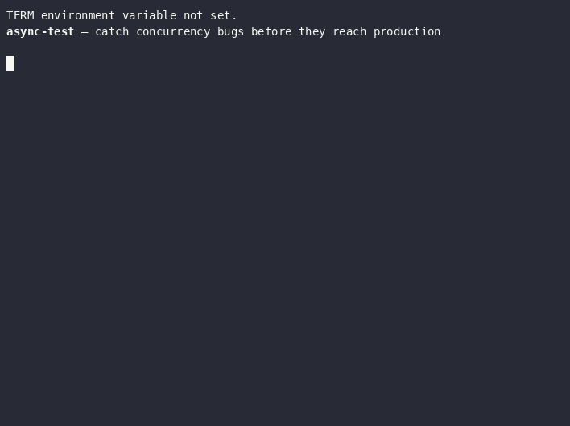

<div align="center">

# @AsyncTest - Asynchronous Testing Library for Java

**JUnit 5 & 6 concurrency stress testing — one annotation, 146 detectors**

[](https://central.sonatype.com/artifact/se.deversity.async-test-lib/async-test-lib)
[](https://pisberg.github.io/async-test-lib/api/latest/)
[](LICENSE)
[](https://github.com/PIsberg/async-test-lib/actions/workflows/tests.yml)
[](https://codecov.io/gh/PIsberg/async-test-lib)
[](https://openjdk.org/projects/jdk/21/)
[](https://github.com/PIsberg/async-test-lib)
[](https://securityscorecards.dev/viewer/?uri=github.com/PIsberg/async-test-lib)
[](checkstyle.xml)
[](pmd-ruleset.xml)
[](spotbugs-exclude.xml)
[](https://find-sec-bugs.github.io/)
[](https://github.com/uber/NullAway)
[](async-test-lib/src/test/java/se/deversity/asynctest/architecture/ArchitectureTest.java)
[](https://github.com/PIsberg/codekoll)
[](https://errorprone.info)
[](https://pitest.org)



</div>

---

## Why async-test?

- **One annotation** — `@AsyncTest` runs your test body on N threads × M rounds, collided on a `CyclicBarrier` so every round starts at the same instant. No executor boilerplate, no `CountDownLatch`, no `Thread.join` loops.
- **146 detectors** — deadlocks, race conditions, virtual-thread pinning, lifecycle bugs, misused JDK types and more, all on by default. See [Detectors](#detectors) for what feeds them.
- **JUnit native, 5 and 6** — a plain `@TestTemplate`: no JVM flags, no required configuration, and it works from Kotlin, Groovy, Scala and Clojure. Jupiter 5.9.3 through 6.1.2, verified per release ([compatibility table](docs/BUILDING.md#junit-compatibility), [language notes](docs/JVM_LANGUAGES.md)).
- **Every finding says how far to trust it** — each detector carries a trust tier, so `failOn` can gate a merge on the measured end of the scale while everything else is still reported ([the tiers](docs/DETECTOR_CATALOG.md#trust-tiers), [Evidence](#evidence-what-has-been-measured-and-on-whose-code)).
- **Optional agent** — `async-test-agent` rewrites field accesses, collection and lock calls, shared JDK objects, coordination primitives, `Thread.sleep` and `System.gc` with Byte Buddy, so **21 of them can see code you did not modify** instead of 3. Being able to see is not the same as firing: on 82 third-party subjects two of those 21 produced every finding, and the other nineteen were correctly silent because nothing in that corpus writes the idiom they model. Not needed for default use, and the core artifact does not depend on Byte Buddy ([docs/AGENT.md](docs/AGENT.md)).
- **CI-ready out of the box** — JUnit XML, machine-readable JSON, SARIF, or plain `AssertionError` fail-gates, straight into GitHub Actions, Jenkins and GitLab CI.

<div align="center">

[](https://www.youtube.com/watch?v=5LBavovcHEg)

▶ **[Watch the walkthrough on YouTube](https://www.youtube.com/watch?v=5LBavovcHEg)**

</div>

---

---

## Evidence: what has been measured, and on whose code

A concurrency detector is easy to make loud and hard to make right, so this project publishes two
independent bodies of evidence and the denominator each was measured over. Neither is a claim
about the JVM ecosystem. Both are reproducible from this repository.

### The corpus: 82 subjects nobody here wrote

`corpus-eval/` runs `@AsyncTest` over 82 subjects from commons-lang3, commons-collections4, Guava,
Jackson, Caffeine, Netty, Spring, HikariCP and the JDK whose **own javadoc states a thread-safety
contract**. That sentence is the ground truth, quoted in the corpus table with the file and line
it came from, so a reader can check the classification without trusting this project. A finding on
a class documented as thread-safe is noise; a finding on one documented as not thread-safe is a
true positive. Nothing is inferred from how the code looks.

| | Result |
|---|---|
| Documented not thread-safe | 22 of 22 detected |
| Documented thread-safe, with any finding at all | **0 of 60** |
| Documented thread-safe, with a `VERDICT`-tier HIGH or CRITICAL | **0 of 60** |

Identical on four platforms: JDK 21, 25 and 26 on Linux, and 26 on Windows. Sixty documented-safe
subjects is what puts a **95% upper bound of 5.0%** on the false-positive rate; the bound comes
from the size of that denominator rather than from the run of zeroes, which is why the safe side is
the larger half of the corpus on purpose.

The zero was not tuned. Each of the findings that used to sit in that column was traced to
something the model could not see, filed as an issue, and closed by a rule that names an idiom and
ships a twin pair in both directions: `ConcurrentReferenceHashMap`'s hint read re-established
under its own lock, Netty's pool metadata built while the receiver is still exclusive to its
builder, Jackson's racy single-check cache recognised by how it converges, and Guava's
`synchronized`-method fields that compile to a flag and no monitor instruction. Detection stayed
at the full unsafe group through every one of them, which is the number that matters while
chasing the noise column: a rule that quietens a false positive by weakening detection has not
fixed anything.

**The eval prints its denominator before any rate**, because a finding count on its own cannot
tell "no false positive from detector X" apart from "X never ran". In code that records nothing,
only 21 of the 146 detectors can see anything at all, and two of those produced every finding in
the corpus. Saying so is the difference between a measurement and a marketing number. A third lane
exists for exactly that reason: it records what the body did, the way a user following
`AsyncTestContext` would, and gives twelve more detectors a denominator over subjects that must
fire and twins that must stay silent. Nine of those pairs are what let their detectors carry
`VERDICT`, the tier a build can fail on. It is where HikariCP
joins the corpus as an eighth library, because a connection pool is the one subject that cannot
be exercised without something to pool.

The method, the misses, the four platforms it was run on and what the numbers do not support are
in [the corpus eval](docs/analysis/corpus-eval.md).

### Three real projects, on every release

The library's own CI proves the library builds. It does not prove the library can be *upgraded
to*, which is a different claim and the one that has actually failed here before. So every release
is swept through three unrelated projects that use `@AsyncTest` for their own reasons, each with
its own concurrency surface, its own build system and its own idea of what a hard test is:

| Project | What it is | Concurrency it puts under `@AsyncTest` | Build |
|---|---|---|---|
| [**BlindBean**](https://github.com/PIsberg/blindbean) | Fully homomorphic encryption for Java, over Microsoft SEAL through Project Panama's FFM | 7 test classes, 29 methods: ciphertext lifecycle and close races, key rotation under load, the Paillier signed path, and the FHE native bridge, where a data race crosses into C++ and out of the JVM's reach | Maven |
| [**VibeTags**](https://github.com/PIsberg/vibetags) | AI guardrails for Java: an annotation processor that generates agent-facing rule files from `@AI*` annotations | 5 test classes: the guardrail file writer, the module sidecar, the write cache and the logger, all of which are written concurrently by an annotation processor running inside javac | Maven **and** Gradle, both declared separately and bumped together |
| [**Skill3**](https://github.com/PIsberg/skill3) | A fully local AI skill relearner | 1 test class, 8 methods: shared `ObjectMapper`, process-resource management, a parallel retrieval path and several stateless-under-concurrency claims | Gradle |

Why these three are worth more than a bigger number of synthetic cases:

- **None of them is a test fixture.** They were written to do a job, and their concurrency is
  whatever that job required. A fixture written to exercise a detector will exercise it; a
  homomorphic-encryption library will not politely arrange itself around one.
- **They span the two failure directions.** BlindBean's FHE bridge is native code where a race
  produces a segfault rather than a wrong answer, and VibeTags' processor runs inside javac, where
  the threading model is somebody else's. Both are places a false positive is expensive, because
  the maintainer cannot easily prove the detector wrong.
- **Two build systems, and both are run.** VibeTags declares the dependency in Maven and in Gradle
  separately. Bumping one and not the other leaves its two tiers on different detector engines,
  so the sweep bumps both or neither, and runs both.
- **The tag matters, and the sweep knows it.** Most of VibeTags' `@AsyncTest` classes carry
  `@Tag("e2e")`. A plain `mvn test` reports 957 green tests having run one of its five async
  classes, which would sign off on a bump that never touched the other four. The sweep runs
  `-Pe2e` and counts the async classes that actually ran, from the result XML rather than from the
  console: Gradle prints `BUILD SUCCESSFUL` without listing a single test, so stdout cannot answer
  the question at all.

The sweep bumps each consumer to the **published** artifact, never to a working-tree build. That
rule is not pedantry: a poisoned `~/.m2` once made a sweep read the wrong bytes and produce a
confident, wrong account of which release removed a detector constant. The preflight now compares
sha1 against Maven Central before anything downstream is believed.

The rules, the failure each one prevents and the numbers from the latest sweep are in
[the regression sweep write-up](docs/analysis/regression-sweep.md); the procedure itself is
[the regression-test skill](.claude/skills/regression-test/SKILL.md).

Latest run, **1.9.8 on 2026-08-25**: 2793 tests across the three projects, zero failures, and no
change to any consumer beyond the version string. Two of the three were four releases behind, so
one sweep exercised eleven new detectors and the whole agent lockset overhaul at once.


## ⚡ Quick Start

<details open>
<summary><b>Maven</b></summary>

1. **Add the dependency** to `pom.xml`:
   ```xml
   <dependency>
       <groupId>se.deversity.async-test-lib</groupId>
       <artifactId>async-test-lib</artifactId>
       <version>1.11.2</version>
       <scope>test</scope>
   </dependency>
   ```

2. **Write your first stress test**:
   ```java
   import se.deversity.asynctest.AsyncTest;
   import se.deversity.asynctest.FailOn;

   class CounterTest {
       private int counter = 0;

       @AsyncTest(threads = 10, invocations = 100, detectAll = true,
                  failOn = FailOn.CRITICAL)
       void counter_mustBeThreadSafe() {
           counter++;  // compound read-modify-write: not atomic
       }
   }
   ```

   `failOn = FailOn.CRITICAL` makes a finding fail the test. The default is
   `FailOn.NONE`, which prints findings and lets the test pass — useful when adding
   `@AsyncTest` to an existing suite, surprising as a first experience.

3. **Run your tests**:
   ```bash
   mvn test -Dlicense.mock.mode=true -Dasynctest.agent=fields=true
   ```

   Two flags, both worth understanding before you drop them:

   - **`-Dlicense.mock.mode=true`** — without a licence key the run stops with
     `LICENSE DENIED`. CI sets mock mode automatically (`CI` or `GITHUB_ACTIONS` in the
     environment); a local run needs the flag. See [Licensing](#licensing).
   - **`-Dasynctest.agent=fields=true`** — attaches the instrumentation agent so a bare
     `counter++` is observed. **Without it this example passes and reports nothing.**
     `counter++` compiles to a field read and a field write with no method call, so
     nothing can see it unless the bytecode is instrumented. Add
     `async-test-agent` as a test dependency for this flag to find anything; the runner
     logs `runner.agent.attach.failed` if the artifact is missing.

   Detection that needs neither flag: deadlocks, which are read from the JVM's own
   thread state. If you want to see the library find something with zero setup, make two
   threads take two locks in opposite orders.

</details>

<details>
<summary><b>Gradle</b></summary>

1. **Add the dependency** to `build.gradle.kts`:
   ```kotlin
   testImplementation("se.deversity.async-test-lib:async-test-lib:1.11.2")
   ```

2. **Write your first stress test**:
   ```java
   import se.deversity.asynctest.AsyncTest;
   import se.deversity.asynctest.FailOn;

   class CounterTest {
       private int counter = 0;

       @AsyncTest(threads = 10, invocations = 100, detectAll = true,
                  failOn = FailOn.CRITICAL)
       void counter_mustBeThreadSafe() {
           counter++;  // compound read-modify-write: not atomic
       }
   }
   ```

   `failOn = FailOn.CRITICAL` makes a finding fail the test; the default `FailOn.NONE`
   prints findings and passes.

3. **Run your tests**:
   ```bash
   ./gradlew test -Dlicense.mock.mode=true -Dasynctest.agent=fields=true
   ```

   `-Dlicense.mock.mode=true` is what a local run without a licence key needs (CI
   activates mock mode by itself). `-Dasynctest.agent=fields=true` attaches the
   instrumentation agent — **without it this example passes and reports nothing**,
   because `counter++` is a field read and write with no method call for the weaver to
   bind to. Add `async-test-agent` as a test dependency for the flag to do anything.

   Deadlock detection needs neither flag; it reads the JVM's own thread state.

</details>

---

## Table of Contents

- [Evidence: what has been measured, and on whose code](#evidence-what-has-been-measured-and-on-whose-code)
- [What is async-test?](#what-is-async-test)
- [Detectors](#detectors)
- [Configuration](#configuration)
- [Examples](#examples)
- [CI/CD Integration](#cicd-integration)
- [IntelliJ Plugin](#intellij-plugin)
- [Project layout](#project-layout)
- [Documentation](#documentation)
- [Publications](#publications)
- [License](#license)

---

## What is async-test?

`async-test` is a JUnit 5 `@TestTemplate` extension that stress-tests concurrent code by running the annotated method body simultaneously across N threads, repeated M times. A `CyclicBarrier` forces all threads to start each round at the same instant, maximising contention and surfacing bugs that only appear under real concurrency — not in sequential unit tests.

After the run, the **detector registry** analyses what was observed and reports any issues via the standard JUnit failure mechanism, so they surface in your IDE, CI dashboard, and test reports without any extra tooling.

```
@AsyncTest
  └─► ConcurrencyRunner
        ├─ CyclicBarrier (all N threads collide on each invocation)
        ├─ Phase 1–N detectors observe the run
        └─ DetectorRegistry.analyzeAll() → JUnit failure / listener events
```

---

## Detectors

146 detectors enabled by default with a single flag, or cherry-pick:

```java
// Everything on (default for bare @AsyncTest)
@AsyncTest

// Curated preset for everyday CI
@AsyncTest(preset = Preset.ESSENTIALS)

// Everything on except false sharing (too slow for this suite)
@AsyncTest(excludes = { DetectorType.FALSE_SHARING })

// Explicit opt-in
@AsyncTest(detectAll = false, detectDeadlocks = true, detectRaceConditions = true)
```

**What feeds them.** Three read the JVM and the harness directly and need no configuration at
all. With the agent attached that becomes 20, because the woven streams carry what those
detectors need without a line of instrumentation. The remaining 125 observe what the test body
records explicitly through `AsyncTestContext`, and the catalog says which of three reasons
keeps each of them there. When a detector is
enabled but nothing can feed it, the runner says so once per JVM at INFO rather than letting an
empty report read as a clean bill of health; [docs/AGENT.md](docs/AGENT.md#when-the-runner-says-a-detector-cannot-see)
lists those notices. Which detectors fall in which group is tabulated in
[docs/DETECTOR_CATALOG.md](docs/DETECTOR_CATALOG.md), and how they behave on code nobody here
wrote is in [the accuracy eval](docs/analysis/detector-accuracy-eval.md).

### Detector categories

| Category | What it catches |
|----------|----------------|
| **Core** | Deadlocks, livelocks, memory-model visibility (`volatile` gaps) |
| **Race conditions** | Unsynchronized field access, non-atomic compound ops (`get`+`set` on `Atomic*`) |
| **Common JDK types** | `ArrayList`, `HashMap`, `StringBuilder`, `Calendar`, `SimpleDateFormat`, `DecimalFormat`, `Matcher`, `MessageDigest`, `TimeZone`, `Timer` shared across threads |
| **Virtual threads** | Thread pinning (JDK-version-aware: `synchronized` pins only before JDK 24/JEP 491, class-init waits before JDK 26, native calls always), CPU-bound tasks, carrier exhaustion, `ScopedValue` misuse, context leak |
| **Locks & monitors** | Boxed-primitive lock (`synchronized(Integer)`), public lock exposure, lock leak, nested monitor lockout, `StampedLock` optimistic-read without `validate()`, lock downgrade |
| **Lifecycle** | Executor never shut down, thread leak, `Future` result ignored, `CountDownLatch` misuse, `CyclicBarrier` trip count wrong |
| **Concurrency primitives** | `CompletableFuture` chain issues, blocking on common pool, `ForkJoinTask` blocking, `Exchanger`, `Phaser`, `Semaphore` misuse |
| **Hygiene** | Interrupt swallowing, MDC context leak, `System.setProperty` from multiple threads, `System.gc()` in tests, deprecated thread API (`Thread.stop()` etc.) |
| **Phase 13** | Daemon-thread hygiene, illegal `notify*()`, shared `SecureRandom`, shared `WeakHashMap`/`IdentityHashMap`, shared JDBC `Connection`/`Statement`/`ResultSet` |
| **Phase 14** (new) | Shared stateful crypto (`Cipher`/`Mac`/`Signature`), non-atomic `ConcurrentMap` check-then-act, shared `Deflater`/`Inflater`, constructor `this`-escape, cached `ThreadLocalRandom` used off-thread |
| **Phase 16 — JDK 25/26 preview** | `StableValue` misuse (read-before-set / double-set / reentrant `orElseSet`), `StructuredTaskScope` lifecycle (fork-after-join, result-before-join, owner-confinement, missing join, and JDK 26 join-timeout hazards), parallel-`Gatherer` without a combiner |
| **Phase 17 — shared stateful JDK objects** | Shared `ByteBuffer`, `CharsetEncoder`/`Decoder`, `Checksum`, `Deflater`, iterators, `FileChannel` implicit-position races, high-contention `Atomic*` advisories, JSON-mapper reconfiguration after concurrent use |
| **Phase 18 — JDK 25/26 GA** (new) | `LazyConstant` misuse (JDK 26 Lazy Constants: reentrant / null-producing / repeat-running suppliers), reflective final-field mutation (JEP 500 — warned on JDK 26, denied later, JMM violation today), shared `javax.crypto.KDF` (JEP 510 — documented not thread-safe) |

Full parameter reference: [docs/USAGE.md](docs/USAGE.md)

> **JDK 25/26 detectors are wired into the pipeline** (Phases 16 and 18). They are part of
> `detectAll` and the `Preset.ALL` / `STRICT` bundles, each with a `DetectorType` constant
> (`STABLE_VALUE_MISUSE`, `STRUCTURED_TASK_SCOPE_MISUSE`, `GATHERER_CONCURRENCY_MISUSE`,
> `LAZY_CONSTANT_MISUSE`, `FINAL_FIELD_MUTATION`, `SHARED_KDF`) and a deprecated `@AsyncTest`
> boolean flag. Record events against them via the matching `AsyncTestContext` accessors
> (`stableValueMisuseDetector()` … `lazyConstantMisuseDetector()`,
> `finalFieldMutationDetector()`, `sharedKdfDetector()`); findings surface through the
> standard report and `failOn` gate. `VirtualThreadPinningDetector` is JDK-version-aware
> since 1.7.0: `synchronized`/`Object.wait` events are annotated as no-longer-pinning on
> JDK 24+ (JEP 491), class-init waits on JDK 26+. See
> [docs/DETECTOR_CATALOG.md](docs/DETECTOR_CATALOG.md).

---

## Configuration

```java
@AsyncTest(
    threads      = 10,                       // concurrent threads per invocation round
    threadCounts = {2, 4, 8, 16, 32},        // OR: sweep multiple counts (one JUnit invocation per entry)
    invocations  = 100,                      // how many rounds to run
    timeoutMs    = 5000,                     // per-test timeout
    useVirtualThreads = true,                // Java 21+ virtual threads
    virtualThreadStressMode = "HIGH",        // OFF / LOW / MEDIUM / HIGH / EXTREME
    preset       = Preset.ESSENTIALS,        // curated detector bundle (overrides detectAll)
    detectAll    = true,                     // legacy umbrella when preset = ALL
    includes     = { DetectorType.DEADLOCKS },      // OR: exactly these detectors, nothing else
    excludes     = { DetectorType.FALSE_SHARING },  // prune even from a preset/includes
    failOn       = FailOn.HIGH,              // findings at/above this severity fail the test
    replaySeed   = 0L                        // 0 = fresh per round; set on failure to reproduce
)
```

| Parameter | Default | Description |
|-----------|---------|-------------|
| `threads` | 10 | Threads spawned per round |
| `threadCounts` | `{}` | Schedule matrix — one invocation per entry; ignored when empty. Sweeps thread counts cheaply since race sensitivity is count-dependent |
| `invocations` | 100 | Number of barrier rounds |
| `timeoutMs` | 5000 | Whole-test timeout (ms) |
| `useVirtualThreads` | true | Use `Thread.ofVirtual()` (Java 21+) |
| `preset` | `Preset.ALL` | Curated bundle: `ALL` / `STRICT` / `ESSENTIALS` / `CI_FAST` / `NONE` |
| `detectAll` | true | Enable all detectors in one shot (honored when `preset = ALL`) |
| `includes` | `{}` | Enable exactly these detectors — overrides `preset`/`detectAll`/per-detector flags when non-empty |
| `excludes` | `{}` | Detectors to skip — layers on top of any preset or `includes` and wins on conflict |
| `failOn` | `FailOn.NONE` | Severity gate: findings at/above this level (`LOW`/`MEDIUM`/`HIGH`/`CRITICAL`) fail the test; `NONE` = report-only |
| `replaySeed` | 0 | Per-round RNG seed. `0` = fresh per round (printed on failure); set explicitly to reproduce a failing schedule |

`@AsyncTest` can also be placed on a **class** (shared config for all `@TestTemplate`
methods; method-level `@AsyncTest` wins) or on an **annotation** to compose reusable
presets like `@EssentialsAsyncTest`.

### Fail gates & baseline

Gate CI on serious findings while adopting incrementally:

```java
@AsyncTest(failOn = FailOn.HIGH)   // HIGH and CRITICAL findings fail the test
void checkout_concurrently() { ... }
```

For a legacy codebase, record the current findings once and ratchet them down:

```bash
mvn test -Dasync-test.baseline=async-test-baseline.txt -Dasync-test.baseline.update=true  # record
mvn test -Dasync-test.baseline=async-test-baseline.txt                                    # enforce
```

Each baseline line is `com.example.MyTest#method | DetectorName` — diff-friendly and
hand-editable; delete lines as you fix the findings.

---

## Examples

### Catching a race condition

```java
class CounterTest {
    private int counter = 0;

    @AsyncTest(threads = 10, invocations = 100, detectAll = true)
    void increment_mustBeAtomic() {
        counter++;  // BUG: compound read-modify-write, not atomic
    }
}
// Fix: use AtomicInteger.incrementAndGet()
```

### Catching a deadlock

```java
class LockTest {
    private final Object lockA = new Object();
    private final Object lockB = new Object();

    @AsyncTest(threads = 4, invocations = 50, detectDeadlocks = true)
    void acquireLocks() {
        if (Thread.currentThread().getId() % 2 == 0) {
            synchronized (lockA) { synchronized (lockB) { /* work */ } }
        } else {
            synchronized (lockB) { synchronized (lockA) { /* work */ } }
            //  ^^^ opposite order — deadlock waiting to happen
        }
    }
}
```

### Virtual thread stress test

```java
class VirtualThreadTest {
    private final List<String> items = Collections.synchronizedList(new ArrayList<>());

    @AsyncTest(
        threads = 100_000,
        invocations = 5,
        useVirtualThreads = true,
        virtualThreadStressMode = "EXTREME",
        detectAll = true
    )
    void highConcurrency() {
        items.add("item-" + Thread.currentThread().threadId());
    }
}
```

### Sweep thread counts to find the contention sweet spot

```java
class HashMapCacheTest {
    private final Map<String, String> cache = new HashMap<>(); // BUG: not thread-safe

    @AsyncTest(threadCounts = {2, 4, 8, 16, 32, 64})  // 6 separate JUnit invocations
    void put_thenGet() {
        cache.put(UUID.randomUUID().toString(), "v");
    }
}
// JUnit emits one test per count; race condition surfaces reliably at 16+
```

### Async test body — await a `CompletionStage` inside @AsyncTest

```java
class AsyncPipelineTest {
    @AsyncTest(threads = 8)
    void hammer_pipeline() {
        CompletableFuture<String> stage = service.processAsync(payload);
        String result = AsyncAssert.awaitAsync(stage, Duration.ofSeconds(5));
        assertEquals("ok", result);
    }
}
// awaitAsync unwraps ExecutionException — failures surface as the real exception type
```

### Reproduce a flaky failure

```java
class FlakyTest {
    @AsyncTest                                          // 1st run: failure prints replaySeed=4242L
    @AsyncTest(replaySeed = 4242L)                      // re-run with the printed seed
    void randomised_workload() {
        var rng = new Random(AsyncTestContext.replaySeed());
        Thread.sleep(rng.nextInt(10));                  // randomised jitter is now deterministic
        service.handle(payload(rng));
    }
}
```

### Scoped listener (no JVM-wide leak)

```java
@Test
void capture_findings_for_one_test() {
    try (var ignored = AsyncTestListenerRegistry.registerScoped(myListener)) {
        // myListener fires only inside this block
        runMyAsyncTest();
    }
    // automatic unregister on close
}
```

More examples with runnable code: [examples/](examples/)

Release notes: [docs/CHANGELOG.md](docs/CHANGELOG.md)

---

## CI/CD Integration

Register a listener in `@BeforeAll` to get structured output alongside the standard JUnit failure:

```java
@BeforeAll
static void setup() {
    // JUnit XML → GitHub Actions / Jenkins / GitLab CI test dashboards
    AsyncTestListenerRegistry.register(new JUnitXmlReportListener());

    // Structured JSON → dashboards, quality gates, custom tooling
    AsyncTestListenerRegistry.register(new JsonReportListener());

    // Throw AssertionError immediately on any finding
    AsyncTestListenerRegistry.register(new StrictModeListener());
}
```

### GitHub Actions example

```yaml
- name: Run tests
  run: mvn test

- name: Upload async-test reports
  uses: actions/upload-artifact@v4
  if: always()
  with:
    name: async-test-reports
    path: target/async-test-reports/
```

Findings appear as named test-case failures in the Actions UI — not just as `stderr` noise.

**Flaky-test policy:** the build does not configure Surefire's `rerunFailingTestsCount` — an intermittently failing `@AsyncTest` is a detector finding a real concurrency bug, not infrastructure noise, so we don't auto-rerun it away.

**Scaling timeouts on slow/shared runners:** every `@AsyncTest(timeoutMs=...)` budget can be scaled globally with `-Dasync-test.timeout.multiplier=<factor>` or the `ASYNC_TEST_TIMEOUT_MULTIPLIER` environment variable (precedence: system property, then env var, then `1.0`). Use this instead of bumping individual annotations when detector setup overhead eats into a short timeout on a slow or oversubscribed runner (e.g. a 3-core macOS or Windows CI box) — an invalid or non-positive value falls back to `1.0`. Prefer the env var in CI: it propagates automatically into Surefire's forked test JVMs, whereas a `-D` passed to the outer `mvn` process does not.

Full CI/CD setup guide: [docs/CI_INTEGRATION.md](docs/CI_INTEGRATION.md)

---

## IntelliJ Plugin

A companion IntelliJ IDEA plugin reads the JSON report and surfaces findings in a dedicated tool window — with severity colouring, full report text, and a Refresh action to pick up new results without leaving the IDE.

```
View → Tool Windows → async-test Findings
```

**Setup:**

1. Build the plugin: `cd intellij-plugin && ./gradlew buildPlugin`
2. Install in IntelliJ: **Settings → Plugins → Install Plugin from Disk**
3. Point it at your report: **Settings → Tools → async-test**
4. Run your tests, then click **Refresh** in the tool window

See [intellij-plugin/README.md](intellij-plugin/README.md) for full instructions.

---

## Project layout

```
async-test-lib/          The library: @AsyncTest, the runner, and every detector.
                         This is the artifact consumers depend on.
async-test-agent/        Opt-in Java agent (Byte Buddy) that weaves field and
                         collection accesses so detectors see unmodified code.
async-test-analysis/     Opt-in ASM pre-scanner for virtual-thread pinning sites.
                         Depends on nothing else here.

consumer-fixture/        A consumer-shaped project proving every detector is
                         reachable through the published API.
consumer-fixture-langs/  The same proof from Kotlin, Groovy, Scala and Clojure.
corpus-eval/             Runs the detectors against real third-party libraries
                         and gates the false-positive and detection rates.
load-tests/              JMH throughput and memory benchmarks, with the measured
                         results pinned per release under results/.
evals/                   Evals that measure whether coding agents actually obey
                         this repository's instruction files.

examples/                Self-contained example projects, each demonstrating a
                         concurrency defect against the release its pom pins.
intellij-plugin/         IDE tool window that renders the JSON report.
tools/                   Release and licensing utilities, and the demo.
docs/                    All documentation, routed from docs/INDEX.md.
```

Only the first three are Maven reactor modules, and they are what publishes to
Maven Central. The fixture, corpus, load-test and example projects consume the
library the way a user would, which is what makes their results evidence; the
rest is documentation and tooling around them.

---

## Documentation

| Resource | Description |
|----------|-------------|
| [API reference](https://pisberg.github.io/async-test-lib/api/latest/) | Javadoc for every public type, one directory per release. [All versions](https://pisberg.github.io/async-test-lib/api/) |
| [docs/USAGE.md](docs/USAGE.md) | Full `@AsyncTest` parameter reference, all detectors, examples |
| [docs/CI_INTEGRATION.md](docs/CI_INTEGRATION.md) | GitHub Actions, Jenkins, GitLab CI setup |
| [docs/ARCHITECTURE.md](docs/ARCHITECTURE.md) | Execution flow, detector phases, extension points |
| [docs/CHANGELOG.md](docs/CHANGELOG.md) | Version history |
| [examples/](examples/) | 30+ runnable example projects |
| [intellij-plugin/README.md](intellij-plugin/README.md) | IntelliJ plugin setup |
| [docs/INDEX.md](docs/INDEX.md) | Documentation index — every document mapped to what it is for |
| [docs/QUALITY_GATES.md](docs/QUALITY_GATES.md) | What must stay green: static analysis, coverage, mutation testing, japicmp |

---

## Publications

Books that cover `@AsyncTest` and the problem it exists to solve.

**[Vibe Architecture: Designing, Scaling, and Guardrailing Large-Scale Systems in the Age of AI Orchestration](https://www.amazon.com/dp/B0HF3MLBB8)** by Peter Isberg.

Chapter 17, "The Asynchronous Trap", is about the class of bug AI-generated concurrent code produces and sequential unit tests never see. It uses this library as the worked example: forced-collision testing on a `CyclicBarrier`, what the detectors turn a bare timeout into, and how to feed that named diagnosis back to the assistant that wrote the bug.

---

## License

[PolyForm Noncommercial License 1.0.0](LICENSE) — free for non-commercial use.

### Commercial licensing — pricing

Commercial use requires an annual license. One key covers your whole team — there are no per-seat
keys. Prices are per year, excluding VAT or sales tax:

| Developers | Price (EUR/year) |
|---|---|
| 1–9 | €250 |
| 10–49 | €900 |
| 50–199 | €2,500 |
| 200+ | €6,000 |
| OEM / redistribution | from €10,000, negotiated |

**[Buy a license at deversity.se/pricing.html →](https://deversity.se/pricing.html)**

Checkout is handled by Paddle, our merchant of record, which shows prices in your local currency
and handles VAT and sales tax. OEM and redistribution are negotiated —
[email us](mailto:peter.isberg@deversity.se).

Your license key is sent by email after purchase; it is issued by hand, so allow one business day.
The license is bound to **one email address** that you nominate — set it once in your shared build
config as `-Dlicense.user.email` and every developer and CI job uses that same value. Operator
runbook and what to send customers: [docs/LICENSING.md](docs/LICENSING.md).

### Running without a license key

| Environment | Behavior |
|---|---|
| CI (any `GITHUB_ACTIONS` or `CI` env var set, no key) | Auto-mocked — tests run freely |
| Local, no key, `-Dlicense.mock.mode=true` | Mock mode active — tests run freely |
| Local, no key, no mock flag | **The gate runs and can refuse.** See below |
| Real key via `-Dlicense.key=<key>` | Full validation against the licensing backend |
| Offline file via `-Dlicense.file=<path>` | Signature-verified locally, no network attempted (air-gapped CI) |

> **First run on a new machine.** With no key configured and no mock flag, the gate consults the
> licensing backend and a denial throws, before any test body runs:
>
> ```
> java.lang.SecurityException: LICENSE DENIED: <reason>
>   To run locally without a key: -Dlicense.mock.mode=true
>   In CI (GITHUB_ACTIONS or CI env var set, no key): mock mode activates automatically.
> ```
>
> This is the gate working as intended, not a bug in your test. CI is unaffected: mock mode turns
> itself on there when no key is present, which is why a suite that passes in CI can still stop on
> a developer laptop.

To run locally without a key during development:
```
mvn test -Dlicense.mock.mode=true
```
Or add to your IDE's JVM args: `-Dlicense.mock.mode=true`. Setting it once in your IDE's default
JUnit configuration is the usual fix, so it applies to every run rather than being remembered
per-test.

Every run that proceeds without a validated commercial key (mock mode, CI auto-mock, or a free-mail
address) prints a three-line licence notice to stderr, once per JVM, naming the licence, the pricing
page and the contact address. It is not a warning and it does not fail anything; it goes away when
a key is validated. It cannot be switched off by a flag, because it is the licence terms restated on
the one path where they are easiest to forget.

Set your email identity when using a real key: `-Dlicense.user.email=you@example.com`

### Enterprise CI: outages, proxies and air-gapped runners

Licensed builds do not depend on the licensing provider being up or reachable:

- **Provider outage or blocked egress.** If the validator host cannot be reached, the build
  proceeds and logs one `LICENSE: validator unavailable` warning per JVM instead of failing. A
  validator that answers and rejects the key still fails the build. Restore unconditional
  fail-closed with `-Dlicense.network.mode=strict`.
- **Validation caching.** A successful validation is recorded (a SHA-256 hash of the
  configuration, never the key) and reused for `license.cache.ttl.hours` (default 24), so a
  fork-per-class suite makes one licensing call per day rather than one per test class.
- **Air-gapped CI.** Ask for an offline license file and point `-Dlicense.file` at it: the file is
  Ed25519-signed and verified inside the JVM, with no network and no provider account. An invalid
  file fails closed; it never falls back to online validation.
- **Proxies.** Validation uses Java's standard HTTP client, so the usual
  `-Dhttps.proxyHost=<host> -Dhttps.proxyPort=<port>` flags apply. Set them on the forked test
  JVM (Surefire `argLine` or `systemPropertyVariables`), not only on the Maven process.

Exact failure semantics, the operator runbook and the offline-file format:
[docs/LICENSING.md](docs/LICENSING.md).
