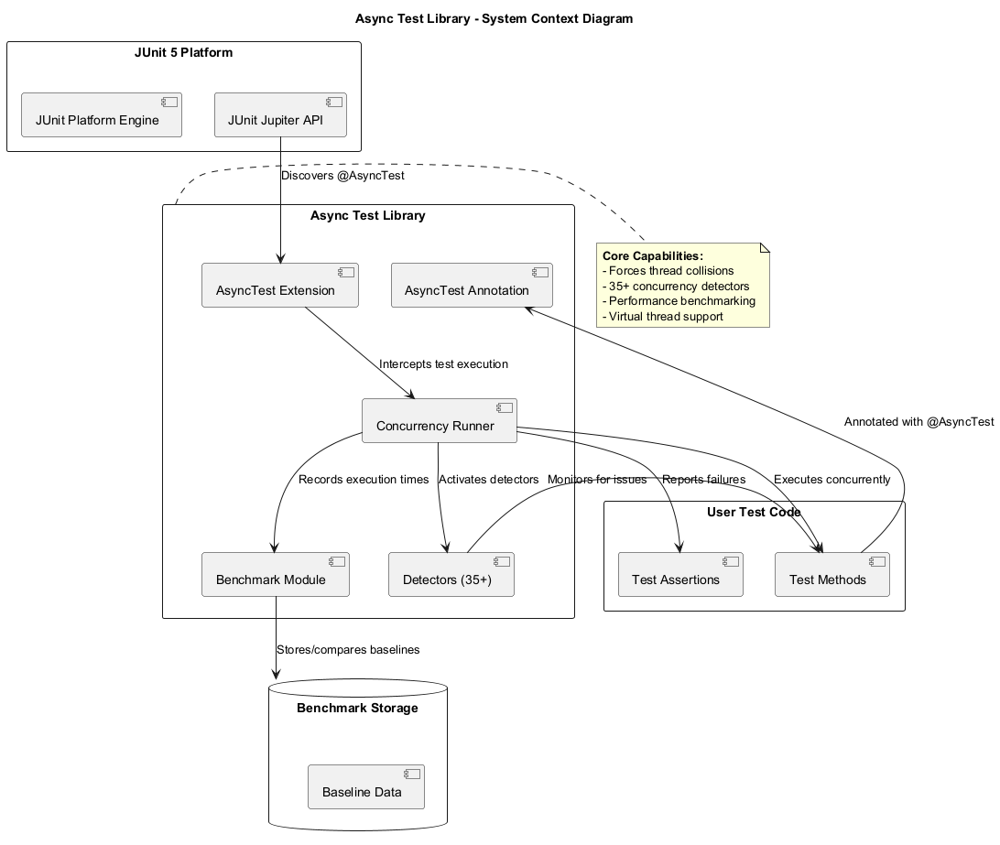
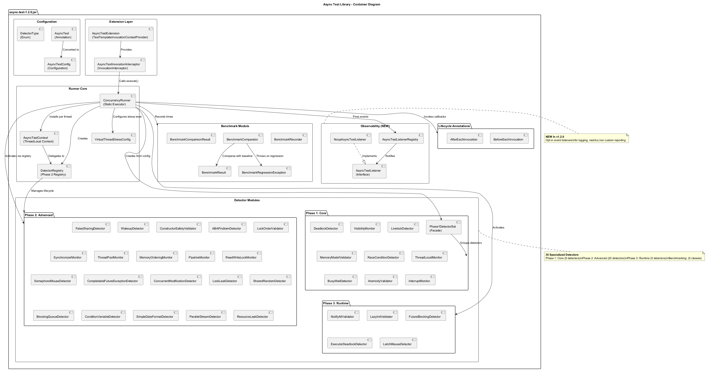
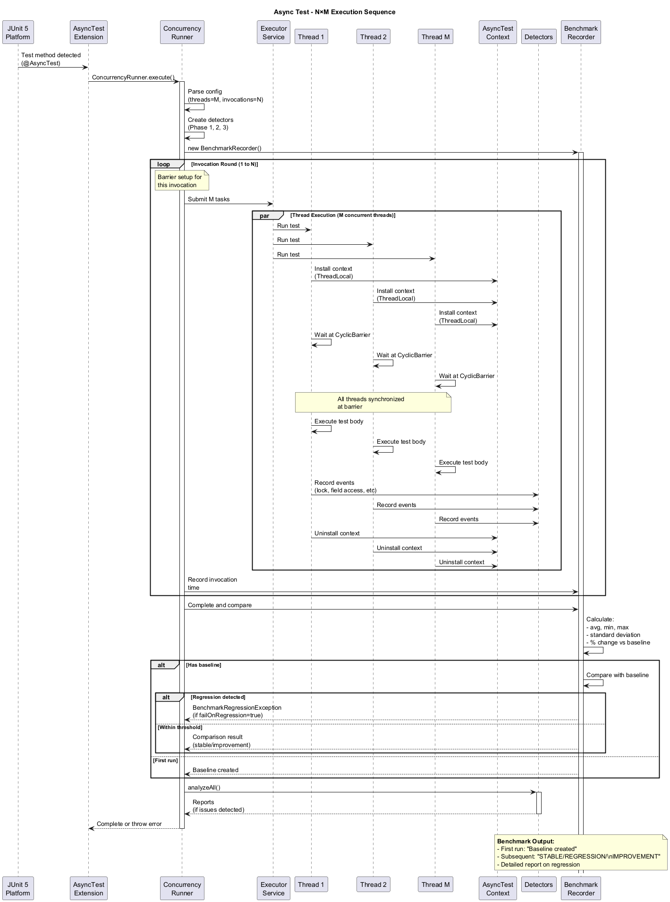
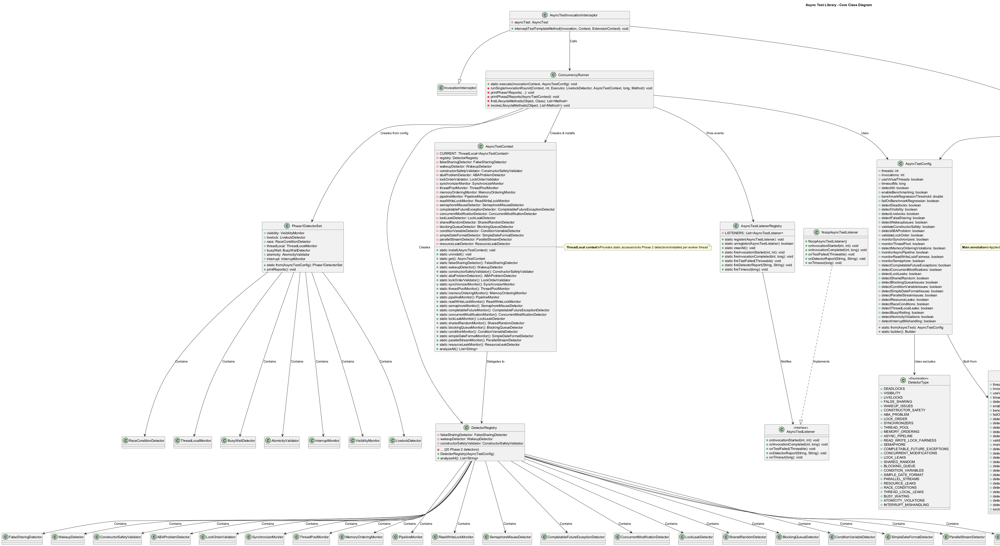
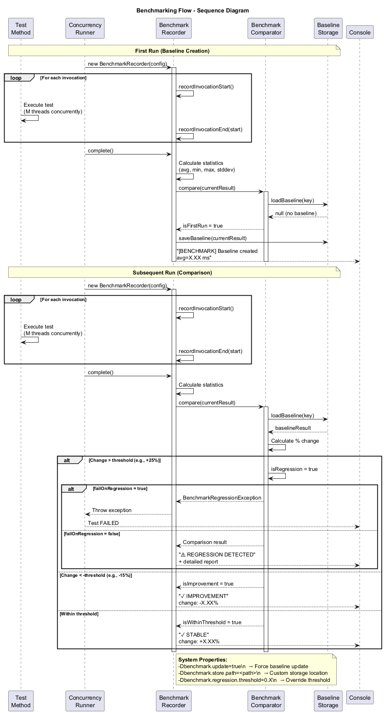
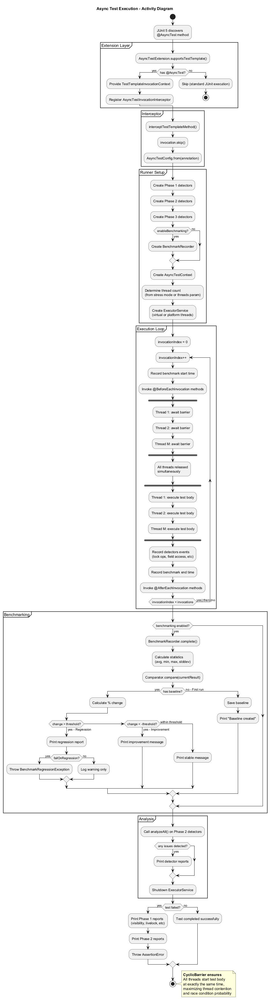
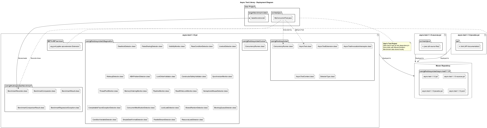
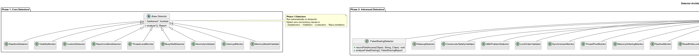

# 🏗️ Async Test Library - Architecture Documentation

## Overview

This document provides a comprehensive architectural overview of the async-test library using PlantUML diagrams. The library enables deterministic concurrency testing by forcing thread collisions and detecting 35+ categories of concurrency bugs.

## Table of Contents

1. [System Context Diagram](#system-context-diagram)
2. [Container Diagram](#container-diagram)
3. [Component Flow Diagram](#component-flow-diagram)
4. [Sequence Diagram - Test Execution](#sequence-diagram---test-execution)
5. [Class Diagram](#class-diagram)
6. [Sequence Diagram - Benchmarking](#sequence-diagram---benchmarking)
7. [Activity Diagram](#activity-diagram)
8. [Deployment Diagram](#deployment-diagram)
9. [Detector Architecture](#detector-architecture)

---

## System Context Diagram

Shows the high-level system architecture and external dependencies.

**Key Components:**
- **JUnit 5 Platform**: Discovers and executes @AsyncTest methods
- **Async Test Library**: Core testing framework with 35+ detectors
- **User Test Code**: Tests annotated with @AsyncTest
- **Benchmark Storage**: Persistent baseline data for performance comparison



**Source:** [`system-context.puml`](../docs/diagrams/system-context.puml)

---

## Container Diagram

Shows the main containers/components within the async-test library JAR.

**Main Containers:**
- **Extension Layer**: JUnit 5 integration (AsyncTestExtension, AsyncTestInvocationInterceptor)
- **Configuration**: AsyncTest annotation and AsyncTestConfig
- **Runner Core**: ConcurrencyRunner, AsyncTestContext, VirtualThreadStressConfig
- **Detector Modules**:
  - Phase 1: Core (9 detectors) — grouped via `Phase1DetectorSet`
  - Phase 2: Advanced (20 detectors) — managed by `DetectorRegistry`
  - Phase 3: Runtime (5 detectors)
- **Benchmark Module**: 5 classes for performance tracking
- **Lifecycle Annotations**: BeforeEachInvocation, AfterEachInvocation
- **Observability** (NEW): AsyncTestListener, AsyncTestListenerRegistry, NoopAsyncTestListener



**Source:** [`container.puml`](../docs/diagrams/container.puml)

---

## Component Flow Diagram

Shows how the JUnit 5 extension intercepts and executes tests.

**Flow:**
1. JUnit discovers @AsyncTest method
2. AsyncTestExtension provides invocation context
3. AsyncTestInvocationInterceptor skips standard execution
4. ConcurrencyRunner creates detectors and context
5. N×M execution loop (N invocations × M threads)
6. Benchmarking records execution times
7. Detector analysis and reporting


**Source:** [`component-flow.puml`](../docs/diagrams/component-flow.puml)

---

## Sequence Diagram - Test Execution

Detailed sequence showing the N×M execution pattern.

**Key Steps:**
1. JUnit 5 detects @AsyncTest method
2. ConcurrencyRunner.execute() is called
3. Detectors and BenchmarkRecorder are created
4. For each invocation (N times):
   - M threads are submitted to ExecutorService
   - All threads wait at CyclicBarrier
   - Barrier releases all threads simultaneously
   - Each thread executes test body concurrently
   - Events are recorded to detectors
   - Benchmark times are recorded
5. After all invocations:
   - Benchmark comparison with baseline
   - Detector analysis
   - Reports printed if issues detected



**Source:** [`sequence-execution.puml`](../docs/diagrams/sequence-execution.puml)

---

## Class Diagram

Shows the main classes and their relationships.

**Core Classes:**
- **AsyncTest**: Main annotation with 35+ configuration parameters
- **AsyncTestConfig**: Immutable configuration object
- **AsyncTestExtension**: JUnit 5 TestTemplateInvocationContextProvider
- **AsyncTestInvocationInterceptor**: InvocationInterceptor that intercepts test execution
- **ConcurrencyRunner**: Static executor that orchestrates test execution
- **AsyncTestContext**: ThreadLocal context providing detector accessors
- **DetectorType**: Enumeration of all detector types
- **Benchmark Classes**: BenchmarkRecorder, BenchmarkComparator, BenchmarkResult, BenchmarkComparisonResult, BenchmarkRegressionException

**Relationships:**
- AsyncTestExtension provides AsyncTestInvocationInterceptor
- AsyncTestInvocationInterceptor calls ConcurrencyRunner.execute()
- ConcurrencyRunner creates and installs AsyncTestContext per thread
- AsyncTestContext contains all Phase 2 detector instances
- BenchmarkRecorder uses BenchmarkComparator to compare with baselines



**Source:** [`class-diagram.puml`](../docs/diagrams/class-diagram.puml)

---

## Sequence Diagram - Benchmarking

Shows how benchmarking integrates with test execution.

**First Run (Baseline Creation):**
1. BenchmarkRecorder created
2. For each invocation: record start/end times
3. Calculate statistics (avg, min, max, stddev)
4. No baseline exists → save current as baseline
5. Print "Baseline created" message

**Subsequent Runs (Comparison):**
1. BenchmarkRecorder created
2. For each invocation: record start/end times
3. Calculate statistics
4. Load baseline from storage
5. Calculate % change
6. If change > threshold: regression detected
   - If failOnRegression=true: throw BenchmarkRegressionException
   - Else: log warning
7. If change < -threshold: improvement detected
8. Else: stable performance



**Source:** [`benchmark-sequence.puml`](../docs/diagrams/benchmark-sequence.puml)

---

## Activity Diagram

Shows the decision flow during test execution.

**Main Flow:**
1. JUnit 5 discovers @AsyncTest method
2. Extension layer checks for annotation
3. Interceptor skips standard execution
4. Runner setup:
   - Create Phase 1, 2, 3 detectors
   - Create BenchmarkRecorder (if enabled)
   - Create AsyncTestContext
   - Determine thread count
   - Create ExecutorService
5. Execution loop (N invocations):
   - Record benchmark start time
   - Invoke @BeforeEachInvocation methods
   - Fork M threads to barrier
   - All threads released simultaneously
   - Fork M threads to execute test body
   - Record detector events
   - Record benchmark end time
   - Invoke @AfterEachInvocation methods
6. Benchmarking:
   - Calculate statistics
   - Compare with baseline
   - Report regression/improvement/stable
7. Analysis:
   - Call analyzeAll() on detectors
   - Print reports if issues detected
   - Shutdown ExecutorService



**Source:** [`activity-diagram.puml`](../docs/diagrams/activity-diagram.puml)

---

## Deployment Diagram

Shows how the library is deployed and used.

**Artifacts:**
- **async-test-1.1.0.jar**: Main library (~150 KB)
  - Extension layer classes
  - Runner classes
  - 35 detector classes
  - 5 benchmark classes
  - META-INF/services (JUnit extension registration)
- **async-test-1.1.0-sources.jar**: Source code (~350 KB)
- **async-test-1.1.0-javadoc.jar**: API documentation (~450 KB)

**Deployment:**
- Published to Maven repository (GitHub Packages)
- User projects add as test dependency
- Benchmark data stored in `target/benchmark-data/`



**Source:** [`deployment-diagram.puml`](../docs/diagrams/deployment-diagram.puml)

---

## Detector Architecture

Shows the structure and common pattern of all 35 detectors.

**Phase 1: Core Detectors (9 classes)**
- DeadlockDetector, VisibilityMonitor, LivelockDetector
- RaceConditionDetector, ThreadLocalMonitor, BusyWaitDetector
- AtomicityValidator, InterruptMonitor, MemoryModelValidator
- Run automatically on timeout
- Detect core concurrency issues

**Phase 2: Advanced Detectors (20 classes)**
- FalseSharingDetector, WakeupDetector, ConstructorSafetyValidator
- ABAProblemDetector, LockOrderValidator, SynchronizerMonitor
- ThreadPoolMonitor, MemoryOrderingMonitor, PipelineMonitor
- ReadWriteLockMonitor, SemaphoreMisuseDetector
- CompletableFutureExceptionDetector, ConcurrentModificationDetector
- LockLeakDetector, SharedRandomDetector, BlockingQueueDetector
- ConditionVariableDetector, SimpleDateFormatDetector
- ParallelStreamDetector, ResourceLeakDetector
- Opt-in via annotation flags
- Record events during test execution

**Phase 3: Runtime Validators (5 classes)**
- NotifyAllValidator, LazyInitValidator, FutureBlockingDetector
- ExecutorDeadlockDetector, LatchMisuseDetector
- Manual validator pattern for legacy Java async patterns

**Common Pattern:**
- Abstract base with `analyze*(): Report` and `hasIssues: boolean`
- Concrete detectors implement analysis logic
- Return specific report types (e.g., FalseSharingReport)



**Source:** [`detector-architecture.puml`](../docs/diagrams/detector-architecture.puml)

---

## Key Design Patterns

### 1. ThreadLocal Context Pattern

**Purpose:** Share detector instances across all worker threads while maintaining thread-safe access.

**Implementation:**
- Runner creates single AsyncTestContext with all detectors
- Each worker thread installs context via `AsyncTestContext.install()`
- All threads access same detector instances concurrently
- Each thread uninstalls via `AsyncTestContext.uninstall()` after completion

### 2. Detector Recording Pattern

**Purpose:** Allow test code to record events for later analysis.

**Implementation:**
- Test code calls static accessor: `AsyncTestContext.falseSharingDetector()`
- Accessor gets context from ThreadLocal
- Returns detector instance
- Test code calls recording method: `recordFieldAccess(this, "counter", long.class)`
- Detector adds event to shared store (thread-safe)
- After test completes, `analyzeAll()` processes all recorded events

### 3. Barrier Synchronization Pattern

**Purpose:** Force all threads to start test body simultaneously for maximum contention.

**Implementation:**
- Runner creates CyclicBarrier with M threads
- Each thread submits task to ExecutorService
- Task calls `barrier.await()` before test body
- All threads block at barrier until last thread arrives
- Barrier releases all threads simultaneously
- Maximum thread contention achieved

---

## Observability (Event Listener System)

The async-test library provides an opt-in observability system via the `AsyncTestListener` interface.

### AsyncTestListener Interface

**Purpose:** Allow users to observe async-test lifecycle events for logging, metrics, or custom reporting.

**Events:**
- `onInvocationStarted(int round, int threads)` — Called before each invocation round
- `onInvocationCompleted(int round, long durationMs)` — Called after each round completes
- `onTestFailed(Throwable cause)` — Called when a test fails
- `onDetectorReport(String detectorName, String report)` — Called when a detector reports an issue
- `onTimeout(long timeoutMs)` — Called when a timeout occurs

### Registration

```java
// Register a custom listener
AsyncTestListenerRegistry.register(new MyCustomListener());

// Unregister later
AsyncTestListenerRegistry.unregister(myListener);

// Clear all listeners (useful for test cleanup)
AsyncTestListenerRegistry.clearAll();
```

### Opt-Out

To silence all output, register a `NoopAsyncTestListener`:

```java
AsyncTestListenerRegistry.register(new NoopAsyncTestListener());
```

### Thread Safety

Listeners may be called from multiple worker threads concurrently. All listener implementations must be thread-safe. The registry uses a `CopyOnWriteArrayList` to allow concurrent iteration without locking.

### Default Behavior

If no listeners are registered, detector reports are printed to `System.err` (backward-compatible behavior). Registering custom listeners does not suppress this default output — both will receive events.

---

## Architecture Principles

### 1. Separation of Concerns

- **Extension Layer**: JUnit 5 integration only
- **Runner Layer**: Test execution orchestration
- **Detector Layer**: Concurrency issue detection
- **Benchmark Layer**: Performance tracking

### 2. Thread Safety

- All detectors are thread-safe
- Shared state protected by concurrent collections
- ThreadLocal for per-thread context isolation

### 3. Opt-in Complexity

- Phase 1: Always on (core detectors)
- Phase 2: Opt-in via flags (advanced detectors)
- Phase 3: Manual validators (legacy patterns)
- Benchmarking: Opt-in via flag or system property

### 4. Zero Overhead Default

- Detectors only created when enabled
- No performance impact when not using @AsyncTest
- Benchmarking completely optional

---

## File Structure

```
src/main/java/com/github/asynctest/
├── AsyncTest.java                    # Main annotation
├── AsyncTestConfig.java              # Configuration object
├── AsyncTestContext.java             # ThreadLocal context
├── AsyncTestListener.java            # Observability listener interface (NEW)
├── AsyncTestListenerRegistry.java    # Listener registry (NEW)
├── NoopAsyncTestListener.java        # No-op listener for opt-out (NEW)
├── DetectorRegistry.java             # Phase 2 detector registry (NEW)
├── DetectorType.java                 # Detector enumeration
├── BeforeEachInvocation.java         # Lifecycle annotation
├── AfterEachInvocation.java          # Lifecycle annotation
├── AsyncAssert.java                  # Async assertion helper
├── extension/
│   ├── AsyncTestExtension.java       # JUnit 5 extension
│   └── AsyncTestInvocationInterceptor.java  # Interceptor
├── runner/
│   └── ConcurrencyRunner.java        # Main execution engine
├── diagnostics/                      # 35 detector implementations
│   ├── Phase1DetectorSet.java        # Phase 1 detector group (NEW)
│   ├── DeadlockDetector.java
│   ├── VisibilityMonitor.java
│   ├── FalseSharingDetector.java
│   ├── ... (28 more detectors)
└── benchmark/                        # Benchmarking module
    ├── BenchmarkRecorder.java
    ├── BenchmarkComparator.java
    ├── BenchmarkResult.java
    ├── BenchmarkComparisonResult.java
    └── BenchmarkRegressionException.java
```

---

## Diagram Source Files

All PlantUML source files are located in [`docs/diagrams/`](../docs/diagrams/):

| Diagram | Source File | PNG File |
|---------|-------------|----------|
| System Context | `system-context.puml` | `SystemContext.png` |
| Container | `container.puml` | `ContainerDiagram.png` |
| Component Flow | `component-flow.puml` | `ComponentFlow.png` |
| Sequence Execution | `sequence-execution.puml` | `SequenceExecution.png` |
| Class Diagram | `class-diagram.puml` | `ClassDiagram.png` |
| Benchmark Sequence | `benchmark-sequence.puml` | `BenchmarkSequence.png` |
| Activity | `activity-diagram.puml` | `ActivityDiagram.png` |
| Deployment | `deployment-diagram.puml` | `DeploymentDiagram.png` |
| Detector Architecture | `detector-architecture.puml` | `DetectorArchitecture.png` |

To regenerate diagrams, see [`docs/diagrams/README.md`](../docs/diagrams/README.md).

---

## Related Documentation

- [BENCHMARKING.md](BENCHMARKING.md) - Detailed benchmarking guide
- [USAGE.md](../USAGE.md) - User guide with examples
- [README.md](../README.md) - Project overview

---

## Refactoring Summary (v1.2.0)

The following structural improvements were made to address code quality concerns:

### 1. Break Up Large Classes

**AsyncTestContext** (539 lines → ~150 lines)
- Extracted `DetectorRegistry` to handle detector instantiation and analysis
- AsyncTestContext now focuses on ThreadLocal lifecycle and public API accessors

**ConcurrencyRunner** (350 lines → ~200 lines)
- Extracted `Phase1DetectorSet` to group Phase 1 detectors
- Eliminates long parameter lists in helper methods

### 2. Reduce Tight Coupling

- `Phase1DetectorSet.from(AsyncTestConfig)` encapsulates detector creation
- `Phase1DetectorSet.printReports()` owns Phase 1 report printing logic
- ConcurrencyRunner now depends on the facade, not individual detectors

### 3. Memory Management

- ThreadLocal cleanup ensured in `runSingleInvocationRound` finally block
- `uninstall()` called before `latch.countDown()` to prevent context leaks
- `ThreadLocal.remove()` properly clears thread state

### 4. Observability (NEW)

- `AsyncTestListener` interface for lifecycle event callbacks
- `AsyncTestListenerRegistry` for thread-safe listener management
- `NoopAsyncTestListener` for opt-out of default output
- Events: invocation start/complete, test failure, detector reports, timeout

### New Classes

| Class | Package | Purpose |
|-------|---------|---------|
| `DetectorRegistry` | `com.github.asynctest` | Phase 2 detector lifecycle |
| `Phase1DetectorSet` | `com.github.asynctest.diagnostics` | Phase 1 detector grouping |
| `AsyncTestListener` | `com.github.asynctest` | Observability interface |
| `AsyncTestListenerRegistry` | `com.github.asynctest` | Listener registration |
| `NoopAsyncTestListener` | `com.github.asynctest` | No-op listener for opt-out |

---

**Last Updated**: March 2026
**Version**: 1.2.0-SNAPSHOT
