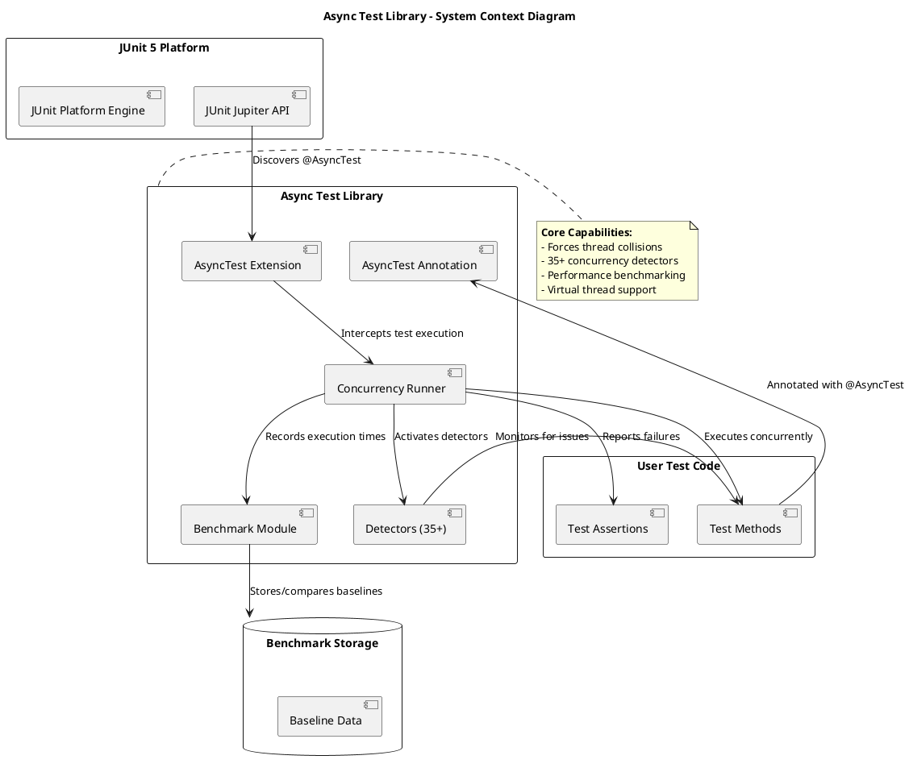
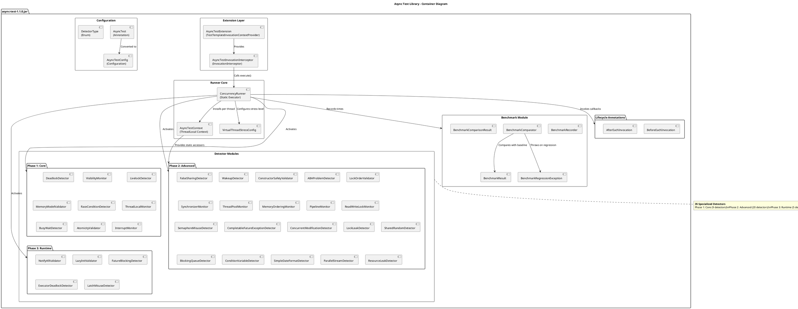
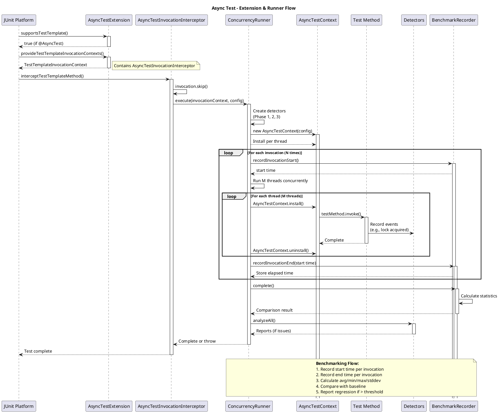
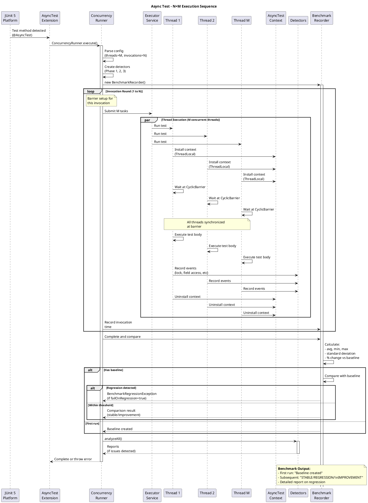
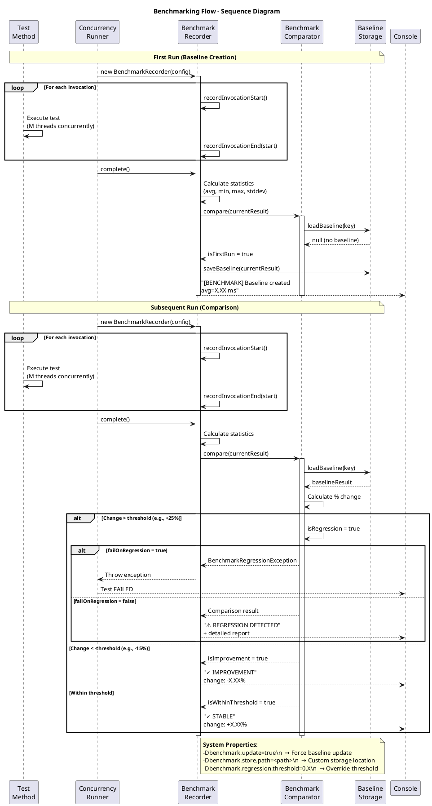
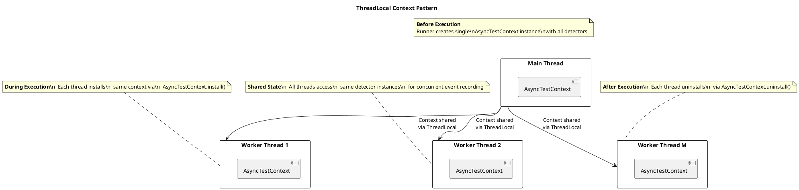
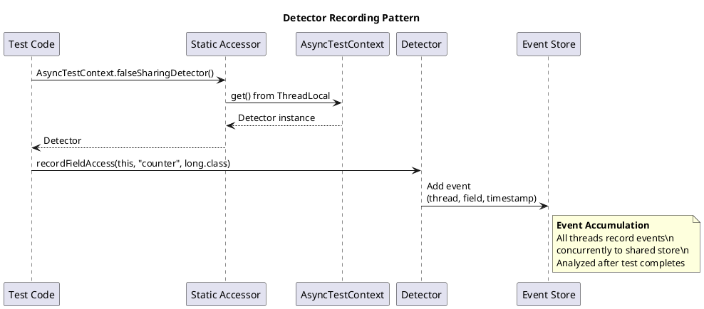
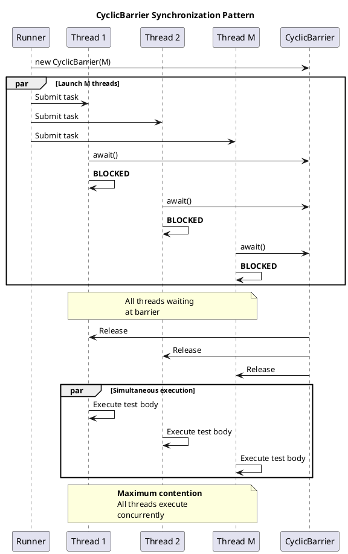

# 🏗️ Async Test Library - Architecture Documentation

## Overview

This document provides a comprehensive architectural overview of the async-test library using PlantUML diagrams. The library enables deterministic concurrency testing by forcing thread collisions and detecting 35+ categories of concurrency bugs.

## Table of Contents

1. [System Context Diagram](#system-context-diagram)
2. [Container Diagram](#container-diagram)
3. [Component Flow Diagram](#component-flow-diagram)
4. [Sequence Diagram - Test Execution](#sequence-diagram---test-execution)
5. [Class Diagram](#class-diagram)
6. [Sequence Diagram - Benchmarking](#sequence-diagram---benchmarking)
7. [Activity Diagram](#activity-diagram)
8. [Deployment Diagram](#deployment-diagram)
9. [Detector Architecture](#detector-architecture)

---

## System Context Diagram

Shows the high-level system architecture and external dependencies.




---

## Container Diagram

Shows the main containers/components within the async-test library.




---

## Component Flow Diagram

Shows how the JUnit 5 extension intercepts and executes tests.




---

## Sequence Diagram - Test Execution

Detailed sequence showing the N×M execution pattern.




---

## Class Diagram

Shows the main classes and their relationships.

```plantuml
@startuml ClassDiagram
title Async Test Library - Core Class Diagram

set namespaceSeparator ::

class AsyncTest <<Annotation>> {
  +threads: int
  +invocations: int
  +useVirtualThreads: boolean
  +timeoutMs: long
  +detectAll: boolean
  +enableBenchmarking: boolean
  +benchmarkRegressionThreshold: double
  +failOnBenchmarkRegression: boolean
  +detectDeadlocks: boolean
  +detectVisibility: boolean
  +detectFalseSharing: boolean
  +detectWakeupIssues: boolean
  +detectABAProblem: boolean
  +validateLockOrder: boolean
  +monitorSemaphore: boolean
  +detectCompletableFutureExceptions: boolean
  +detectConcurrentModifications: boolean
  +detectLockLeaks: boolean
  +detectSharedRandom: boolean
  +detectBlockingQueueIssues: boolean
  +detectConditionVariableIssues: boolean
  +detectSimpleDateFormatIssues: boolean
  +detectParallelStreamIssues: boolean
  +detectResourceLeaks: boolean
  +detectRaceConditions: boolean
  +detectThreadLocalLeaks: boolean
  +detectBusyWaiting: boolean
  +detectAtomicityViolations: boolean
  +detectInterruptMishandling: boolean
  +excludes: DetectorType[]
}

class AsyncTestConfig {
  +threads: int
  +invocations: int
  +useVirtualThreads: boolean
  +timeoutMs: long
  +detectAll: boolean
  +enableBenchmarking: boolean
  +benchmarkRegressionThreshold: double
  +failOnBenchmarkRegression: boolean
  +detectDeadlocks: boolean
  +detectVisibility: boolean
  +detectLivelocks: boolean
  +detectFalseSharing: boolean
  +detectWakeupIssues: boolean
  +validateConstructorSafety: boolean
  +detectABAProblem: boolean
  +validateLockOrder: boolean
  +monitorSynchronizers: boolean
  +monitorThreadPool: boolean
  +detectMemoryOrderingViolations: boolean
  +monitorAsyncPipeline: boolean
  +monitorReadWriteLockFairness: boolean
  +monitorSemaphore: boolean
  +detectCompletableFutureExceptions: boolean
  +detectConcurrentModifications: boolean
  +detectLockLeaks: boolean
  +detectSharedRandom: boolean
  +detectBlockingQueueIssues: boolean
  +detectConditionVariableIssues: boolean
  +detectSimpleDateFormatIssues: boolean
  +detectParallelStreamIssues: boolean
  +detectResourceLeaks: boolean
  +detectRaceConditions: boolean
  +detectThreadLocalLeaks: boolean
  +detectBusyWaiting: boolean
  +detectAtomicityViolations: boolean
  +detectInterruptMishandling: boolean
  +static from(AsyncTest): AsyncTestConfig
  +static builder(): Builder
}

class AsyncTestExtension {
  -supportsTestTemplate(Context): boolean
  -provideTestTemplateInvocationContexts(Context): Stream<TestTemplateInvocationContext>
}

class AsyncTestInvocationInterceptor {
  -asyncTest: AsyncTest
  +interceptTestTemplateMethod(Invocation, Context, ExtensionContext): void
}

class ConcurrencyRunner {
  +static execute(InvocationContext, AsyncTestConfig): void
  -runSingleInvocationRound(Context, int, Executor, LivelockDetector, AsyncTestContext, long, Method): void
  -printPhase1Reports(...): void
  -printPhase2Reports(AsyncTestContext): void
  -findLifecycleMethods(Object, Class): List<Method>
  -invokeLifecycleMethods(Object, List<Method>): void
}

class AsyncTestContext {
  -CURRENT: ThreadLocal<AsyncTestContext>
  -falseSharingDetector: FalseSharingDetector
  -wakeupDetector: WakeupDetector
  -constructorSafetyValidator: ConstructorSafetyValidator
  -abaProblemDetector: ABAProblemDetector
  -lockOrderValidator: LockOrderValidator
  -synchronizerMonitor: SynchronizerMonitor
  -threadPoolMonitor: ThreadPoolMonitor
  -memoryOrderingMonitor: MemoryOrderingMonitor
  -pipelineMonitor: PipelineMonitor
  -readWriteLockMonitor: ReadWriteLockMonitor
  -semaphoreMisuseDetector: SemaphoreMisuseDetector
  -completableFutureExceptionDetector: CompletableFutureExceptionDetector
  -concurrentModificationDetector: ConcurrentModificationDetector
  -lockLeakDetector: LockLeakDetector
  -sharedRandomDetector: SharedRandomDetector
  -blockingQueueDetector: BlockingQueueDetector
  -conditionVariableDetector: ConditionVariableDetector
  -simpleDateFormatDetector: SimpleDateFormatDetector
  -parallelStreamDetector: ParallelStreamDetector
  -resourceLeakDetector: ResourceLeakDetector
  +static install(AsyncTestContext): void
  +static uninstall(): void
  +static get(): AsyncTestContext
  +static falseSharingDetector(): FalseSharingDetector
  +static wakeupDetector(): WakeupDetector
  +static constructorSafetyValidator(): ConstructorSafetyValidator
  +static abaProblemDetector(): ABAProblemDetector
  +static lockOrderValidator(): LockOrderValidator
  +static synchronizerMonitor(): SynchronizerMonitor
  +static threadPoolMonitor(): ThreadPoolMonitor
  +static memoryOrderingMonitor(): MemoryOrderingMonitor
  +static pipelineMonitor(): PipelineMonitor
  +static readWriteLockMonitor(): ReadWriteLockMonitor
  +static semaphoreMonitor(): SemaphoreMisuseDetector
  +static completableFutureMonitor(): CompletableFutureExceptionDetector
  +static concurrentModificationMonitor(): ConcurrentModificationDetector
  +static lockLeakMonitor(): LockLeakDetector
  +static sharedRandomMonitor(): SharedRandomDetector
  +static blockingQueueMonitor(): BlockingQueueDetector
  +static conditionMonitor(): ConditionVariableDetector
  +static simpleDateFormatMonitor(): SimpleDateFormatDetector
  +static parallelStreamMonitor(): ParallelStreamDetector
  +static resourceLeakMonitor(): ResourceLeakDetector
  +analyzeAll(): List<String>
}

class DetectorType <<Enumeration>> {
  +DEADLOCKS
  +VISIBILITY
  +LIVELOCKS
  +FALSE_SHARING
  +WAKEUP_ISSUES
  +CONSTRUCTOR_SAFETY
  +ABA_PROBLEM
  +LOCK_ORDER
  +SYNCHRONIZERS
  +THREAD_POOL
  +MEMORY_ORDERING
  +ASYNC_PIPELINE
  +READ_WRITE_LOCK_FAIRNESS
  +SEMAPHORE
  +COMPLETABLE_FUTURE_EXCEPTIONS
  +CONCURRENT_MODIFICATIONS
  +LOCK_LEAKS
  +SHARED_RANDOM
  +BLOCKING_QUEUE
  +CONDITION_VARIABLES
  +SIMPLE_DATE_FORMAT
  +PARALLEL_STREAMS
  +RESOURCE_LEAKS
  +RACE_CONDITIONS
  +THREAD_LOCAL_LEAKS
  +BUSY_WAITING
  +ATOMICITY_VIOLATIONS
  +INTERRUPT_MISHANDLING
}

class BeforeEachInvocation <<Annotation>> {
}

class AfterEachInvocation <<Annotation>> {
}

' Benchmark Classes
package benchmark {
  class BenchmarkRecorder {
    -config: AsyncTestConfig
    -testClass: String
    -testMethod: String
    -invocationTimesNanos: List<Long>
    -startTimeNanos: long
    -comparator: BenchmarkComparator
    -benchmarkingEnabled: boolean
    +isBenchmarkingEnabled(): boolean
    +recordInvocationStart(): long
    +recordInvocationEnd(long): void
    +complete(): BenchmarkComparisonResult
    +getTotalExecutionTimeNanos(): long
    +getInvocationCount(): int
  }
  
  class BenchmarkComparator {
    -benchmarkStorePath: Path
    -regressionThresholdPercent: double
    -failOnRegression: boolean
    +compare(BenchmarkResult): BenchmarkComparisonResult
    +saveBaseline(BenchmarkResult): void
    +loadBaseline(String): Optional<BenchmarkResult>
    +clearAllBaselines(): void
  }
  
  class BenchmarkResult {
    -testClass: String
    -testMethod: String
    -timestamp: LocalDateTime
    -threads: int
    -invocations: int
    -totalExecutionTimeNanos: long
    -avgTimePerInvocationNanos: long
    -minTimePerInvocationNanos: long
    -maxTimePerInvocationNanos: long
    -invocationTimesNanos: List<Long>
    +getBenchmarkKey(): String
    +getStandardDeviation(): double
    +static formatTime(long): String
    +static builder(): Builder
  }
  
  class BenchmarkComparisonResult {
    -currentResult: BenchmarkResult
    -baselineResult: BenchmarkResult
    -percentChange: double
    -isRegression: boolean
    -isImprovement: boolean
    -isFirstRun: boolean
    -thresholdPercent: double
    +isWithinThreshold(): boolean
    +static firstRun(BenchmarkResult): BenchmarkComparisonResult
    +static builder(): Builder
  }
  
  class BenchmarkRegressionException {
    -comparisonResult: BenchmarkComparisonResult
    +getComparisonResult(): BenchmarkComparisonResult
  }
}

' Relationships
AsyncTestExtension --|> TestTemplateInvocationContextProvider
AsyncTestInvocationInterceptor --|> InvocationInterceptor
AsyncTestInvocationInterceptor --> AsyncTest : "Uses"
AsyncTestInvocationInterceptor --> ConcurrencyRunner : "Calls"
ConcurrencyRunner --> AsyncTestConfig : "Uses"
ConcurrencyRunner --> AsyncTestContext : "Creates & installs"
AsyncTestConfig --> AsyncTest : "Built from"
AsyncTestConfig --> DetectorType : "Uses excludes"
AsyncTestContext --> FalseSharingDetector : "Contains"
AsyncTestContext --> WakeupDetector : "Contains"
AsyncTestContext --> ConstructorSafetyValidator : "Contains"
AsyncTestContext --> ABAProblemDetector : "Contains"
AsyncTestContext --> LockOrderValidator : "Contains"
AsyncTestContext --> SynchronizerMonitor : "Contains"
AsyncTestContext --> ThreadPoolMonitor : "Contains"
AsyncTestContext --> MemoryOrderingMonitor : "Contains"
AsyncTestContext --> PipelineMonitor : "Contains"
AsyncTestContext --> ReadWriteLockMonitor : "Contains"
AsyncTestContext --> SemaphoreMisuseDetector : "Contains"
AsyncTestContext --> CompletableFutureExceptionDetector : "Contains"
AsyncTestContext --> ConcurrentModificationDetector : "Contains"
AsyncTestContext --> LockLeakDetector : "Contains"
AsyncTestContext --> SharedRandomDetector : "Contains"
AsyncTestContext --> BlockingQueueDetector : "Contains"
AsyncTestContext --> ConditionVariableDetector : "Contains"
AsyncTestContext --> SimpleDateFormatDetector : "Contains"
AsyncTestContext --> ParallelStreamDetector : "Contains"
AsyncTestContext --> ResourceLeakDetector : "Contains"

' Benchmark relationships
BenchmarkRecorder --> AsyncTestConfig : "Uses config"
BenchmarkRecorder --> BenchmarkComparator : "Uses"
BenchmarkRecorder --> BenchmarkComparisonResult : "Returns"
BenchmarkComparator --> BenchmarkResult : "Compares"
BenchmarkComparator --> BenchmarkRegressionException : "Throws"
BenchmarkComparisonResult --> BenchmarkResult : "Contains current & baseline"

note top of AsyncTest
  **Main annotation**\nApplied to test methods\nConfigures all detectors\nand benchmarking
end note

note right of AsyncTestContext
  **ThreadLocal context**\nProvides static accessors\nto Phase 2 detectors\nInstalled per worker thread
end note

note bottom of BenchmarkRecorder
  **Benchmarking**\nRecords execution times\nCompares with baselines\nDetects regressions
end note
@enduml
```




---

## Sequence Diagram - Benchmarking

Shows how benchmarking integrates with test execution.




---

## Activity Diagram

Shows the decision flow during test execution.

```plantuml
@startuml ActivityDiagram
title Async Test Execution - Activity Diagram

start
:JUnit 5 discovers\n@AsyncTest method;

partition "Extension Layer" {
  :AsyncTestExtension.supportsTestTemplate();
  if (has @AsyncTest?) then (yes)
    :Provide TestTemplateInvocationContext;
    :Register AsyncTestInvocationInterceptor;
  else (no)
    :Skip (standard JUnit execution);
    stop
  endif
}

partition "Interceptor" {
  :interceptTestTemplateMethod();
  :invocation.skip();
  :AsyncTestConfig.from(annotation);
}

partition "Runner Setup" {
  :Create Phase 1 detectors;
  :Create Phase 2 detectors;
  :Create Phase 3 detectors;
  
  if (enableBenchmarking?) then (yes)
    :Create BenchmarkRecorder;
  else (no)
  endif
  
  :Create AsyncTestContext;
  :Determine thread count\n(from stress mode or threads param);
  :Create ExecutorService\n(virtual or platform threads);
}

partition "Execution Loop" {
  :invocationIndex = 0;
  repeat :invocationIndex++;
  :Record benchmark start time;
  :Invoke @BeforeEachInvocation methods;
  
  fork
    :Thread 1: await barrier;
    :Thread 2: await barrier;
    :Thread M: await barrier;
  end fork
  
  :All threads released\nsimultaneously;
  
  fork
    :Thread 1: execute test body;
    :Thread 2: execute test body;
    :Thread M: execute test body;
  end fork
  
  :Record detectors events\n(lock ops, field access, etc);
  :Record benchmark end time;
  :Invoke @AfterEachInvocation methods;
  
  repeat while (invocationIndex < invocations) is (yes) then (no)
}

partition "Benchmarking" {
  if (benchmarking enabled?) then (yes)
    :BenchmarkRecorder.complete();
    :Calculate statistics\n(avg, min, max, stddev);
    :Comparator.compare(currentResult);
    
    if (has baseline?) then (yes)
      :Calculate % change;
      
      if (change > threshold?) then (yes - Regression)
        :Print regression report;
        
        if (failOnRegression?) then (yes)
          :Throw BenchmarkRegressionException;
        else (no)
          :Log warning only;
        endif
      elseif (change < -threshold?) then (yes - Improvement)
        :Print improvement message;
      else (within threshold)
        :Print stable message;
      endif
    else (no - First run)
      :Save baseline;
      :Print "Baseline created";
    endif
  endif
}

partition "Analysis" {
  :Call analyzeAll() on Phase 2 detectors;
  
  if (any issues detected?) then (yes)
    :Print detector reports;
  endif
  
  :Shutdown ExecutorService;
}

if (test failed?) then (yes)
  :Print Phase 1 reports\n(visibility, livelock, etc);
  :Print Phase 2 reports;
  :Throw AssertionError;
else (no)
  :Test completed successfully;
endif

stop

note right of **All threads released**
  **CyclicBarrier ensures**
  All threads start test body
  at exactly the same time,
  maximizing thread contention
  and race condition probability
end note
@enduml
```


---

## Deployment Diagram

Shows how the library is deployed and used.

```plantuml
@startuml DeploymentDiagram
title Async Test Library - Deployment Diagram

artifact "async-test-1.1.0.jar" as Jar {
  folder "com/github/asynctest" {
    file "AsyncTest.class" as Annotation
    file "AsyncTestExtension.class" as Ext
    file "AsyncTestInvocationInterceptor.class" as Interceptor
    file "ConcurrencyRunner.class" as Runner
    file "AsyncTestContext.class" as Context
    file "DetectorType.class" as DType
  }
  
  folder "com/github/asynctest/runner" {
    file "ConcurrencyRunner.class" as Runner2
  }
  
  folder "com/github/asynctest/diagnostics" {
    file "DeadlockDetector.class" as Deadlock
    file "FalseSharingDetector.class" as FalseSharing
    file "VisibilityMonitor.class" as Visibility
    file "RaceConditionDetector.class" as Race
    file "LivelockDetector.class" as Livelock
    file "WakeupDetector.class" as Wakeup
    file "ABAProblemDetector.class" as ABA
    file "LockOrderValidator.class" as LockOrder
    file "ConstructorSafetyValidator.class" as Constructor
    file "SynchronizerMonitor.class" as Sync
    file "ThreadPoolMonitor.class" as ThreadPool
    file "MemoryOrderingMonitor.class" as MemOrder
    file "PipelineMonitor.class" as Pipeline
    file "ReadWriteLockMonitor.class" as RWLock
    file "SemaphoreMisuseDetector.class" as Semaphore
    file "CompletableFutureExceptionDetector.class" as CF
    file "ConcurrentModificationDetector.class" as ConcurrentMod
    file "LockLeakDetector.class" as LockLeak
    file "SharedRandomDetector.class" as SharedRandom
    file "BlockingQueueDetector.class" as BlockingQueue
    file "ConditionVariableDetector.class" as Condition
    file "SimpleDateFormatDetector.class" as SimpleDateFormat
    file "ParallelStreamDetector.class" as ParallelStream
    file "ResourceLeakDetector.class" as ResourceLeak
  }
  
  folder "com/github/asynctest/benchmark" {
    file "BenchmarkRecorder.class" as BenchRecorder
    file "BenchmarkComparator.class" as BenchComparator
    file "BenchmarkResult.class" as BenchResult
    file "BenchmarkComparisonResult.class" as BenchCompare
    file "BenchmarkRegressionException.class" as BenchException
  }
  
  folder "META-INF/services" {
    file "org.junit.jupiter.api.extension.Extension" as Service
  }
}

artifact "async-test-1.1.0-sources.jar" as Sources {
  folder "src/main/java" {
    file "*.java (all source files)" as JavaSources
  }
}

artifact "async-test-1.1.0-javadoc.jar" as Javadoc {
  folder "api/" {
    file "*.html (API documentation)" as HtmlDocs
  }
}

database "Maven Repository" as Maven {
  folder "com/github/asynctest/async-test/1.1.0/" {
    file "async-test-1.1.0.jar"
    file "async-test-1.1.0-sources.jar"
    file "async-test-1.1.0-javadoc.jar"
    file "async-test-1.1.0.pom"
  }
}

folder "User Project" as UserProject {
  folder "src/test/java" {
    file "MyConcurrentTest.java" as UserTest
  }
  
  folder "target/benchmark-data/" {
    file "baseline-store.dat" as Baseline
  }
}

Jar --> Maven : "Deployed to"
Sources --> Maven : "Deployed to"
Javadoc --> Maven : "Deployed to"

UserTest ..> Annotation : "@AsyncTest"
UserTest ..> Runner : "Executed by"
UserTest ..> BenchRecorder : "Records times"
BenchRecorder --> Baseline : "Stores/reads"

note bottom of UserProject
  **User's Test Project**
  Adds async-test as test dependency\n
  Runs tests with Maven/Gradle\n
  Benchmark data stored locally
end note

note right of Service
  **Service Provider**
  Registers AsyncTestExtension\n
  Auto-discovered by JUnit 5
end note
@enduml
```




---

## Detector Architecture

Shows the structure and common pattern of all 35 detectors.

```plantuml
@startuml DetectorArchitecture
title Detector Architecture - Common Pattern

package "Phase 1: Core Detectors" {
  abstract class "Base Detector" as Base1 {
    +analyze*(): Report
    #hasIssues*: boolean
  }
  
  class DeadlockDetector
  class VisibilityMonitor
  class LivelockDetector
  class RaceConditionDetector
  class ThreadLocalMonitor
  class BusyWaitDetector
  class AtomicityValidator
  class InterruptMonitor
  class MemoryModelValidator
}

package "Phase 2: Advanced Detectors" {
  abstract class "Base Detector" as Base2 {
    +analyze*(): Report
    #hasIssues*: boolean
  }
  
  class FalseSharingDetector {
    +recordFieldAccess(Object, String, Class): void
    +analyzeFalseSharing(): FalseSharingReport
  }
  
  class WakeupDetector
  class ConstructorSafetyValidator
  class ABAProblemDetector
  class LockOrderValidator
  class SynchronizerMonitor
  class ThreadPoolMonitor
  class MemoryOrderingMonitor
  class PipelineMonitor
  class ReadWriteLockMonitor
  class SemaphoreMisuseDetector
  class CompletableFutureExceptionDetector
  class ConcurrentModificationDetector
  class LockLeakDetector
  class SharedRandomDetector
  class BlockingQueueDetector
  class ConditionVariableDetector
  class SimpleDateFormatDetector
  class ParallelStreamDetector
  class ResourceLeakDetector
}

package "Phase 3: Runtime Validators" {
  class NotifyAllValidator
  class LazyInitValidator
  class FutureBlockingDetector
  class ExecutorDeadlockDetector
  class LatchMisuseDetector
}

package "Report Classes" {
  interface "Report Interface" as Report {
    +hasIssues(): boolean
    +toString(): String
  }
}

Base1 <|-- DeadlockDetector
Base1 <|-- VisibilityMonitor
Base1 <|-- LivelockDetector
Base1 <|-- RaceConditionDetector
Base1 <|-- ThreadLocalMonitor
Base1 <|-- BusyWaitDetector
Base1 <|-- AtomicityValidator
Base1 <|-- InterruptMonitor
Base1 <|-- MemoryModelValidator

Base2 <|-- FalseSharingDetector
Base2 <|-- WakeupDetector
Base2 <|-- ConstructorSafetyValidator
Base2 <|-- ABAProblemDetector
Base2 <|-- LockOrderValidator
Base2 <|-- SynchronizerMonitor
Base2 <|-- ThreadPoolMonitor
Base2 <|-- MemoryOrderingMonitor
Base2 <|-- PipelineMonitor
Base2 <|-- ReadWriteLockMonitor
Base2 <|-- SemaphoreMisuseDetector
Base2 <|-- CompletableFutureExceptionDetector
Base2 <|-- ConcurrentModificationDetector
Base2 <|-- LockLeakDetector
Base2 <|-- SharedRandomDetector
Base2 <|-- BlockingQueueDetector
Base2 <|-- ConditionVariableDetector
Base2 <|-- SimpleDateFormatDetector
Base2 <|-- ParallelStreamDetector
Base2 <|-- ResourceLeakDetector

note right of Base1
  **Phase 1 Detectors**
  Run automatically on timeout\n
  Detect core concurrency issues:\n
  - Deadlocks\n  - Visibility\n  - Livelocks\n  - Race conditions
end note

note right of Base2
  **Phase 2 Detectors**
  Opt-in via annotation flags\n
  Record events during test execution\n
  Analyze at completion:\n
  - False sharing\n  - ABA problems\n  - Lock ordering\n  - etc.
end note

note right of Phase3
  **Phase 3 Validators**
  Manual validator pattern\n
  For legacy Java async patterns:\n
  - notify/notifyAll\n  - Lazy initialization\n  - Future blocking\n  - Executor deadlock\n  - Latch misuse
end note
@enduml
```


---

## Key Design Patterns

### 1. ThreadLocal Context Pattern



### 2. Detector Recording Pattern



### 3. Barrier Synchronization Pattern



---

## Architecture Principles

### 1. Separation of Concerns

- **Extension Layer**: JUnit 5 integration only
- **Runner Layer**: Test execution orchestration
- **Detector Layer**: Concurrency issue detection
- **Benchmark Layer**: Performance tracking

### 2. Thread Safety

- All detectors are thread-safe
- Shared state protected by concurrent collections
- ThreadLocal for per-thread context isolation

### 3. Opt-in Complexity

- Phase 1: Always on (core detectors)
- Phase 2: Opt-in via flags (advanced detectors)
- Phase 3: Manual validators (legacy patterns)
- Benchmarking: Opt-in via flag

### 4. Zero Overhead Default

- Detectors only created when enabled
- No performance impact when not using @AsyncTest
- Benchmarking completely optional

---

## File Structure

```
src/main/java/com/github/asynctest/
├── AsyncTest.java                    # Main annotation
├── AsyncTestConfig.java              # Configuration object
├── AsyncTestContext.java             # ThreadLocal context
├── DetectorType.java                 # Detector enumeration
├── BeforeEachInvocation.java         # Lifecycle annotation
├── AfterEachInvocation.java          # Lifecycle annotation
├── AsyncAssert.java                  # Async assertion helper
├── extension/
│   ├── AsyncTestExtension.java       # JUnit 5 extension
│   └── AsyncTestInvocationInterceptor.java  # Interceptor
├── runner/
│   └── ConcurrencyRunner.java        # Main execution engine
├── diagnostics/                      # 35 detector implementations
│   ├── DeadlockDetector.java
│   ├── VisibilityMonitor.java
│   ├── FalseSharingDetector.java
│   ├── ... (28 more detectors)
└── benchmark/                        # Benchmarking module
    ├── BenchmarkRecorder.java
    ├── BenchmarkComparator.java
    ├── BenchmarkResult.java
    ├── BenchmarkComparisonResult.java
    └── BenchmarkRegressionException.java
```

---

## Related Documentation

- [BENCHMARKING.md](BENCHMARKING.md) - Detailed benchmarking guide
- [USAGE.md](../USAGE.md) - User guide with examples
- [README.md](../README.md) - Project overview

---

**Last Updated**: March 2026  
**Version**: 1.1.0
