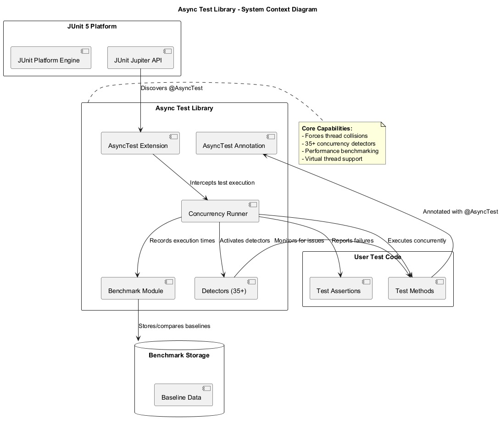
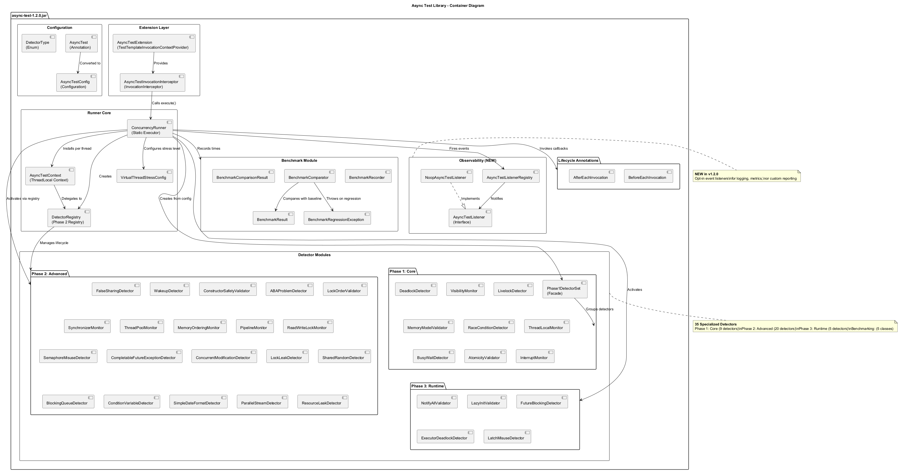
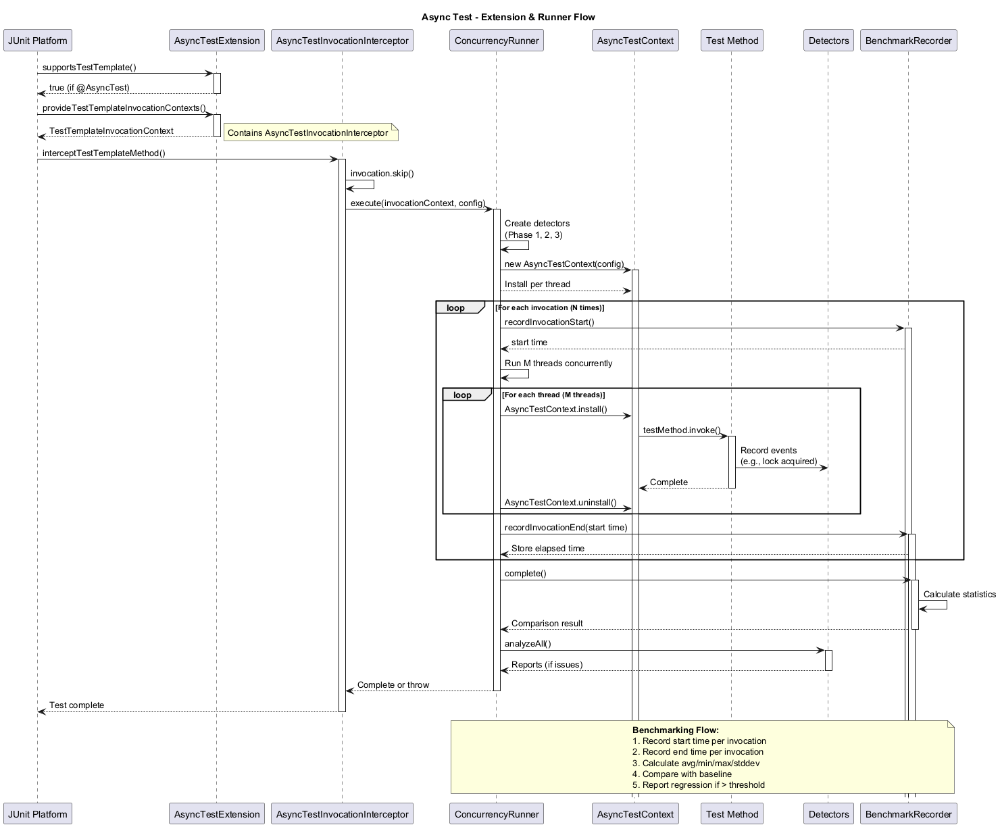
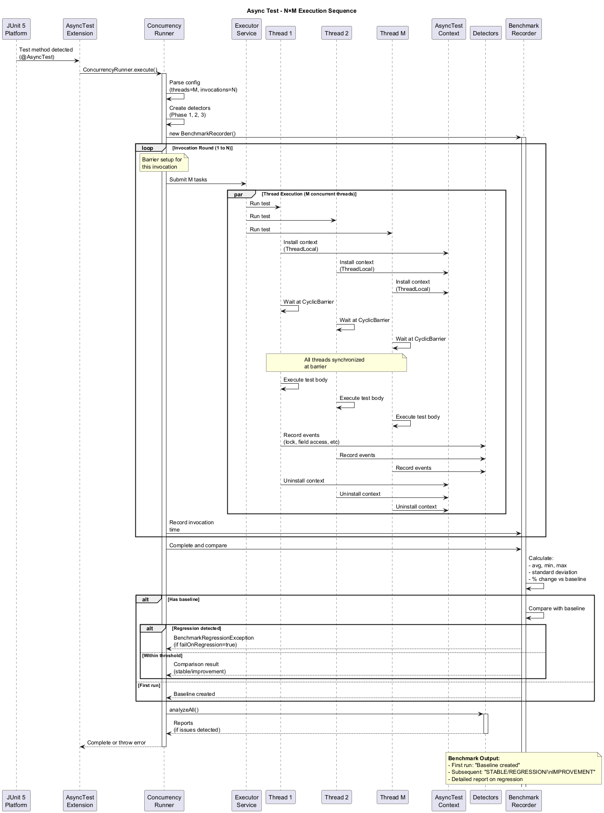
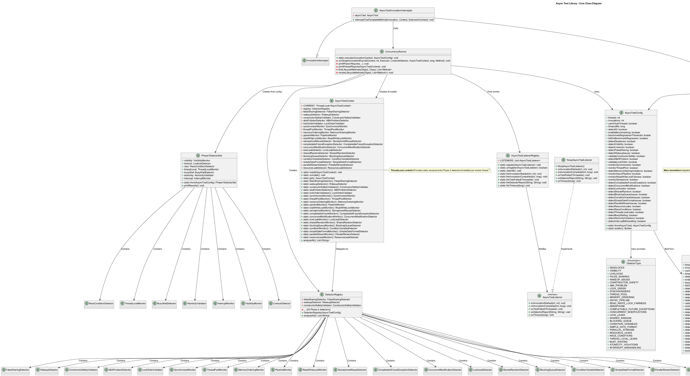
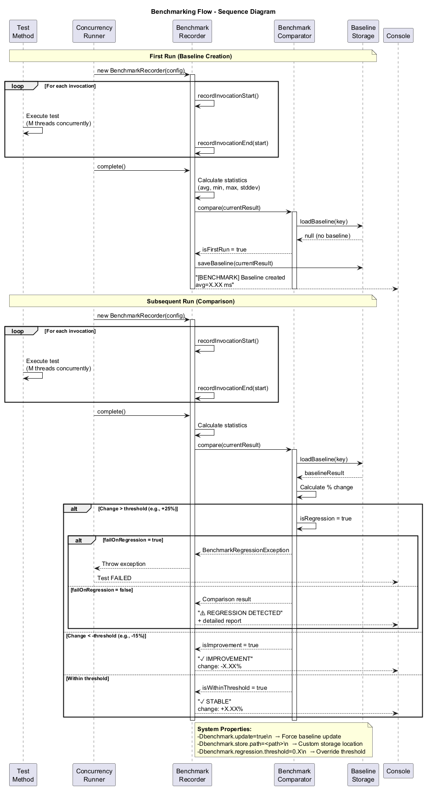
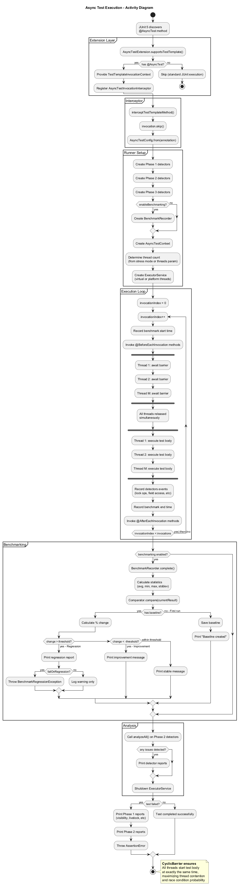
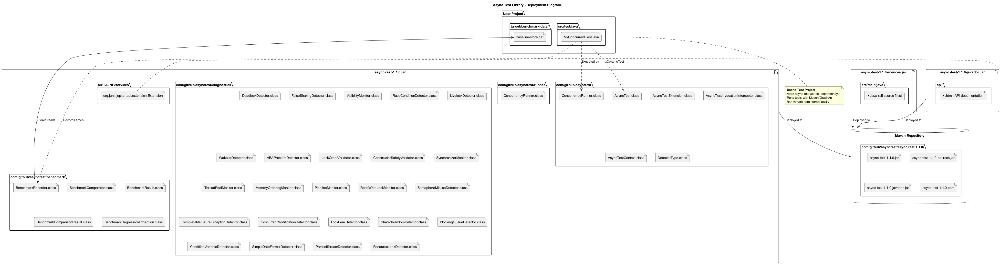
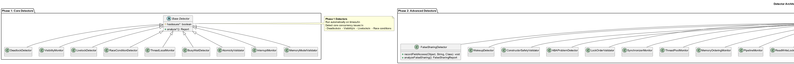

# 🏗️ Async Test Library - Architecture Documentation

## Overview

This document provides a comprehensive architectural overview of the async-test library using PlantUML diagrams. The library enables deterministic concurrency testing by forcing thread collisions and detecting **100 categories** of concurrency bugs across **13 detector phases**.

> **Note (1.6.0):** Several public-API additions and an SPI introduced in 1.6.0 are described in [Reporting Pipeline](#reporting-pipeline-100), [Detector SPI](#detector-spi-100), and [License Guard](#license-guard-100) sections below. The Detector SPI now covers **every** `DetectorType` value via `LegacyDetectorFactories` (was canary-only at SPI introduction); see the Detector SPI section. Phase 13 (5 new detectors) was added end-to-end and is integrated through the same 13-point fan-out as the legacy 95. The PlantUML diagrams elsewhere in this document still reflect the pre-1.6.0 detector wiring; they remain accurate for the legacy registry. Diagrams will be regenerated as part of the next docs sweep.

## Table of Contents

1. [System Context Diagram](#system-context-diagram)
2. [Container Diagram](#container-diagram)
3. [Component Flow Diagram](#component-flow-diagram)
4. [Sequence Diagram - Test Execution](#sequence-diagram---test-execution)
5. [Class Diagram](#class-diagram)
6. [Sequence Diagram - Benchmarking](#sequence-diagram---benchmarking)
7. [Activity Diagram](#activity-diagram)
8. [Deployment Diagram](#deployment-diagram)
9. [Detector Architecture](#detector-architecture)

---

## System Context Diagram

Shows the high-level system architecture and external dependencies.

**Key Components:**
- **JUnit 5 Platform**: Discovers and executes @AsyncTest methods
- **Async Test Library**: Core testing framework with 114 detectors
- **User Test Code**: Tests annotated with @AsyncTest
- **Benchmark Storage**: Persistent baseline data for performance comparison



**Source:** [`system-context.puml`](../docs/diagrams/system-context.puml)

---

## Container Diagram

Shows the main containers/components within the async-test library JAR.

**Main Containers:**
- **Extension Layer**: JUnit 5 integration (`AsyncTestExtension`, `AsyncTestInvocationInterceptor`).
  Since 1.6.0 the extension fans out one `TestTemplateInvocationContext` per
  `@AsyncTest(threadCounts={…})` entry for the schedule matrix.
- **Configuration**: `AsyncTest` annotation, `AsyncTestConfig` (immutable), `Preset` enum
- **Runner Core**: `ConcurrencyRunner`, `AsyncTestContext`, `VirtualThreadStressConfig`,
  `LicenseGuard` (extracted in 1.6.0 — see [License Guard](#license-guard-100))
- **Detector Modules** (114 detectors across 16 phases):
  - Phase 1: Core (3 detectors) — grouped via `Phase1DetectorSet`
  - Phases 2–14: managed by `DetectorRegistry`
- **Reporting** (NEW in 1.6.0 — `se.deversity.async-test-lib.report`):
  `Violation` record, `Formatter` interface, `MarkdownFormatter`, `JsonFormatter`
- **Detector SPI** (NEW in 1.6.0 — `se.deversity.async-test-lib.spi`):
  `Detector`, `DetectorFactory`, SPI-driven `DetectorRegistry`, `adapters/` for canary migrations
- **Diagnostics helpers**: `SiteCapture` (new in 1.6.0) for source-line attribution
- **Benchmark Module**: 5 classes for performance tracking
- **Lifecycle Annotations**: `BeforeEachInvocation`, `AfterEachInvocation`
- **Observability**: `AsyncTestListener`, `AsyncTestListenerRegistry` (with scoped
  `Registration` / `Snapshot` since 1.6.0), `NoopAsyncTestListener`
- **Assertion helpers**: `AsyncAssert.awaitUntil`, `AsyncAssert.capture`,
  `AsyncAssert.awaitAsync` (new in 1.6.0)



**Source:** [`container.puml`](../docs/diagrams/container.puml)

---

## Component Flow Diagram

Shows how the JUnit 5 extension intercepts and executes tests.

**Flow:**
1. JUnit discovers @AsyncTest method
2. AsyncTestExtension provides invocation context
3. AsyncTestInvocationInterceptor skips standard execution
4. ConcurrencyRunner creates detectors and context
5. N×M execution loop (N invocations × M threads)
6. Benchmarking records execution times
7. Detector analysis and reporting



**Source:** [`component-flow.puml`](../docs/diagrams/component-flow.puml)

---

## Sequence Diagram - Test Execution

Detailed sequence showing the N×M execution pattern.

**Key Steps:**
1. JUnit 5 detects @AsyncTest method
2. ConcurrencyRunner.execute() is called
3. Detectors and BenchmarkRecorder are created
4. For each invocation (N times):
   - M threads are submitted to ExecutorService
   - All threads wait at CyclicBarrier
   - Barrier releases all threads simultaneously
   - Each thread executes test body concurrently
   - Events are recorded to detectors
   - Benchmark times are recorded
5. After all invocations:
   - Benchmark comparison with baseline
   - Detector analysis
   - Reports printed if issues detected



**Source:** [`sequence-execution.puml`](../docs/diagrams/sequence-execution.puml)

---

## Class Diagram

Shows the main classes and their relationships.

**Core Classes:**
- **AsyncTest**: Main annotation with 35+ configuration parameters
- **AsyncTestConfig**: Immutable configuration object
- **AsyncTestExtension**: JUnit 5 TestTemplateInvocationContextProvider
- **AsyncTestInvocationInterceptor**: InvocationInterceptor that intercepts test execution
- **ConcurrencyRunner**: Static executor that orchestrates test execution
- **AsyncTestContext**: ThreadLocal context providing detector accessors
- **DetectorType**: Enumeration of all detector types
- **Benchmark Classes**: BenchmarkRecorder, BenchmarkComparator, BenchmarkResult, BenchmarkComparisonResult, BenchmarkRegressionException

**Relationships:**
- AsyncTestExtension provides AsyncTestInvocationInterceptor
- AsyncTestInvocationInterceptor calls ConcurrencyRunner.execute()
- ConcurrencyRunner creates and installs AsyncTestContext per thread
- AsyncTestContext contains all Phase 2 detector instances
- BenchmarkRecorder uses BenchmarkComparator to compare with baselines



**Source:** [`class-diagram.puml`](../docs/diagrams/class-diagram.puml)

---

## Sequence Diagram - Benchmarking

Shows how benchmarking integrates with test execution.

**First Run (Baseline Creation):**
1. BenchmarkRecorder created
2. For each invocation: record start/end times
3. Calculate statistics (avg, min, max, stddev)
4. No baseline exists → save current as baseline
5. Print "Baseline created" message

**Subsequent Runs (Comparison):**
1. BenchmarkRecorder created
2. For each invocation: record start/end times
3. Calculate statistics
4. Load baseline from storage
5. Calculate % change
6. If change > threshold: regression detected
   - If failOnRegression=true: throw BenchmarkRegressionException
   - Else: log warning
7. If change < -threshold: improvement detected
8. Else: stable performance



**Source:** [`benchmark-sequence.puml`](../docs/diagrams/benchmark-sequence.puml)

---

## Activity Diagram

Shows the decision flow during test execution.

**Main Flow:**
1. JUnit 5 discovers @AsyncTest method
2. Extension layer checks for annotation
3. Interceptor skips standard execution
4. Runner setup:
   - Create Phase 1, 2, 3 detectors
   - Create BenchmarkRecorder (if enabled)
   - Create AsyncTestContext
   - Determine thread count
   - Create ExecutorService
5. Execution loop (N invocations):
   - Record benchmark start time
   - Invoke @BeforeEachInvocation methods
   - Fork M threads to barrier
   - All threads released simultaneously
   - Fork M threads to execute test body
   - Record detector events
   - Record benchmark end time
   - Invoke @AfterEachInvocation methods
6. Benchmarking:
   - Calculate statistics
   - Compare with baseline
   - Report regression/improvement/stable
7. Analysis:
   - Call analyzeAll() on detectors
   - Print reports if issues detected
   - Shutdown ExecutorService



**Source:** [`activity-diagram.puml`](../docs/diagrams/activity-diagram.puml)

---

## Deployment Diagram

Shows how the library is deployed and used.

**Artifacts:**
- **async-test-lib-1.6.0.jar**: Main library (~150 KB)
  - Extension layer classes
  - Runner classes
  - 35 detector classes
  - 5 benchmark classes
  - META-INF/services (JUnit extension registration)
- **async-test-lib-1.6.0-sources.jar**: Source code (~350 KB)
- **async-test-lib-1.6.0-javadoc.jar**: API documentation (~450 KB)

**Deployment:**
- Published to Maven repository (GitHub Packages)
- User projects add as test dependency
- Benchmark data stored in `target/benchmark-data/`



**Source:** [`deployment-diagram.puml`](../docs/diagrams/deployment-diagram.puml)

---

## Detector Architecture

Shows the structure and common pattern of all detectors.

**Phase 1: Core Detectors (9 classes)**
- DeadlockDetector, VisibilityMonitor, LivelockDetector
- RaceConditionDetector, ThreadLocalMonitor, BusyWaitDetector
- AtomicityValidator, InterruptMonitor, MemoryModelValidator
- Run automatically on timeout
- Detect core concurrency issues

**Phase 2: Advanced Detectors (20 classes)**
- FalseSharingDetector, WakeupDetector, ConstructorSafetyValidator
- ABAProblemDetector, LockOrderValidator, SynchronizerMonitor
- ThreadPoolMonitor, MemoryOrderingMonitor, PipelineMonitor
- ReadWriteLockMonitor, SemaphoreMisuseDetector
- CompletableFutureExceptionDetector, ConcurrentModificationDetector
- LockLeakDetector, SharedRandomDetector, BlockingQueueDetector
- ConditionVariableDetector, SimpleDateFormatDetector
- ParallelStreamDetector, ResourceLeakDetector
- Opt-in via annotation flags
- Record events during test execution

**Phase 3: Behavioral Detectors (5 classes) — auto-wired via DetectorRegistry**
- RaceConditionDetector, ThreadLocalMonitor, BusyWaitDetector
- AtomicityValidator, InterruptMonitor
- Instantiated and analyzed automatically when their config flags are enabled

**Standalone Validators (5 classes) — manual instantiation**
- NotifyAllValidator, LazyInitValidator, FutureBlockingDetector
- ExecutorDeadlockDetector, LatchMisuseDetector
- Instantiate directly in test code; not wired into DetectorRegistry

**Phase 4: Infrastructure & Resource Management (4 classes)**
- ThreadLeakDetector, SleepInLockDetector, UnboundedQueueDetector, ThreadStarvationDetector
- Detect operational / infrastructure-level concurrency hazards

**Phase 5: Thread-Safety of Common Types (5 classes)**
- CalendarDetector, SharedCollectionDetector, TimerDetector
- CopyOnWriteCollectionDetector, StringBuilderDetector
- Detect misuse of JDK types that are not thread-safe

**Phase 6: Virtual Thread Concurrency — Java 21+ (3 classes)**
- StructuredConcurrencyMisuseDetector — unclosed scopes, skipped join(), unsafe result access
- VirtualThreadContextLeakDetector — ThreadLocal values set but not removed in virtual threads,
  InheritableThreadLocal misuse, excessive ThreadLocal count per virtual thread
- ScopedValueMisuseDetector — ScopedValue.get() outside a binding, unintentional re-binding

**Common Pattern:**
- Abstract base with `analyze*(): Report` and `hasIssues: boolean`
- Concrete detectors implement analysis logic
- Return specific report types (e.g., FalseSharingReport)



**Source:** [`detector-architecture.puml`](../docs/diagrams/detector-architecture.puml)

---

## JDK 25/26 Preview-Era Detectors (Standalone, 1.7.0+)

Three detectors target concurrency features introduced or finalized in JDK 24–26.
They follow the **same `recordXxx(...)` → `analyze(): Report` pattern** as every other
diagnostics detector and are thread-safe (`ConcurrentHashMap` / `newKeySet`-backed), but
they are deliberately **not wired into the `@AsyncTest` execution pipeline**:

- `se.deversity.asynctest.diagnostics.StableValueMisuseDetector` — `StableValue`
  (JEP 502, preview JDK 25 → JDK 26): read-before-set, double-set, reentrant
  `orElseSet` supplier, set-contention.
- `se.deversity.asynctest.diagnostics.StructuredTaskScopeMisuseDetector` —
  `StructuredTaskScope` (JEP 505, fifth preview JDK 25 → final JDK 26): fork-after-join,
  `Subtask.get()` before join, owner-confinement violation, close-without-join.
- `se.deversity.asynctest.diagnostics.GathererConcurrencyMisuseDetector` — Stream
  Gatherers (JEP 485, final JDK 24): stateful gatherer on a parallel stream with no
  combiner, concurrent-integrator shared-state race.

**Why standalone, not pipeline-wired.** Every pipeline detector is addressable via a
`DetectorType` enum constant (used by `excludes` / `includes` / `Preset` / the SPI's
`type()`). `DetectorType` is an `@AILocked` file: adding a constant requires the
synchronized six-place change documented in `CLAUDE.md` (annotation field, config field +
builder default, `from(AsyncTest)`, both `build()` branches, and the registry arm). Rather
than make that locked change in isolation, these three ship as standalone, directly-usable
detectors. They are implemented entirely against `String` keys and `Thread` (no
`java.lang.StableValue` / new `StructuredTaskScope` imports), so they **compile and run on
the project's Java 21 baseline** while modeling APIs that only exist on JDK 24/25/26.

**Usage.** Instantiate the detector (one instance can be shared across an `@AsyncTest`'s
worker threads), call its `recordXxx(...)` methods from the test body, then call
`analyze()` and assert on the returned report's `hasIssues()`. To promote any of them to a
full pipeline detector once a `DetectorType` slot is available: add the enum constant +
config flag, then either add an `AsyncTestContext` accessor (legacy path) or a
`DetectorFactory` + `META-INF/services` line (SPI path) — see [Detector SPI](#detector-spi-100).

---

## Key Design Patterns

### 1. ThreadLocal Context Pattern

**Purpose:** Share detector instances across all worker threads while maintaining thread-safe access.

**Implementation:**
- Runner creates single AsyncTestContext with all detectors
- Each worker thread installs context via `AsyncTestContext.install()`
- All threads access same detector instances concurrently
- Each thread uninstalls via `AsyncTestContext.uninstall()` after completion

### 2. Detector Recording Pattern

**Purpose:** Allow test code to record events for later analysis.

**Implementation:**
- Test code calls static accessor: `AsyncTestContext.falseSharingDetector()`
- Accessor gets context from ThreadLocal
- Returns detector instance
- Test code calls recording method: `recordFieldAccess(this, "counter", long.class)`
- Detector adds event to shared store (thread-safe)
- After test completes, `analyzeAll()` processes all recorded events

### 3. Barrier Synchronization Pattern

**Purpose:** Force all threads to start test body simultaneously for maximum contention.

**Implementation:**
- Runner creates CyclicBarrier with M threads
- Each thread submits task to ExecutorService
- Task calls `barrier.await()` before test body
- All threads block at barrier until last thread arrives
- Barrier releases all threads simultaneously
- Maximum thread contention achieved

---

## Observability (Event Listener System)

The async-test library provides an opt-in observability system via the `AsyncTestListener` interface.

### AsyncTestListener Interface

**Purpose:** Allow users to observe async-test lifecycle events for logging, metrics, or custom reporting.

**Events:**
- `onInvocationStarted(int round, int threads)` — Called before each invocation round
- `onInvocationCompleted(int round, long durationMs)` — Called after each round completes
- `onTestFailed(Throwable cause)` — Called when a test fails
- `onDetectorReport(String detectorName, String report)` — Called when a detector reports an issue
- `onTimeout(long timeoutMs)` — Called when a timeout occurs

### Registration

```java
// Register a custom listener
AsyncTestListenerRegistry.register(new MyCustomListener());

// Unregister later
AsyncTestListenerRegistry.unregister(myListener);

// Clear all listeners (useful for test cleanup)
AsyncTestListenerRegistry.clearAll();
```

### Opt-Out

To silence all output, register a `NoopAsyncTestListener`:

```java
AsyncTestListenerRegistry.register(new NoopAsyncTestListener());
```

### Thread Safety

Listeners may be called from multiple worker threads concurrently. All listener implementations must be thread-safe. The registry uses a `CopyOnWriteArrayList` to allow concurrent iteration without locking.

### Default Behavior

If no listeners are registered, detector reports are printed to `System.err` (backward-compatible behavior). Registering custom listeners does not suppress this default output — both will receive events.

---

## Architecture Principles

### 1. Separation of Concerns

- **Extension Layer**: JUnit 5 integration only
- **Runner Layer**: Test execution orchestration
- **Detector Layer**: Concurrency issue detection
- **Benchmark Layer**: Performance tracking

### 2. Thread Safety

- All detectors are thread-safe
- Shared state protected by concurrent collections
- ThreadLocal for per-thread context isolation

### 3. Opt-in Complexity

- Phase 1: Always on (core detectors: deadlock, visibility, livelock)
- Phase 2: Opt-in via flags (40+ advanced detectors managed by DetectorRegistry)
- Phase 3: Behavioral auto-detectors (race conditions, ThreadLocal leaks, busy-wait, atomicity, interrupt)
- Standalone validators: manual instantiation for targeted legacy-pattern checks
- Benchmarking: Opt-in via flag or system property

### 4. Zero Overhead Default

- Detectors only created when enabled
- No performance impact when not using @AsyncTest
- Benchmarking completely optional

---

## Reporting Pipeline (1.6.0)

In 1.6.0 detector findings gained a structured representation alongside the
historical free-text `String` reports. Both flow through the runner unchanged;
new tooling consumes the structured form.

```
Detector observation (recordAccess, etc.)
        │
        ▼
analyze() → legacy String reports     +     analyze().structuredViolations: List<Violation>
                                                      │
                                                      ▼
                                     Formatter.format(...)
                                     ├── MarkdownFormatter  → PR comments, CI logs
                                     └── JsonFormatter      → dashboards / SARIF / IDE plugins
```

`Violation` (`se.deversity.async-test-lib.report`) is an immutable record:
`(detector, severity: IssueSeverity, message, sites: List<SiteCapture.Site>, attributes: Map<String,Object>, when: Instant)`.
The canonical constructor enforces non-blank `detector`, defaults `sites` and
`attributes` to empty immutables, and stamps `when` with `Instant.now()` if null.

**Source-line attribution** is captured by `SiteCapture.capture()` which performs
a single `StackWalker.walk` and returns the first non-framework `StackFrame` as a
`Site(className, methodName, fileName, lineNumber)` record. Framework frames are
filtered by package prefix (`runner.`, `extension.`, `benchmark.`, JDK reflection,
`java.util.concurrent`, JUnit, Gradle) and class-name suffix (`Detector`,
`Monitor`, `Validator`, `SiteCapture`). Detectors that adopt the helper add
`Set<SiteCapture.Site>` to their per-instance state; the `Set` dedupes by
`(class, line)` so a tight loop on one call site contributes a single
attribution. `SharedMessageDigestDetector` is the canary; other detectors
migrate incrementally.

The two formatters ship with no external dependencies. JSON output uses a small
hand-rolled writer with proper escape handling for `\"`, `\\`, `\n`, `\r`, `\t`,
and control characters (`\\u00xx`).

---

## Detector SPI (1.6.0)

The legacy detector architecture required synchronized edits across five places
(annotation field, config field+builder+defaults, both `build()` branches,
registry instantiation arm) — a documented fan-out risk in `CLAUDE.md`. The SPI
in `se.deversity.async-test-lib.spi` collapses that to **one class + one
META-INF/services line**.

```
META-INF/services/se.deversity.async-test-lib.spi.DetectorFactory
        │
        ▼  ServiceLoader.load(...)
DetectorFactory(s)                              ← user-implemented or built-in
        │
        ▼  build(AsyncTestConfig)
DetectorRegistry                                 ← SPI registry (new package)
        │
        ▼  analyzeAll()
List<Violation>                                  ← structured stream
```

**SPI contracts:**

- `Detector` — `type() → DetectorType`, `analyze() → List<Violation>`, optional
  `onTestStart()` / `onTestEnd()` lifecycle hooks. Per-test instance lifecycle.
- `DetectorFactory` — `type()`, `isEnabledFor(AsyncTestConfig)`,
  `create(AsyncTestConfig)`. `isEnabledFor` reads whichever boolean field on
  `AsyncTestConfig` corresponds to the detector — no automatic mapping (each
  factory is explicit, keeping the addressable surface intact).
- `DetectorRegistry` (in the `spi` package, distinct from the legacy one) —
  `build(config)` discovers via ServiceLoader, filters by `isEnabledFor`,
  instantiates. Two lookup styles: typed `get(Class<T>)` and enum-keyed
  `get(DetectorType)`. `analyzeAll()` aggregates structured violations.

**Full SPI coverage (1.6.0+).** Every `DetectorType` value — all 100 of them —
is registered as a `DetectorFactory` and discoverable via `ServiceLoader`.
Coverage is automated:

- **`LegacyDetectorFactories`** is a single file containing 99 inner-class
  `DetectorFactory` implementations (one per `DetectorType`, excluding the
  one with a dedicated typed adapter). Each declares its `type()`, reads its
  matching `AsyncTestConfig` boolean in `isEnabledFor()`, and produces a
  `LegacyDetectorAdapter` wrapping a fresh detector instance.
- **`LegacyDetectorAdapter<D>`** is the generic SPI `Detector` that reflectively
  invokes `delegate.analyze()` and the resulting report's `hasIssues()` /
  `toString()`, wrapping the toString into a single `Violation` when has-issues
  fires. Detectors whose report doesn't follow the canonical
  `analyze() → Report{hasIssues(), toString()}` shape return an empty list.
- **`SharedMessageDigestDetectorFactory`** is the typed-adapter template: when
  a legacy detector is migrated to expose `structuredViolations` natively,
  its factory uses a typed adapter to project them directly (no reflection).
- **`AllDetectorsSpiCoverageTest`** guards against drift: a new
  `DetectorType` value without a matching factory fails the build with a
  precise list of missing types.

**Coexistence with the legacy registry.** Both registries instantiate
independently and run side-by-side. The legacy
`se.deversity.async-test-lib.DetectorRegistry` continues to drive per-test
execution and owns the `AsyncTestContext` wiring; the SPI registry is the
surface for programmatic discovery, custom user detectors, and incremental
migration of each detector to expose structured violations natively.

---

## License Guard (1.6.0)

Previously `ConcurrencyRunner.execute()` constructed a fresh `LicenseGate` and
called `gate.check(...)` on **every test invocation**, including in mock-mode CI
runs. For a suite with 1000 `@AsyncTest` methods that meant 1000 redundant gate
constructions — pure noise on the hot path and a layering smell (a concurrency
engine should not know about license vendors).

`LicenseGuard` (in `se.deversity.async-test-lib.runner`) now owns the concern:

- `check(config)` is a `ConcurrentHashMap.get()` on a `Fingerprint` derived from
  the resolved license-config fields (account, key, product, store, license,
  mockMode + their System-property fallbacks).
- First call per fingerprint runs the real gate exactly once; all later calls
  with matching fingerprints return immediately.
- "Zero-Config CI" announcement and "LICENSE GRANTED" message are guarded by
  volatile flags so they print at most once per JVM, not per test.
- Denied results still throw `SecurityException` with the original message
  format (no behavior change for failing licenses).

`ConcurrencyRunner.execute()` dropped ~40 lines of license plumbing in favor of
a single `LicenseGuard.check(config)` call.

---

## Worker latch.countDown() guarantee (1.6.0)

The per-worker code in `runSingleInvocationRound` previously placed the
`AsyncTestContext.uninstall()` and `phase1.livelock.captureSnapshot()` calls
**before** `latch.countDown()` inside a single `finally` block. If any of those
cleanup calls threw, `countDown()` was skipped and the runner blocked on
`latch.await(roundTimeoutMs)` until the deadline elapsed — surfacing a
misleading "timed out — possible deadlock" instead of the real cause.

In 1.6.0 the structure is:

```java
boolean installed = false;
try {
    AsyncTestContext.install(phase2Context);
    installed = true;
    try { barrier.await(); method.invoke(target, args); }
    catch (Throwable ex) { failures.add(unwrap(ex)); }
} catch (Throwable installErr) {
    failures.add(installErr);
} finally {
    if (installed) { try { AsyncTestContext.uninstall(); }
                     catch (Throwable e) { failures.add(e); } }
    if (phase1.livelock != null) { try { phase1.livelock.captureSnapshot(); }
                                   catch (Throwable e) { /* warn-only */ } }
    latch.countDown();   // ALWAYS — last statement in the outermost finally
}
```

Each cleanup step is independently guarded so one failure cannot suppress the
next. The `installed` flag preserves the ThreadLocal install/uninstall symmetry
rule from `CLAUDE.md` (only uninstall what was installed).

---

## File Structure

```
src/main/java/se/deversity/asynctest/
├── AsyncTest.java                    # Main annotation (incl. threadCounts, preset, replaySeed since 1.6.0)
├── AsyncTestConfig.java              # Immutable configuration snapshot
├── AsyncTestContext.java             # ThreadLocal context + replaySeed accessor
├── AsyncTestListener.java            # Observability listener interface
├── AsyncTestListenerRegistry.java    # Listener registry (+ scoped Registration/Snapshot since 1.6.0)
├── NoopAsyncTestListener.java        # No-op listener for opt-out
├── DetectorRegistry.java             # Legacy detector lifecycle (powers existing 90+)
├── DetectorType.java                 # Detector enumeration
├── Preset.java                       # NEW in 1.6.0 — curated detector bundles
├── BeforeEachInvocation.java         # Lifecycle annotation
├── AfterEachInvocation.java          # Lifecycle annotation
├── AsyncAssert.java                  # Async assertion helper (+ awaitAsync since 1.6.0)
├── extension/
│   ├── AsyncTestExtension.java       # JUnit 5 extension (matrix fan-out since 1.6.0)
│   └── AsyncTestInvocationInterceptor.java  # Interceptor (threadCount override since 1.6.0)
├── runner/
│   ├── ConcurrencyRunner.java        # Main execution engine
│   └── LicenseGuard.java             # NEW in 1.6.0 — process-wide license cache
├── diagnostics/                      # 100 detector implementations across 13 phases
│   ├── Phase1DetectorSet.java        # Phase 1 detector group
│   ├── SiteCapture.java              # NEW in 1.6.0 — source-line attribution helper
│   ├── DeadlockDetector.java
│   ├── ... (95 more across phases 1–12)
│   ├── DaemonThreadHygieneDetector.java   # NEW in 1.6.0 — Phase 13
│   ├── NotifyWithoutMonitorDetector.java  # NEW in 1.6.0 — Phase 13
│   ├── SharedSecureRandomDetector.java    # NEW in 1.6.0 — Phase 13
│   ├── WeakHashMapSharedDetector.java     # NEW in 1.6.0 — Phase 13
│   ├── JdbcConnectionSharedDetector.java  # NEW in 1.6.0 — Phase 13
│   ├── StableValueMisuseDetector.java          # NEW in 1.7.0 — standalone, JDK 25/26 (JEP 502)
│   ├── StructuredTaskScopeMisuseDetector.java  # NEW in 1.7.0 — standalone, JDK 25/26 (JEP 505)
│   ├── GathererConcurrencyMisuseDetector.java  # NEW in 1.7.0 — standalone, JDK 24+ (JEP 485)
├── report/                           # NEW package in 1.6.0 — structured reporting
│   ├── Violation.java                # (detector, severity, message, sites, attributes, when)
│   ├── Formatter.java                # functional interface List<Violation> → String
│   ├── MarkdownFormatter.java        # PR comments / CI logs
│   └── JsonFormatter.java            # dashboards / SARIF / IDE plugins
├── spi/                              # NEW package in 1.6.0 — Detector SPI
│   ├── Detector.java                 # SPI interface: type(), analyze(), lifecycle hooks
│   ├── DetectorFactory.java          # ServiceLoader-discovered factory
│   ├── DetectorRegistry.java         # SPI-driven registry (coexists with legacy)
│   └── adapters/
│       ├── LegacyDetectorAdapter.java               # generic reflective wrapper
│       ├── LegacyDetectorFactories.java             # 99 inner-class factories (1 per DetectorType)
│       └── SharedMessageDigestDetectorFactory.java  # typed canary adapter (template)
└── benchmark/                        # Benchmarking module
    ├── BenchmarkRecorder.java
    ├── BenchmarkComparator.java
    ├── BenchmarkResult.java
    ├── BenchmarkComparisonResult.java
    └── BenchmarkRegressionException.java

src/main/resources/META-INF/services/
└── se.deversity.async-test-lib.spi.DetectorFactory  # NEW in 1.6.0 — ServiceLoader registration
```

---

## Diagram Source Files

All PlantUML source files are located in [`docs/diagrams/`](../docs/diagrams/):

| Diagram | Source File | PNG File |
|---------|-------------|----------|
| System Context | `system-context.puml` | `SystemContext.png` |
| Container | `container.puml` | `ContainerDiagram.png` |
| Component Flow | `component-flow.puml` | `ComponentFlow.png` |
| Sequence Execution | `sequence-execution.puml` | `SequenceExecution.png` |
| Class Diagram | `class-diagram.puml` | `ClassDiagram.png` |
| Benchmark Sequence | `benchmark-sequence.puml` | `BenchmarkSequence.png` |
| Activity | `activity-diagram.puml` | `ActivityDiagram.png` |
| Deployment | `deployment-diagram.puml` | `DeploymentDiagram.png` |
| Detector Architecture | `detector-architecture.puml` | `DetectorArchitecture.png` |

To regenerate diagrams, see [`docs/diagrams/README.md`](../docs/diagrams/README.md).

---

## Related Documentation

- [BENCHMARKING.md](BENCHMARKING.md) - Detailed benchmarking guide
- [USAGE.md](../USAGE.md) - User guide with examples
- [README.md](../README.md) - Project overview

---

## Refactoring Summary (v1.2.0)

The following structural improvements were made to address code quality concerns:

### 1. Break Up Large Classes

**AsyncTestContext** (539 lines → ~150 lines)
- Extracted `DetectorRegistry` to handle detector instantiation and analysis
- AsyncTestContext now focuses on ThreadLocal lifecycle and public API accessors

**ConcurrencyRunner** (350 lines → ~200 lines)
- Extracted `Phase1DetectorSet` to group Phase 1 detectors
- Eliminates long parameter lists in helper methods

### 2. Reduce Tight Coupling

- `Phase1DetectorSet.from(AsyncTestConfig)` encapsulates detector creation
- `Phase1DetectorSet.printReports()` owns Phase 1 report printing logic
- ConcurrencyRunner now depends on the facade, not individual detectors

### 3. Memory Management

- ThreadLocal cleanup ensured in `runSingleInvocationRound` finally block
- `uninstall()` called before `latch.countDown()` to prevent context leaks
- `ThreadLocal.remove()` properly clears thread state

### 4. Observability (NEW)

- `AsyncTestListener` interface for lifecycle event callbacks
- `AsyncTestListenerRegistry` for thread-safe listener management
- `NoopAsyncTestListener` for opt-out of default output
- Events: invocation start/complete, test failure, detector reports, timeout

### New Classes

| Class | Package | Purpose |
|-------|---------|---------|
| `DetectorRegistry` | `se.deversity.async-test-lib` | Phase 1–3 detector lifecycle |
| `Phase1DetectorSet` | `se.deversity.async-test-lib.diagnostics` | Phase 1 detector grouping |
| `AsyncTestListener` | `se.deversity.async-test-lib` | Observability interface |
| `AsyncTestListenerRegistry` | `se.deversity.async-test-lib` | Listener registration |
| `NoopAsyncTestListener` | `se.deversity.async-test-lib` | No-op listener for opt-out |

---

## High-Precision Contention Engine (1.6.0+)

Four architectural improvements that address the baseline's contention precision, observer
effect, manual instrumentation overhead, and late detection of Loom pinning sites.

---

### 1. SpinContentionBarrier — Lock-Free Busy-Spin Barrier

**Package:** `se.deversity.async-test-lib.runner`

#### Baseline limitation
`CyclicBarrier` parks threads via `LockSupport.park()`.  When the last thread arrives it
wakes sleeping threads through the OS scheduler.  Threads are released staggered over
20–100 µs, dispersing the execution window and reducing the probability of triggering
true microsecond-level memory-ordering races.

#### Design
`SpinContentionBarrier` replaces OS-level parking with a VarHandle acquire/release spin:

- A `volatile int currentPhase` field (protected with manual cache-line padding `long` fields
  on both sides) tracks the barrier generation.
- An `AtomicInteger arrivalCount` is incremented by each arriving thread.
- The **last** thread to arrive resets `arrivalCount` to 0 and publishes the new phase via
  `VarHandle.setRelease`.  All spinners observe the change via `VarHandle.getAcquire` and
  return simultaneously within a sub-microsecond window.
- `Thread.onSpinWait()` emits the `x86 PAUSE` / `ARM YIELD` hint to reduce pipeline stalls
  during the spin, and the interrupt flag is checked every 64 iterations for clean teardown.

#### Integration
`ConcurrencyRunner.createBarrier(threads)` returns a `ContentionBarrier` functional interface.
Enable the spin variant at runtime with:

```
-Dasyc-test.spin-barrier.enabled=true
```

The default remains `CyclicBarrier` to preserve compatibility with virtual-thread schedulers
that are not benefit from busy-spinning platform threads.

---

### 2. TelemetryEventBuffer + TelemetryRegistry — Lock-Free Ring Buffer

**Package:** `se.deversity.async-test-lib.telemetry`

#### Baseline limitation
Synchronous writes to thread-local lists during detector `recordAccess()` calls change the
scheduling pattern of the recording thread — the overhead of a lock acquisition or stack
trace capture slows the thread enough to prevent the race from manifesting
(**Heisenbug / observer effect**).

#### Design — TelemetryEventBuffer
An MPSC (multi-producer single-consumer) ring buffer modelled after the
[LMAX Disruptor](https://lmax-exchange.github.io/disruptor/) pattern:

| Concern | Solution |
|---------|----------|
| Slot claim (producer) | `AtomicLong.getAndIncrement()` — no lock, no CAS loop |
| Publication signal | `VarHandle.setRelease` on the per-slot `sequence` field |
| Consumer ordering | `VarHandle.getAcquire` check before processing each slot |
| Allocation on hot path | Zero — all `AccessEvent` slots are pre-allocated at construction |
| Capacity | Power-of-two (default 16 384); oldest events overwritten on overflow |

**Key API:**

```java
buffer.publish(threadId, "ClassName#fieldName", isWrite); // producer hot path
buffer.drain(callback);                                    // single consumer thread
```

#### Design — TelemetryRegistry
Global singleton that owns the shared buffer and a daemon drain thread (scheduled at 1 ms
intervals).  The `recordAccess(threadId, className, methodName)` path is designed to be
allocation-free and lock-free.

---

### 3. AsyncTestAgent — Java Agent Bytecode Instrumentation

**Package:** `se.deversity.async-test-lib.agent`  
**Dependency:** `net.bytebuddy:byte-buddy`

#### Baseline limitation
Detectors that rely on manual `recordFieldAccess("count", count)` calls require production
code to carry testing hooks, coupling production and test concerns and polluting JIT profiling.

#### Design
`AsyncTestAgent` is a [Byte Buddy](https://bytebuddy.net) Java agent that instruments
getter/setter methods at class-load time:

```
JVM startup → premain() → AgentBuilder intercepts non-JDK classes
                        → FieldAccessAdvice.enter() injected before each getter/setter
                        → TelemetryRegistry.recordAccess() called transparently
```

The `FieldAccessAdvice.enter` advice method is inlined at the call site by Byte Buddy (not
called via reflection), so it does not appear in stack traces and incurs minimal overhead
after JIT compilation.

**Scope guards** prevent recursive instrumentation of `java.*`, `jdk.*`, `sun.*`, and
`se.deversity.async-test-lib.*` itself.

#### Attachment
The library JAR is agent-capable — its MANIFEST contains:
```
Premain-Class: se.deversity.async-test-lib.agent.AsyncTestAgent
Can-Retransform-Classes: true
Can-Redefine-Classes: true
```

Attach with:
```
-javaagent:async-test-lib-<version>.jar
```

---

### 4. StaticPinningScanner — Compile-Time Pinning Pre-Scanner

**Package:** `se.deversity.async-test-lib.analysis`  
**Dependency:** `org.ow2.asm:asm`

#### Baseline limitation
`VirtualThreadPinningDetector` finds pinning at runtime, but only if the pinning code path
is exercised during the stress-test window.  Rarely-executed synchronized blocks that call
blocking operations go undetected until production load triggers them.

#### Design
`StaticPinningScanner` walks compiled `.class` files using the ASM bytecode library and flags
any method that calls a **blocking JDK method** while inside a `MONITORENTER` block:

```
MONITORENTER detected → monitorDepth++
Method call detected  → if monitorDepth > 0 && isBlockingMethod(owner, name) → PinningSite
MONITOREXIT detected  → monitorDepth--
```

The `BLOCKING_METHODS` set covers `Thread.sleep`, `Object.wait`, socket I/O,
`FileInputStream/OutputStream`, `Selector.select`, `Process.waitFor`,
`Condition.await*`, and `BlockingQueue.take/put`.

**Key API:**

```java
// Scan a single class from its bytes
List<PinningSite> sites = StaticPinningScanner.scanClass(classBytes);

// Scan all .class files under a build output directory
List<PinningSite> sites = StaticPinningScanner.scanDirectory(Path.of("target/classes"));

// Use as a JUnit @BeforeAll guard
@BeforeAll
static void noPinningSites() throws IOException {
    var sites = StaticPinningScanner.scanDirectory(Path.of("target/classes"));
    assertTrue(sites.isEmpty(), "Pinning sites detected:\n" + sites);
}
```

**Known limitation:** nesting depth is tracked per method body only.  Cross-method
synchronization (e.g. a `synchronized` method calling a blocking helper) is not detected
without inter-procedural analysis.

---

### Component Map (1.6.0)

```
runner/
  SpinContentionBarrier      ← lock-free barrier; enabled via system property
  ConcurrencyRunner          ← createBarrier() selects spin vs. cyclic at runtime

telemetry/
  TelemetryEventBuffer       ← MPSC ring buffer, zero allocation on publish()
  TelemetryRegistry          ← global singleton; daemon drain thread

agent/
  AsyncTestAgent             ← premain entry; Byte Buddy AgentBuilder
  FieldAccessAdvice          ← inlined Advice; calls TelemetryRegistry.recordAccess

analysis/
  StaticPinningScanner       ← ASM ClassVisitor; produces List<PinningSite>
```

---

**Last Updated**: May 2026
**Version**: 1.6.0-SNAPSHOT
