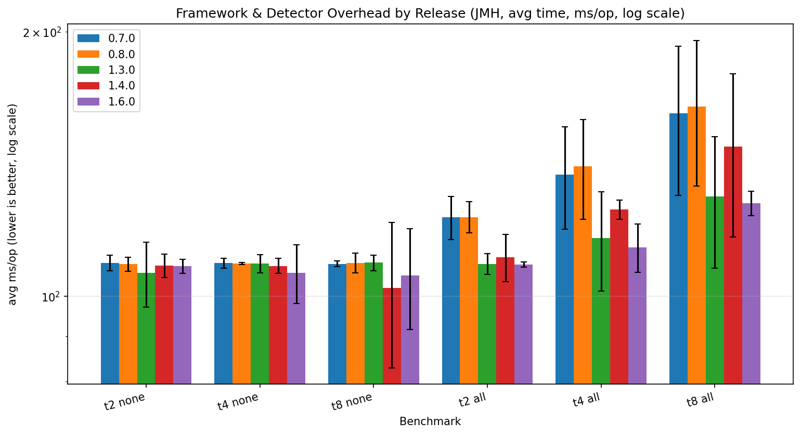
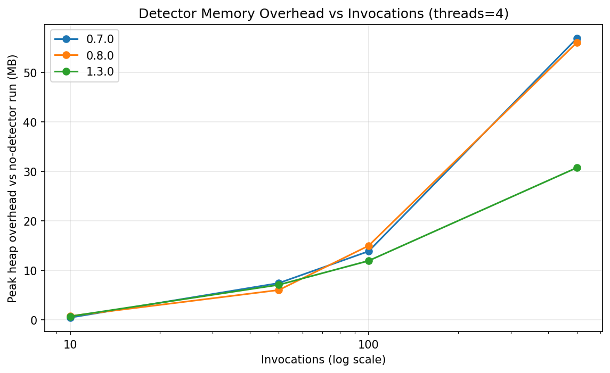

# Changelog

All notable changes to this project will be documented in this file.

The format is based on [Keep a Changelog](https://keepachangelog.com/en/1.1.0/),
and this project adheres to [Semantic Versioning](https://semver.org/spec/v2.0.0.html).

## [Unreleased]

### Fixed: two dead static-analysis exclusions, and a Gradle gate CI never ran

Audited every rule the build suppresses by emptying each config in turn and reading what the
analysers then reported. Of 12 PMD exclusions, 11 still cover live violations; `AvoidCatchingThrowable`
covered none, because PMD 7.26.0's quickstart ruleset no longer contains that rule, and PMD had been
printing "Exclude pattern 'AvoidCatchingThrowable' did not match any rule" on every Maven and Gradle
run. Of 20 SpotBugs `Match` blocks, 19 are live; `DP_DO_INSIDE_DO_PRIVILEGED` matched nothing in any
module, which its own comment predicted (SecurityManager is gone on Java 21). Both are removed. The
`URF_UNREAD_FIELD` block covering the whole `runner` package fired on one class, `SpinContentionBarrier`,
so it is now scoped to that class and an unread field in any other runner class is reported again.
`CRLF_INJECTION_LOGS` said 24 findings and is now 36.

`gradle-tests.yml` gained a `./gradlew pmdMain spotbugsMain` step. Gradle hangs those tasks off
`check`, and the job ran `test`, `publishToMavenLocal` and `assemble`, so the Gradle PMD and SpotBugs
configuration had never been executed by any workflow. Maven ran the same rules over the same sources
throughout, so nothing was unchecked, but the comment in `build.gradle.kts` claiming the gate was
being exercised was wrong.

Verified with the analysers, not with the docs: 88 SpotBugs findings in `async-test-lib` and 2 in
`async-test-agent` with the filter emptied, 772 PMD violations with the exclusions removed, both back
to 0 with the trimmed configs. Checkstyle was checked the same way, by adding a star import to a main
source, and it failed the build as it should; its empty `checkstyle-result.xml` is the plugin's
incremental cache, not an inert gate.

## [1.9.4] - 2026-08-16

### Changed: every hand-pinned dependency bumped, and a skill that repeats it

Dependabot watches the reactor root and nothing else, so the satellites had drifted: the 137
examples were on JUnit 5.10.2, `consumer-fixture` on 6.0.3, the language fixtures one to five
toolchain releases behind. All of it now sits on the latest release: JUnit 6.1.3 everywhere,
Groovy 5.1.0 with gmavenplus 5.1.0, Scala 3.8.4 with scala-maven-plugin 4.9.10, Clojure 1.12.5,
Surefire 3.5.6 in the fixtures, logback 1.6.3 in the Gradle build, vibetags 1.2.2 in the reactor
(which regenerated one guardrail rule file). Held back on purpose and reported instead:
`intellij-plugin/` (no workflow builds it), the Gradle wrapper (already current), the japicmp
baseline and the library's own version pins. `.claude/skills/bumpdeps/` (`bump-deps.sh`,
`latest-version.sh`, `verify.sh`) is the repeatable pass: a rule table of every satellite pin,
pre-releases filtered, and the verification sequence that ran here: fast suite 1844/0, Gradle
build, both fixtures on both builds (consumer-fixture 273/0, langs 8/0 plus 2 clojure.test),
examples 01 and 128, load-tests compile.

### Added: `@AsyncTest` from Kotlin, Groovy, Scala and Clojure, proven on every build

`consumer-fixture-langs/` drives the published artifact from each of the four languages with
the same two classes: an unguarded write that `RaceConditionDetector` must report and a
guarded twin it must not, both asserted through `AsyncFindings` in `@AfterAll`. It runs on
JDK 21 and 25 in the e2e consumer-fixture job (Maven, all four) and in the Gradle job (Kotlin,
Groovy, Scala). [docs/JVM_LANGUAGES.md](JVM_LANGUAGES.md) records what each language needs:
Groovy 5 refuses the plugin's 1.8 bytecode default; Scala `var` accessors are `x()`/`x_$eq()`
and invisible to the agent's default accessor weaving; Clojure needs `#=(int N)` for `int`
annotation elements, `^{:static true}` on the signature vector for `@AfterAll`, and AOT plus a
Surefire include. No library code changed. The investigation and the two open items (a
programmatic runner for Spock/ScalaTest/kotest/`clojure.test`, and Scala accessor weaving)
are in [analysis/jvm-languages-plan.md](analysis/jvm-languages-plan.md).

The release bump script now rewrites only `<async-test.version>` / `<async-test-lib.version>`
property pins, not any `<foo.version>` that happens to equal the release: a dry run bumped
`clojure-maven-plugin` 1.9.3 to a 1.9.4 that does not exist.
### Added: `AsyncTestRunner`, the engine without the annotation

`AsyncTestRunner.run(config, body)` runs a body the way `@AsyncTest` runs a method: N threads, M
rounds, one barrier per round, the detectors the config selects, the same licence gate, timeout
and `failOn` semantics, and it returns the run's `AsyncFindings`. It exists for the test
frameworks a Jupiter `@TestTemplate` cannot run inside of: Spock, ScalaTest, MUnit, kotest and
`clojure.test`. It is an adapter over the unchanged `ConcurrencyRunner`, so the Critical engine
did not move. Two things a caller must know, both in [USAGE.md](USAGE.md#running-without-the-annotation-asynctestrunner-194):
detectors are opt-in on the builder (the annotation defaults to `detectAll = true`, the builder
to nothing), and every programmatic run shares one identity,
`AsyncTestRunner$BodyHolder#run`, in the log events and the finding baseline. Pinned by
`AsyncTestRunnerTest` (N x M count on several threads, context installed, body failure as the
engine's `AssertionError` with the body's exception as cause, findings returned, collector
closed, `failOn` gate applies, timeout is the engine's `AssertionError`) and reachable from a
consumer by `ConsumerProgrammaticRunnerTest`. New public API; ships as patch 1.9.4 by owner
decision (as 1.9.1 did), so `@since` and the docs say 1.9.4.

### Added: a licence notice on unlicensed runs

A run that proceeds without a validated commercial key (mock mode, CI auto-mock, or a free-mail
address) now prints a three-line notice to stderr, once per JVM: the library is PolyForm
Noncommercial 1.0.0, business use needs a commercial licence, prices are at
<https://deversity.se/pricing.html> and the contact is peter.isberg@deversity.se. It goes on the
report channel rather than SLF4J so a consumer with no logging binding still sees it, and it has no
off switch: a validated key is the off switch. Runs granted by an offline file, a cached
validation, the outage grace policy or `LICENSE_VALID` stay silent, so paying customers never see
it. Pinned in both directions by `LicenseGuardTest` (mock prints once across two fingerprints) and
`KeygenValidateKeyContractTest`, `OfflineLicenseGuardTest` and `LicenseGuardLemonSqueezyTest` (a validated key or offline file does not print).

### Added: the guardrail layer can go red

A self-audit against the *Vibe Architecture* health scorecard
([analysis/vibe-architecture-scorecard.md](analysis/vibe-architecture-scorecard.md)) found the
usual shape: mechanisms that existed and nothing that checked them. Each is now a gate or a lane.

- **`guardrails.yml`**: `guardrail-drift` fails when a clean build regenerates any committed
  guardrail file differently; `locked-files` fails a PR that touches an `@AILocked` element
  (`lock-override` label for a reviewed detector wiring); `diagrams` regenerates the code-karta
  SVGs and fails on structural drift. The committed diagrams were 27 node titles stale.
- **`DocsIndexCoverageTest`**: every document under `docs/` is routed from `INDEX.md`, every
  relative link resolves. Five documents were unrouted. `DetectorCatalogCoverageTest` now scans
  the agent-facing files too, where the last stale detector counts lived.
- **`CoreFlowsBddTest`** executes `features/core-flows.feature` (five core `@AsyncTest`
  behaviours) against the real engine with a two-way scenario/binding match.
- **`mutation.yml`** runs PIT weekly and on demand against the pom's 74% threshold;
  `CONTRIBUTING.md` had claimed a schedule that did not exist.
- **Review lanes**: `inquisitor.yml` (adversarial reviewer against `.github/INQUISITOR.md`,
  skips loudly without a key), `copilot-review.yml` (verifies the request landed),
  `.github/MODEL-ROSTER.md` (model per lane, pinned).
- **`evals/`**: an instruction-eval task bank (four rules, deterministic detectors) wired to
  PRs that edit the instruction files.
- `CLAUDE.md` is on the context diet: 232 to 168 lines, opening with a 15-line invariant list
  that names the enforcing gate per line; the moved prose lives verbatim in `docs/BUILDING.md`
  and `docs/ARCHITECTURE.md`. `consultation-loop` skill; PR template asks for provenance and
  proposed-not-added dependencies.
- **Second pass, same day, Copilot Free as the only AI lane:** `WorkflowInputHygieneTest` (no
  untrusted event text in a `run:`/`script:`/`prompt:` block), `RunnerAllocationBudgetTest`
  (80,000 bytes per body execution ceiling, calibrated red-first at 3.0x), a nightly load-test
  trend comparison (`load-tests/tools/compare-baseline.sh`, warn-only), the Keygen validate-key
  contract replayed against a loopback stand-in, `Baseline` files carrying `# format-version: 1`
  with a data-at-rest rule in `SUPPORT_POLICY.md`, fuzzing on PRs that touch the config surface,
  and the eval bank measured on the Copilot CLI (two of four rules bind; the two that do not
  already had a build-failing gate). Required checks on `main` now include the three guardrail
  gates and the ubuntu test leg. Scorecard: 42 to 66 of 66.

## [1.9.3] - 2026-08-14

### Fixed

- **Eighteen `registerX` methods discarded everything observed about their subject.** They
  installed a fresh state object on every call, and an `@AsyncTest` body runs once per thread - so
  a consumer registering inside it registers once per worker, and each worker's accesses ended up
  in state that had seen a single thread. Every finding phrased as "more than one thread touched
  this" was then unreachable for those detectors. Because it depends on interleaving and on
  identity hash codes, it was not reliably absent either: three detectors surfaced it on one CI
  leg each while passing everywhere else, one only under JUnit 5.9.3. `BlockingQueueDetector`,
  `ConcurrentModificationDetector`, `ConditionVariableDetector`, `CountDownLatchDetector`,
  `CyclicBarrierDetector`, `ExchangerDetector`, `ForkJoinPoolDetector`, `PhaserDetector`,
  `ReentrantLockDetector`, `ScheduledExecutorDetector`, `SemaphoreMisuseDetector`,
  `SharedRandomDetector`, `SimpleDateFormatDetector`, `StampedLockDetector`,
  `ThreadFactoryDetector`, `ThreadPoolDeadlockDetector`, `ThreadStarvationDetector` and
  `VolatileArrayDetector` are now first-registration-wins, and
  `RegistrationIsIdempotentTest` fails on the nineteenth. `record*` methods that begin an episode
  were deliberately left alone: replacing state there can be correct, and changing them without
  evidence would be a guess.

- **`GathererConcurrencyMisuseDetector.registerGatherer` discarded earlier observations.** It did
  an unconditional `put`, so a consumer registering the gatherer inside the concurrent body -
  which is what an `@AsyncTest` body is, since it runs once per thread - had each worker's
  registration reset the previous one's `integratingThreadIds`. The "integrator ran on more than
  one thread" finding could never reach two threads, so the detector was silent under exactly the
  parallelism it polices. Now `putIfAbsent`, matching the first-registration-wins convention
  already documented in `SharedMessageDigestDetector` and `DaemonThreadHygieneDetector`.
- **`VirtualThreadPinningDetector` reported pinning that no longer pins on JDK 24+.**
  `PinningReport.hasIssues()` was made to delegate to `hasEffectivePinningIssues()` in 1.9.2
  precisely so that a `synchronized` event, non-pinning since JEP 491, is not reported as a
  defect a user cannot act on. `DetectorRegistry.analyzeAllNamed()` — the path that builds the
  report a user actually reads — bound `hasPinningIssues()` instead, which counts obsolete
  events, so the fix never reached the report. On JDK 24+ this surfaced a finding for correct
  code. Now binds `hasIssues()`.
- **Five detectors lost records when two threads raced to register a shared instance.**
  `SharedRandomDetector`, `SimpleDateFormatDetector`, `CacheConcurrencyDetector` (both record
  paths) and `LockLeakDetector.recordLockReleased` auto-registered per-instance state with
  `get`, a null check and a `put`. Two threads touching an instance for the first time both saw
  `null`, both built a state, and the second `put` discarded the first, so each thread
  accumulated into its own object and the surviving state recorded a single thread.
  `SharedRandomDetector` and `SimpleDateFormatDetector` therefore went **silent** under exactly
  the contention they exist to find; `LockLeakDetector` ran the other way and **invented a leak**
  in correct code, because a dropped release leaves acquires above releases.
  `LockLeakDetector.recordLockAcquired` had already been fixed, with a comment describing this
  hazard - the release path was missed. All five now use `computeIfAbsent`.

- **`RecordMutableComponentLeakDetector` was silent for every record a consumer declares.** It
  reads each component through `RecordComponent.getAccessor().invoke(...)`, which is rejected for
  a record declared outside this library's packages - and `read()` returned `null` on failure, so
  no component looked mutable, no component looked changed, and the detector reported nothing for
  a record two threads were plainly sharing. Its own unit tests could not catch it: they declare
  their fixture records next to the detector, where the accessor needs no widening. `read()` now
  widens access before invoking, and falls back to the previous behaviour if a module system
  refuses. Found by the consumer fixture asserting detection rather than reachability.

- **License tests wrote their validation cache to the developer's home directory.**
  `LicenseValidationCache` records each successful validation under `~/.asynctest` unless
  `license.cache.dir` says otherwise, and only two of the four license test classes set it. Every
  fork of the build and every previous run shared that directory - this machine had accumulated
  162 records - so a test asserting a denial could find a record on disk, take the outage grace
  path, and get no `SecurityException` at all. That is why
  `LicenseGuardLemonSqueezyTest.deniedGuidanceMentionsTheLemonSqueezyProperties` and
  `LicenseGuardNetworkModeTest.reachableButErroringValidator_failsClosedWhenNothingEverValidated`
  failed on a CI runner while passing everywhere else. `LicenseGuardLemonSqueezyTest` and
  `LicenseGuardTest` now use a `@TempDir` cache, and the network-mode test asserts its "nothing
  ever validated" precondition instead of assuming it. Verified: after deleting `~/.asynctest`,
  a full suite run leaves zero records behind.

### Added

- **Every consumer fixture file now asserts detection.** All 27 files in
  `consumer-fixture/.../detectors` record what their detectors watch for and assert the finding
  comes back out through `AsyncFindings` - or, where the fixture deliberately demonstrates the
  correct pattern, assert the detector stays silent. `FixtureDetectionContractTest`'s debt list
  is empty, and a new fixture file cannot be added without one assertion or the other.
  Detectors reporting across the fixture run went from 20 to the full set.
- **`SleepInLockDetector`'s virtual-thread blind spot is pinned.** It establishes whether a lock
  is held by asking `ThreadMXBean`, which returns nothing for a virtual thread, so on
  `@AsyncTest`'s default virtual-thread workers it cannot fire at all.
  `SleepInLockDetectorTest` records the limitation and its retirement condition; the fixture
  proves the firing direction with `useVirtualThreads = false` and says why it has to.
- Roughly thirty fixtures could never have failed and now can. The recurring causes, all worth
  knowing when writing a new one: the subject was allocated per invocation so nothing was
  shared; the fixture demonstrated the fix rather than the hazard; an id was invented where
  `recordScopeOpened` / `recordTaskStart` return the one the detector knows; a threshold was
  never crossed; or two halves of a finding were recorded against different identities.


- **Five more consumer fixture files assert detection** (Phase01, Phase03, Phase19, Phase20,
  Phase21), taking the debt list from 21 files to 16. Converting them surfaced one detector bug
  (above) and four fixtures that could never have failed: `visibility` allocated its flag per
  invocation so no value could diverge, `threadLocalLeaks` called `remove()` in a finally block
  and so demonstrated the fix rather than the leak, `platformThreadPerTask` created two unstarted
  threads against a churn threshold of 16, and `staticInitDeadlock` recorded one half of a
  wait-for cycle and then completed it.
- `DetectorFixtureSupport.assertNoneReported(...)`, the true-negative direction. Some fixtures
  deliberately demonstrate the correct pattern - `tryLock` released, an interrupt restored, a
  retry loop that makes progress - and for those, silence is the behaviour worth pinning;
  demanding a finding would demand that correct code be flagged. `DeadlockDetector`,
  `LivelockDetector` and `InterruptMonitor` now carry that assertion instead of a false one.

- **The consumer fixtures now assert detection, not only reachability.** Every file in
  `consumer-fixture/.../detectors` enables one `DetectorType` per fixture and runs a realistic
  workload for it, which reads like end-to-end coverage. It was not: the load-bearing assertion
  was `reachable(...)`, which proves the accessor resolves on the published artifact and says
  nothing about whether the detector still detects. Measured before the change: of 23 fixture
  files, 18 called no `record*` method at all, ~100 fixtures ran their hazard past a detector
  that observed nothing, and one test in the whole module asserted a finding. Phase05, Phase11
  and Phase17 are converted - they record the access a consumer would record and assert through
  `AsyncFindings` in `@AfterAll`. Detectors reporting anywhere in the fixture run went from 20
  to 34, 15 of them now asserted rather than incidental.
- **`FixtureDetectionContractTest`** holds the ratchet: a converted fixture file cannot drop
  back to reachability-only, and a new one cannot be added without either asserting detection or
  being argued onto the pinned debt list in review.
- `DetectorFixtureSupport.assertAllReported(...)`, the companion to `reachable(...)`. Its
  failure message names which detectors in the class did report, which is usually enough to
  locate a missing recording call.
- **`ReportingPathPredicateTest`**, gating the class of bug above: every `ifIssue(...)` line in
  `analyzeAllNamed()` must bind `hasIssues()`, the predicate `LegacyDetectorAdapter` resolves
  for the SPI `Violation` pipeline and `DetectorFiringContractTest` requires every report to
  expose. The reporting path picked its predicate by hand, once per detector across ~135 lines,
  and nothing made the two paths ask the same question. Three further bindings
  (`hasFairnessIssues`, `hasLeaks`, `hasDeadlockRisk`) were aliases of `hasIssues()` by
  coincidence rather than by contract, and are now bound canonically.
- **`SharedTypeAccuracyEvalTest`**, extending the buggy-vs-synchronized-twin eval to all 19
  detectors in the `Shared*` family, the largest cluster in the catalogue. Measured: 19 of 19
  fire on unguarded sharing, 2 of 19 stay silent on the `synchronized(instance)` twin. The 17
  that fire on correct code are pinned rather than hidden, and the pin can only shrink. This
  test is what found the lost-update bug above: the true-positive column was red on first run.
- **`DetectorRegistrationRaceTest`**, pinning the property that made those bugs findable - a
  detector's verdict must not depend on whether two threads raced to register the instance,
  compared by running the identical recordings barrier-released and then strictly sequenced.
  Carries an anti-vacuity guard requiring the sequenced run to fire, so the comparison cannot
  pass by both runs finding nothing.
- `docs/analysis/detector-accuracy-eval.md` gains the Shared* family table and the
  lost-update account; the evaluated set goes from 7 of 135 detectors to 26.

## [1.9.2] - 2026-08-13

> Versioning note: as in 1.9.1, this ships as a patch by explicit owner decision. Strictly it is
> additive — `TelemetryRegistry.clearCallbackIf(expected)` is new public API, and `fields=true`,
> `-Dasynctest.agent` and `-Dasynctest.validate.jmm` are new configuration — which the
> SUPPORT_POLICY.md table would make 1.10.0. Nothing was removed or changed incompatibly.
> This is also the release that re-pins the japicmp baseline to 1.9.1, so it is the first one
> whose API-compatibility gate actually compares against the preceding release.

### Added

- **Direct field weaving in the agent (`fields=true`).** The agent bound `Advice` to
  `isGetter()` / `isSetter()`, so a bare `counter++` inside a method — the shape of most real
  races, and the README's own headline example — produced no events under any configuration.
  `FieldAccessWeaver` now instruments the field instructions themselves. Opt-in, because it
  weaves every field access in every matched class; pair it with `includes=`. See
  [AGENT.md](AGENT.md#32-launch-flag-with-arguments).
- **`-Dasynctest.agent=<agentArgs>`** attaches the agent from inside the run, so field weaving is
  reachable without resolving a `-javaagent` jar path that differs per machine and changes every
  release. Degrades to a single `runner.agent.attach.failed` warning when the artifact is absent
  or the JVM forbids self-attachment.
- **`-Dasynctest.validate.jmm`** gates the JVM memory-model self-check, which previously ran on
  every test method.
- **`TelemetryRegistry.clearCallbackIf(expected)`** — a compare-and-clear so a finishing bridge
  releases only its own registration.

### Fixed

- **Six detectors could not emit a `Violation` under any input.** `LOCK_ORDER` and
  `CONSTRUCTOR_SAFETY` name their report methods `validateLockOrder()` /
  `validateConstructorSafety()` while the adapter looked up a method named exactly `analyze`;
  `VIRTUAL_THREAD_PINNING`, `THREAD_POOL_DEADLOCK`, `READ_WRITE_LOCK_FAIRNESS` and
  `COMPLETABLE_FUTURE_COMPLETION_LEAKS` had no `hasIssues()` on their reports. Every failure path
  in `LegacyDetectorAdapter.analyze()` returns an empty list, so all six looked healthy while
  being silently inert. New `DetectorFiringContractTest` fails on that shape.
- **A throwing `@AfterEachInvocation` destroyed the round's failure.** Hooks ran in a bare
  `finally`, and Java discards the in-flight exception when a `finally` throws, so a
  `RoundTimeoutError` with its thread dump and per-worker causes was replaced by "teardown method
  threw". The hook failure is now attached as suppressed. Workers are also quiesced before
  teardown on the failure path.
- **A finishing test could blind a concurrently running one.** `TelemetryBridge.close()` cleared
  the registry callback unconditionally, so the run that lost the single callback slot could, on
  finishing first, silence the run that legitimately held it — which then detected nothing and
  passed green.
- **Class-level `@AsyncTest` with plain `@Test` methods** ran single-threaded with no barrier, no
  detectors and no licence check, and passed. Now warns once per class, naming the method and the
  spelling that would have worked. It warns rather than fails because mixing async templates with
  ordinary unit tests is legitimate and indistinguishable at runtime.
- **False positives on correct code.** `BlockingQueueDetector` treated a rejected `offer()` and a
  null `poll()` as findings — both are what a bounded queue returns when working, and the
  canonical backpressure and drain-loop idioms produce them by construction; they are now counts,
  with saturation the only finding. `VisibilityMonitor` no longer asserts "Missing 'volatile'",
  a cause its value-only recording API cannot establish. `StaticPinningScanner` no longer reports
  `Selector.selectNow` or `Socket.get*Stream`, which the JDK documents as non-blocking.
- **`StaticPinningScanner` aborted the whole scan on one unparseable `.class` file**, failing the
  consumer's build over a stray artefact. Unreadable files are skipped.
- **`premain` could abort JVM startup.** `install()` had no exception handling and calls a class
  deliberately not shaded into the agent jar; a throw there kills the JVM before `main`. It also
  claimed the at-most-once gate before the fallible work, so a failure wedged the JVM with no
  transformer and every later `selfAttach()` silently no-opping.
- **Racy counters** in `ExchangerDetector`, `ForkJoinPoolDetector`,
  `DoubleCheckedLockingDetector` and `BlockingQueueDetector` are now atomics.
- **japicmp compared against 1.6.0** across six releases, leaving every API added in 1.7.0–1.9.1
  unguarded. Re-pinned to 1.9.1 with the obsolete excludes removed, and re-pinning is now a step
  in [RELEASE.md](RELEASE.md#2-bump-the-version).
- **`bump-version.sh` bumped the japicmp baseline along with everything else**, which would have
  undone that re-pin on the very next release: `<oldVersion>` moved to the version being cut, so
  the gate would have compared the release against itself, on a coordinate not yet on Central. The
  rewrite and the missed-pin check now both skip the `<oldVersion>` block. Verified by running
  the shipped script and the fixed one over the same clean checkout: the first moved the baseline
  to 1.9.2, the second left it at 1.9.1 while still moving all 285 other pins.
- **Load tests had never measured the current build.** The workflow pinned `1.6.0` on every
  automatic trigger and resolved it from Maven Central, making the preceding `publishToMavenLocal`
  dead weight; the Gradle-side fallback was `1.3.0`. Both literals are gone — the version comes
  from `pom.xml`.
- **A Jazzer crash could not turn anything red**, surfacing only as a 30-day artifact on a green
  weekly job. Findings now fail the run.
- **Documentation counts.** Documents variously claimed 35, 100, 111, 114, 127, 128 or 135 detectors;
  `DETECTOR_CATALOG.md` numbered only 128 of its 135 entries, leaving an apparent gap at 121–127
  that read as seven missing detectors when they were merely lettered A–F. All entries are now
  numbered 1–135, and `DetectorCatalogCoverageTest` pins both the catalog and the prose against
  `DetectorType`.

## [1.9.1] - 2026-08-11

> Versioning note: by the SUPPORT_POLICY.md table the new licensing configuration options
> (`license.file`, `license.network.mode`, `license.cache.*`, `keygen.base.uri`) would make this
> a minor release (1.10.0). It ships as patch 1.9.1 by explicit owner decision; docs and javadoc
> that said "since 1.10" while this work was unreleased now say 1.9.1. No public Java API
> changed. (This originally read "japicmp green against 1.9.0". It was not: `<oldVersion>` was
> pinned to 1.6.0 at the time, so the comparison against 1.9.0 never ran. Corrected in 1.9.2,
> which re-pins the baseline and adds the re-pin to the release checklist.)


### Added — enterprise licensing: offline files, outage grace, validation caching

- **Offline license files** (`-Dlicense.file=<path>`): Ed25519-signed, verified inside the JVM
  against the vendor key embedded in `OfflineLicense`, with no network and no provider account.
  The sanctioned path for air-gapped and egress-blocked CI. Product, expiry and email binding
  (`domain` / `exact` / `none`) are enforced; every anomaly fails closed with a named
  `OFFLINE_*` reason and never falls back to online validation or CI auto-mock. Files are issued
  with `tools/IssueOfflineLicense.java`; operator flow in docs/LICENSING.md Part 3.
- **Outage grace** (`-Dlicense.network.mode`, default `grace`): a `NETWORK_ERROR` fails a
  licensed build only when the provider is reachable and no prior successful validation of the
  same configuration is on record. A licensing-provider outage or an egress-blocked runner no
  longer fails paying customers' builds; fabricated or rejected credentials still do. `strict`
  restores unconditional fail-closed. Pinned by `LicenseGuardNetworkModeTest`, written failing
  first against the old behaviour.
- **Validation caching** (`license.cache.ttl.hours`, default 24; `license.cache.dir`, default
  `~/.asynctest`): successful online validations are recorded as a SHA-256 hash of the
  configuration (never the key) and honoured across JVMs, so `forkEvery = 1` suites stop making
  one licensing API call per test-class JVM.
- `keygen.base.uri` system property to point the Keygen validator at a stand-in host in tests,
  matching the existing `ls.api.base.uri`.

### Added — real-licensing end-to-end tests (operator machine)

- `RealKeygenLicenseE2eTest` and `RealOfflineLicenseE2eTest` exercise the real Deversity AB
  licence against the live Keygen account and the real Ed25519-signed offline file - the only
  tests that prove a genuine grant end to end (everything else is hermetic by design). Both run
  in strict network mode with the validation cache disabled, so neither CI auto-mock, outage
  grace nor a cached validation can produce the green; each pins the denial direction too
  (same-domain decoy, foreign domain, tampered file). They assume the `ATL_E2E_*` environment
  from `~/.config/deversity/e2e-license.env` and skip cleanly everywhere else, including CI.

### Changed — guard-on-self synchronization awareness for three flagship detectors

- `RaceConditionDetector`, `SharedMessageDigestDetector` and `SharedStatefulCryptoDetector`
  now probe `Thread.holdsLock(<tracked instance>)` on the accessing thread at record time.
  Accesses serialized by the shared object's own monitor — the `synchronized (theInstance)`
  idiom and synchronized methods of the instance — count as guarded: a fully guarded
  instance or round produces no finding, a partially guarded one still fires. Three pinned
  false positives in `DetectorAccuracyEvalTest` flipped to true negatives (the eval now
  measures 9 synchronized twins, 6 silent); guards on any other lock object remain
  invisible and are pinned as the remaining false-positive class in
  docs/analysis/detector-accuracy-eval.md. `AtomicityValidator` is unchanged because its
  recording API carries no object reference to probe; extending the probe across the rest
  of the Shared* family is the documented follow-up. The probe is a JVM intrinsic over the
  current thread's own lock records, so it adds no synchronization to the racing threads
  it observes.

## [1.9.0] - 2026-08-10

### Added — three virtual-thread-era detectors (Phase 21)

- **`VIRTUAL_THREAD_POOLING`** (`VirtualThreadPoolingDetector`) — flags virtual threads being
  pooled or reused across tasks, the anti-pattern JEP 444 calls out directly. A registered
  `ThreadPoolExecutor` whose factory manufactures virtual threads is identified by probing the
  factory with one unstarted, discarded thread; a virtual thread observed executing more than
  one recorded task is flagged as reuse. Pooling virtual threads caps concurrency at the pool
  size and carries `ThreadLocal` state across tasks.
- **`PLATFORM_THREAD_PER_TASK`** (`PlatformThreadPerTaskDetector`) — flags thread-per-task
  execution on platform threads: a registered `newThreadPerTaskExecutor` backed by a platform
  factory (learned from one no-op probe task), and recorded platform-thread churn of 16+
  creations with at least half already terminated. Long-lived pool workers stay silent; the
  fix is virtual threads or a bounded pool.
- **`SHARED_SPLITTABLE_RANDOM`** (`SharedSplittableRandomDetector`) — flags `SplittableRandom`
  and JEP 356 `RandomGenerator` instances accessed from more than one thread. Unlike
  `java.util.Random` (thread-safe but contended), these corrupt silently: the state update is
  a plain read-modify-write. `Random` subclasses are excluded — they belong to
  `SHARED_RANDOM`, `SHARED_SECURE_RANDOM`, and `THREAD_LOCAL_RANDOM_MISUSE`.

All three follow the record-and-analyze SPI shape, ship with `AsyncTestContext` accessors
(`virtualThreadPoolingDetector()`, `platformThreadPerTaskDetector()`,
`sharedSplittableRandomDetector()`), and are on by default under `detectAll`. The detector
count moves from 132 to 135.

### Added — an assertion surface for detector findings

- **`AsyncFindings`** — collects the structured `Violation` behind every finding and turns the
  common checks into one call: `assertReported(name)`, `assertReported(name, severity)`,
  `assertNotReported(name)`, `assertNone()`, plus `violations()` / `violationsFrom(name)` for
  anything else. Until now the only programmatic hook was `onDetectorReport(String, String)`, so
  a test asserting "this run reported a race" had to substring-match a report written for
  humans. Collect around the run and assert after it, with `failOn = FailOn.NONE` so the
  findings are assertable rather than fatal. A null or blank detector name is rejected with
  `IllegalArgumentException` rather than matching nothing, which would make `assertNotReported`
  pass forever on a typo. See
  [docs/ASYNC_ASSERT.md](ASYNC_ASSERT.md#asserting-on-detector-findings-asyncfindings-190).
- **`AsyncTestListener.onViolation(Violation)`** — the structured callback the collector is
  built on, fired for every finding alongside the two string callbacks. `Violation.attributes()`
  keeps the full report text under the key `"report"`. Default no-op, so existing listeners are
  unaffected. `AsyncTestListenerRegistry.fireViolation(violation)` publishes one directly.
- **`AsyncAssert.awaitUntil(condition, timeout, description)`** and the four-argument overload:
  the timeout message names the wait, counts the evaluations and reports the last exception the
  condition threw, which is now attached as the `AssertionError`'s cause instead of discarded.
- **`AsyncAssert.capture(CompletionStage)`**, and `FutureCapture.isSuccess()`, `isFailed()`,
  `requireResult()`. `getResult()` returns `null` for "still running", "failed" and "completed
  with null" alike; `requireResult()` separates the three.

### Fixed

- **`awaitUntil` no longer reports a timeout for a condition that was true inside the window.**
  The condition is now evaluated after the last sleep rather than only before it, and a poll
  interval longer than the remaining budget is clamped to it instead of slept through. It is
  therefore always evaluated at least once, including at `Duration.ZERO`, where the old loop
  could fail without ever calling it.
- **Repeated worker failures are grouped in the aggregate message.** N threads hitting one
  defect produced N identical lines and N identical suppressed stack traces, burying the
  failures that differed. Identical failures now collapse to one line with a count (`x3`), and
  one representative per distinct failure is attached. The thread count in the header is
  unchanged.
- `FutureCapture.awaitDone` timing out now says "Future did not complete within N ms" instead of
  "Condition not met within N ms".

## [1.8.0] - 2026-08-08

### Added — Phase 20: five detectors for FFM, VarHandle, record and class-init hazards (127 → 132)

- **`CONFINED_ARENA_THREAD_ESCAPE`** — a `MemorySegment` from `Arena.ofConfined()` (FFM API,
  final in JDK 22) touched by a thread that does not own the arena, or used after the arena
  closed. Confinement is asked of the JVM via `MemorySegment.isAccessibleBy` rather than inferred
  from the observed thread set, so the finding is a verdict at CRITICAL; where that method is
  unavailable the detector falls back to the recorded owner and reports at MEDIUM with wording
  that says what is unverified.
- **`SHARED_MEMORY_SEGMENT_RACE`** — overlapping byte ranges of a shared `MemorySegment` touched
  concurrently with at least one write. Carries an optional lock model: pass a `guard` label to
  `recordAccess` and overlapping accesses that agree on a monitor stay silent, so disagreeing
  locks report at HIGH while unguarded overlap reports at MEDIUM. Use after close is CRITICAL.
- **`VAR_HANDLE_NON_ATOMIC_UPDATE`** — the `VarHandle` counterpart of
  `ATOMIC_NON_ATOMIC_UPDATE`: a `get` followed by a `set` where `compareAndExchange` was needed.
  The access mode does not excuse it, and the detector says so — `getVolatile` then
  `setVolatile` loses updates as readily as the plain pair. A second rule reports plain-mode
  access to a location several threads share, which has no ordering even on a `volatile` field.
- **`RECORD_MUTABLE_COMPONENT_LEAK`** — records shared across threads whose components hold
  mutable state. Components are fingerprinted on first sight and re-read at analysis time, so a
  component that actually changed is reported at HIGH as an observed fact while an unexercised
  `ArrayList` component is reported at MEDIUM as a structural hole. `java.util.concurrent`
  components are deliberately not reported.
- **`STATIC_INIT_DEADLOCK`** — deadlocks between class initializers, which
  `ThreadMXBean.findDeadlockedThreads()` cannot see because a class initialization lock is
  neither a monitor nor an ownable synchronizer. A recorded wait-for cycle reports at CRITICAL;
  with no instrumentation the detector samples live threads for `<clinit>` frames and reports
  the shape at HIGH.

All five are wired into `detectAll`, the `DetectorType` enum, `@AsyncTest` flags,
`AsyncTestConfig`, the registry, the SPI factory list and `AsyncTestContext` accessors, and
carry both-direction tests: each fires on the buggy shape and stays silent on the correct twin
of that same code.

### Added — `SarifFormatter`: findings as SARIF 2.1.0 for code scanning

`new SarifFormatter().format(violations)` renders a report GitHub code scanning accepts, so a
concurrency finding lands as an annotation on the pull request rather than as text buried in a
job log. Severity maps to both `level` and `security-severity`, and each detector becomes a
distinct SARIF rule so findings can be triaged per detector.

A concurrency bug has no single location — the interleaving involves at least two sites — so the
first captured site becomes the SARIF location and the rest are attached as related locations. A
finding whose detector captured no site is emitted without a location rather than being pinned to
an arbitrary line that is not the problem. Marked `@API(status = EXPERIMENTAL)`: the output shape
may change while the mapping settles.

### Added — stable JPMS module names for the three published artifacts

`async-test-lib`, `async-test-agent` and `async-test-analysis` now declare
`Automatic-Module-Name` (`se.deversity.asynctest`, `se.deversity.asynctest.agent`,
`se.deversity.asynctest.analysis`). Without it the module name is derived from the jar file name,
which makes every consumer's `requires` clause hostage to an artifact rename.

### Added — a JUnit compatibility matrix, governance files and a Kotlin example

- `e2e-tests.yml` runs the suite against JUnit 5.9.3, 5.10.5, 5.11.4, 5.12.2, 5.13.4, 6.0.3 and
  6.1.2. The supported floor is 5.9.3 because that matrix passes on it, not because a release
  note says so. The job also asserts the resolved `junit-jupiter-api` version matches the
  declared one, so the matrix cannot quietly test a single version seven times.
- `CONTRIBUTING.md`, `CODE_OF_CONDUCT.md`, `docs/SUPPORT_POLICY.md`, issue templates and a pull
  request template.
- `examples/128-kotlin-lost-update` — a lost update in Kotlin, so the examples cover a second JVM
  language.
- `docs/CI_INTEGRATION.md` plus trust tiers and baselines in `docs/DETECTOR_CATALOG.md`,
  `docs/USAGE.md` and `docs/BUILDING.md`.

### Fixed — a supplied licence key is now validated in CI instead of auto-mocked past

`LicenseGuard` decided "this run has no credentials, mock it" from the presence of a Keygen
operator token. Customers are never issued one, so every paying customer's CI run took the mock
path and announced GRANTED without the key they had paid for ever being checked — an expired,
revoked or fabricated key passed identically, in the environment where builds actually run. The
decision is now keyed off the licence key itself, with an operator token still counting when
present.

A key supplied against the placeholder provider coordinates the library ships with is also no
longer granted. That state cannot be validated by anyone, and granting it is the worst of the
three outcomes: the customer believes they are licensed, the check never ran, and an invalid key
is indistinguishable from a valid one. The run now fails closed and names the missing property.

### Changed — VibeTags 1.0.0 → 1.0.3

Picks up the reactor fixes in the annotation processor that generates this repository's AI
context files. Build-time only; nothing in the published artifacts changes.

## [1.7.3] - 2026-08-07

### Fixed — six soundness holes in the detection engine

An audit of the core detection mechanics under JMM edge cases found six mechanical defects
that made the library miss, misreport, or mask the bugs it exists to catch:

1. The runner analyzed detector state while cancelled workers still ran. On a round timeout, a
   `ConcurrentModificationException` inside one detector was silently swallowed as an empty
   report, on exactly the timeout runs that need the diagnosis. `execute()` now quiesces the
   executor (`shutdownNow` plus a bounded 2s wait, tunable via `-Dasync-test.quiesce.grace.ms`)
   before any analysis, and logs each surviving worker's stack (`runner.quiesce.stuck-worker`)
   if quiescing doesn't finish in time.
2. `isTimeoutLike()` sniffed failure messages for "timed out", so a user assertion mentioning
   those words was rewrapped as a harness timeout and the replay-seed line was never printed.
   Runner timeouts now carry a `RoundTimeoutError` marker type and routing is instanceof-based.
3. `SpinContentionBarrier` livelocked under virtual threads: neither `onSpinWait()` nor
   `interrupted()` is a virtual-thread scheduling point, so with more participants than
   carriers the spinners held every carrier and the round burned its full timeout reporting
   zero detections. Virtual-thread runs now ignore the spin property.
4. `VisibilityMonitor` threw a `NullPointerException` into the user's test body on a recorded
   null — the canonical stale-read value. Nulls now map to a sentinel and participate in
   variation analysis normally. Its semantics were also inverted: it flagged any value change
   across rounds (a false-positive machine on ordinary counters) and could not flag two threads
   seeing different values within one round (the actual stale-read signature). It now reports a
   field only when two threads observed two distinct values within a single round.
5. `RaceConditionDetector` merged distinct objects on identity-hash collision (about 50% odds
   near ~54k live recorded objects); keys are now referent-identity (`==`) with the hash cached.
   Its record path also serialized racing threads on a shared lock, a probe effect that can mask
   the very race being hunted; per-field storage is now a `ConcurrentLinkedQueue`.
6. Telemetry `publish()` into a full ring with no consumer spun forever, hanging every woven
   thread and, once the shutdown hook had stopped the drain, JVM shutdown itself. Producers now
   claim slots with a compare-and-set and drop after 1s of zero consumer progress
   (`droppedCount()` exposes it); the periodic drain also survives a callback
   `StackOverflowError` instead of being cancelled.

Both `RaceConditionDetector` and `AtomicityValidator` also paired accesses *across* rounds and
reported them as races, even though the runner totally orders rounds through the runner thread
- the common case under virtual threads, where every round brings fresh thread ids. Both
detectors now stamp each record with a per-round invocation epoch and only pair same-epoch
accesses; same-round pairs still flag correctly.

### Removed — `UNCOMMITTED_CHANGES`: the git-status environment check leaves the detector set

**Breaking.** `UncommittedChangesDetector` inspected the working tree (`git status
--porcelain`), an environment-hygiene property rather than a concurrency one, and its
subprocess once accounted for 99% of the whole analysis sweep. Removed across the full
synchronized set: the `DetectorType` constant, the deprecated `detectUncommittedChanges`
annotation attribute, the config field/builder/resolution line, both registries, the SPI
factory and its `builtin-detector-factories` entry, the `AsyncTestContext` accessors, the
consumer fixture and its Phase 9 coverage class, `examples/09-uncommitted-changes-detection`,
and the documentation (catalog renumbered). Suites that want the old behavior can run
`git status --porcelain` as a build step outside the test JVM.

## [1.7.2] - 2026-08-07

### Added — `FLOW_PUBLISHER_CONCURRENCY`: the first Flow API detector (detector 128)

`java.util.concurrent.Flow` was the one JDK concurrency API with no detector at all.
`FlowPublisherConcurrencyDetector` records `onSubscribe` / `request` / bracketed `onNext` /
terminal signals and reports three reactive-streams contract violations: overlapping `onNext`
delivery (rule 1.3, HIGH — observed via a concurrent-delivery high-water mark, not inferred),
signals after a terminal signal (rule 1.7, HIGH), and deliveries exceeding recorded demand
(rule 1.1, MEDIUM with conditional wording, and only when at least one `request()` was
recorded, so partial instrumentation cannot fake an overrun). Wired through the full
synchronized set (enum, annotation attribute, config, both registries, SPI factory list,
`AsyncTestContext.flowPublisherConcurrencyDetector()` accessor) and verified by the existing
wiring gates.

### Changed — local `mvn test` runs the plain-JUnit tier; CI still runs everything

The 22 `EngineTestKit` meta-test classes plus the two agent end-to-end classes now carry
`@Tag("e2e")` (via the `@E2E` meta-annotation) and are excluded from the default local
`mvn test` / `gradlew test` run — measured on 2026-08-05 they were 48.5% of in-test time for
4.9% of the tests. The `e2e` Maven profile clears the exclusion and auto-activates on the `CI`
environment variable, so every GitHub Actions workflow (tests, publish, gradle) still runs the
full suite with no flag changes; locally `-P e2e` / `-Pe2e` opts in. The jacoco check gate is
skipped (and logs the skip) when the e2e tier is excluded, because that tier carries most
`runner/` and `extension/` coverage; CI always enforces it. `E2eTagGuardTest` pins the tag set
in both drift directions. See `docs/analysis/test-profiles-and-detector-gaps.md` for the
measurements and design.

## [1.7.1] - 2026-08-05

### Added — a LemonSqueezy licence can now actually license a run

`@AsyncTest` accepted a `lemonSqueezyStore` attribute and an `-Dls.store.subdomain` property, but
neither had any effect on whether a run was licensed. Both fed `LicenseConfig`'s checkout-URL
builder, which by its own javadoc never calls the LemonSqueezy API. `LicenseGate.check` had a
single validation path — Keygen — so a real LemonSqueezy key was posted to Keygen and denied.
Selling a licence on LemonSqueezy therefore did not produce a licence this library would accept.

Requires **common-license-lib 0.4.0**, which adds the validator this release drives.

Opt in with `-Dlicense.provider=lemonsqueezy`:

| Property | Meaning | Default |
|---|---|---|
| `license.provider` | `keygen` or `lemonsqueezy` | `keygen` |
| `ls.store.id` | Numeric store id; **required** for LemonSqueezy | — |
| `ls.product.id` | Optional narrower product scope | unset |
| `ls.email.binding` | `domain` or `exact` | `domain` |
| `ls.api.base.uri` | Override the API host; for tests | LemonSqueezy |

`ls.store.id` is not optional, because `POST /v1/licenses/validate` is unauthenticated and
answers for every store on LemonSqueezy — without a store scope, a key bought from an unrelated
vendor validates. Default binding is by **email domain**, so one company purchase covers every
developer on the buyer's domain; `exact` narrows it to the buying address for per-seat licensing.

[docs/LICENSING.md](LICENSING.md) is the new end-to-end runbook: issuing a licence, the flags to
send a customer, what an expiry looks like, and how renewal works. The `/newcustomerlicense`
skill automates the issuing side.

### Fixed — CI auto-mock could report GRANTED without validating anything

`LicenseGuard`'s zero-config CI path mocks the licence when `GITHUB_ACTIONS`/`CI` is set and no
key is present, where "no key" was tested as *no Keygen API key*. A correctly configured
LemonSqueezy run supplies no Keygen key, so that run would have silently mocked itself in CI and
logged `LICENSE GRANTED` while validating nothing. The test is now per-provider: LemonSqueezy
counts as configured when a store id and licence key are present. The Keygen path is unchanged.

`license.provider`, `ls.store.id`, `ls.product.id` and `ls.email.binding` are part of
`LicenseGuard`'s cache fingerprint, so changing a provider or store within one JVM recomputes the
decision rather than reusing a cached grant.

### Compatibility

No change for existing users. The provider defaults to `keygen`, so a build that names no
provider behaves exactly as it did in 1.7.0. No public API was added, removed or changed — the
whole surface is system properties.


## [1.7.0] - 2026-08-04

### Added — a dependency inventory with a reasoned entry per library

[docs/DEPENDENCIES.md](DEPENDENCIES.md) lists every third-party library ordered by how far it
travels toward a consumer's classpath, names each version's `pom.xml` property instead of
repeating the number, and replaces the stale dependency section in DISTRIBUTION.md (which still
claimed JUnit 5.10.2 and zero runtime dependencies). ArchUnit moved 1.4.2 → 1.5.0 and PITest
1.25.8 → 1.25.9 — the only two of sixteen third-party versions Dependabot had not already
caught up.

### Changed — supply-chain hardening closed or resolved all 19 Scorecard alerts

Workflow actions in demo.yml, gradle-tests.yml and load-tests.yml now pin to commit SHAs like
the rest of the repo; the demo workflow's pip install is hash-verified via
`tools/demo/requirements.txt` and its agg binary pins a release version checked against the
published sha256; demo.yml's token is read-only at workflow level; sbom.yml dropped an unused
`packages: write`. The eight structural alerts (wrapper jars, branch protection, solo-maintainer
code review, external registrations, required job-level writes) are dismissed with recorded
reasons.

### Fixed — the published agent jar aborted every consumer JVM it was attached to

`-javaagent:async-test-agent-<version>.jar`, the attach flag AGENT.md documents, was fatal in
every 1.7.0 release candidate: the jar shipped without Byte Buddy, the JVM resolves
`AsyncTestAgent`'s method signatures before `premain` runs, and the resulting
`NoClassDefFoundError: net/bytebuddy/matcher/ElementMatcher` escalates to `FATAL ERROR in native
method: processing of -javaagent failed` — the consumer's test JVM never starts. Nothing caught it
because no gate ever attached the packaged jar standalone: the agent's own tests run with Byte
Buddy on the module test classpath, and downstream suites use the library without the agent.

The agent jar now bundles `byte-buddy` and `byte-buddy-agent`, relocated to
`se.deversity.asynctest.agent.shaded.bytebuddy` (11.7 KB → ~5.2 MB). Relocation rather than plain
bundling, so the copy cannot collide with a consumer's own Byte Buddy — Mockito's, typically. The
published pom no longer declares Byte Buddy at all (dependency-reduced pom), so `selfAttach()`
consumers also stop pulling it transitively; the relocated copy inside the jar serves both attach
modes. The ignore-matcher prefix for `net.bytebuddy.` is now assembled at runtime so relocation
cannot rewrite the literal — consumers' unrelocated Byte Buddy stays unwoven, pinned by the
existing `ignoreMatcher_ignoresByteBuddyClasses`.

The gate is `AgentJarPremainIT` (Failsafe, so it runs against the packaged artifact in
`mvn verify` and CI's `mvn clean install`): it launches a fresh JVM whose classpath contains
async-test-lib but no Byte Buddy — a consumer's classpath — and attaches the packaged jar via
`-javaagent:` in one scenario and `selfAttach()` in the other, requiring both children to reach
`main`. Verified failing-first: against the unshaded jar the premain scenario reproduces the fatal
abort verbatim; with shading both scenarios pass and the agent's 43 unit and end-to-end tests are
unchanged. Also corrected AGENT.md and contention-engine.md, which still claimed the library JAR
carries the premain manifest — it moved to the agent jar in the module split.

## [1.7.0-RC8] - 2026-08-04

### Fixed — 17 shared-instance detectors asserted corruption they cannot observe

The `Shared*` detectors track which threads touched an instance and fire when more than one did.
They carry no representation of locks, so a correctly synchronized shared instance fires exactly
like a raced one. That is now measured and pinned in `DetectorAccuracyEvalTest`. Every report none
the less asserted that corruption had happened ("concurrent update()/digest() calls silently corrupt
the hash state"), which turned the library's most common false positive into a confident wrong claim
about the user's most careful code.

Each violation message now states the conditional fact (unsynchronized concurrent use corrupts X)
and closes with "the detector observes sharing, not locks — verify external synchronization or use a
per-thread instance". The class javadoc says the same. Severities, report headers and `Fix:` lines
are unchanged, and no added prose contains an uppercase severity token, so the regex-scraped
`failOn` gate reads what it read before.

`SharedSecureRandomDetector` drops from HIGH to MEDIUM, with an explicit `Severity: MEDIUM` marker
in the rendered report. `java.security.SecureRandom` documents its instances as safe for concurrent
use and the JDK providers synchronize internally, so a shared instance is the documented-safe idiom
and HIGH was failing `failOn=HIGH` builds over correct code. `failOn=MEDIUM` restores the old gating
for anyone who relied on it. The other two security-listed crypto detectors keep HIGH and their
concrete consequences, now qualified by "unsynchronized"; detection fires on identical inputs, so
the change adds no false negatives.

Verified failing-first for the severity change, both new `SharedSecureRandomDetector` assertions
were red at HIGH before the edit, then across the full surface after: 180 tests over the 17 detector
test classes, `DetectorAccuracyEvalTest`, `DetectionCoverageTest`, `IssueSeverityTest` and
`FailOnGateTest`, 0 failures.

### Added — a detector-accuracy eval, so a finding's meaning is measured rather than assumed

Nothing in the repo measured whether a detector finding means the code is wrong. The
buggy-versus-synchronized-twin eval now runs in CI as a characterization suite of 12 assertions, and
[docs/analysis/detector-accuracy-eval.md](analysis/detector-accuracy-eval.md) publishes the table it
produces.

Measured: 6 of 6 buggy variants fire. 3 of 6 correctly synchronized twins stay silent
(`LockOrderValidator`, `AtomicNonAtomicUpdateDetector`, `DeadlockDetector`). The three that fire on
correct code (`RaceConditionDetector`, `AtomicityValidator`, `SharedMessageDigestDetector`) share
one cause: their input is `(thread, access)` tuples with no representation of locks. Those false
positives are pinned deliberately, in the `DetectionCoverageTest` tradition. If a detector gains
synchronization awareness the assertion goes red, and the document says to flip it and move the row
up.

### Changed — `FalseSharingDetector` findings now require `-Dasync-test.experimental.false-sharing=true`

The detector's findings are uncorrelated with the phenomenon it names. Field offsets are estimated
by summing nominal type sizes in declaration order, while the JVM reorders fields, compresses
references and honors `@Contended` padding; keying is per class, so thread-confined instances, the
standard fix, look identical to genuine sharing; and the pair predicate requires unequal thread
sets, which excludes the textbook case of every thread hammering both adjacent fields. Cache-line
effects are not observable from pure Java without PMU counters.

`analyze()` returns an empty report unless the property is set. Recording is unaffected, so opting
in needs no re-run. The catalog entry says the same.

Verified in both directions: with the gate active, the fixture that fires the pre-gate analysis
reports nothing (11 of 11 green); with the property forced on globally, the gate test goes red,
which proves the test detects the detector firing.

### Added — one INFO line when agent-backed detection is inactive

A first-time user adds the dependency, writes `@AsyncTest`, and sees a green suite under a "127
detectors" banner, while the telemetry pipeline that feeds `AtomicityValidator` is not running
because the agent was never attached. Nothing said so. `DetectionCoverageTest` already pins that a
bare `@AsyncTest` detects almost nothing without instrumentation; the runtime now admits it.

One `runner.agent.absent` event per JVM, at INFO, because the affected user is exactly the one
without DEBUG on. It names the test, the affected detector, and the `async-test-agent` artifact that
closes the gap. Once per JVM rather than per test, so a large suite is not drowned in repetition.

Verified failing-first: the new `ConcurrencyRunnerLogContractTest` assertion saw 0 announcements
before the log line existed and exactly 1 across two engine runs after.

### Fixed — a round timeout discarded the worker failures that explain it

When `latch.await` expired, `runSingleInvocationRound` threw "Invocation round timed out" before
ever reading the failures list. A round where 5 of 8 workers threw real assertion errors and 3 hung
reported only a thread count, and the thrown failures, which usually explain why the peers never
arrived, were dropped on exactly the path where diagnostics matter most.

The collected failures now ride along as suppressed exceptions on the round-timeout error, and the
message says how many are attached. They stay reachable through the cause chain of the "Test timed
out after ..." error the user sees.

Verified failing-first: `RoundTimeoutFailurePreservationTest` (one worker throws, one hangs) failed
on the unpatched tree because the worker's `IllegalStateException` was unreachable from the reported
error, and passes after.

### Fixed — `invocations = 0` reported a green test whose body never ran

`@AsyncTest(invocations = 0)` passed. The interceptor had already called `invocation.skip()`, so
JUnit counted the test as executed while the runner's round loop never entered. `threads = 0` failed
loudly, but only as `new CyclicBarrier(0)` deep inside the first round, naming the barrier rather
than the configuration mistake.

Both bounds now fail in `Builder.build()`, naming the offending parameter, before any thread exists.
The annotation path is covered because `AsyncTestConfig.from()` resolves through the same `build()`.

Verified failing-first: `AsyncTestConfigValidationTest` showed 4 failures ("nothing was thrown") on
the unpatched tree, and 5 of 5 pass after the guard.

### Fixed — the tool comparison table had ThreadSanitizer's capabilities inverted

The table scored ThreadSanitizer "no" on race detection, deadlock detection and lock-order
validation. Happens-before race detection is precisely what ThreadSanitizer does; its real
limitation for this audience is that it does not instrument JVM bytecode at all. Anyone who knows
the tooling space read that table as a credibility problem for every claim near it.

Rewritten with the capabilities each tool actually has, jcstress added as the honest Java-side
comparison, and async-test's differentiators stated as what they are: the JUnit-5-native harness,
zero-config deadlock detection, and the report and gate pipeline. Not race proof. It links ahead to
the detector-accuracy eval.

### Changed — every module pom declares the PolyForm Noncommercial license explicitly

The parent pom and the Gradle publishing block already declared it, and the three module poms
relied on Maven inheritance, which leaves the license absent from the raw pom a consumer or a
scanner reads without resolving the parent. Each module pom now states it, byte-identical to the
parent's block. `BuildMetadataSyncTest` stays green.


### Fixed — 733 published javadoc descriptions said nothing, and a test now says so

The previous entries in this release closed every doclint warning. Doclint answers exactly one
question, is the tag present, so closing its warnings does not mean a reader learns anything. It
cannot tell `@param timeout the timeout` from a description. Counting what the mechanical pass had
actually produced:

| Restatement | Count | All on public members |
|---|---|---|
| `@param` tags | 432 | yes |
| `@return` tags | 166 | yes |
| one-line summaries | 135 | yes |

Every one restated the identifier it documented and nothing else. `@param lockName the lock name`.
`@return the size` on `size()`. The worst read `/** The totcou races. */` over a public field
recording time-of-check-to-time-of-use races, where the generated prose had respelled a misspelled
acronym into a non-word. All 733 now describe something a caller cannot read off the signature: the
unit on `sleepDuration` (nanoseconds), the null rule on `SiteCapture.capture()`, that detectors
track subjects by identity rather than equality, that `distanceInBytes` under a cache line is what
makes two fields share one.

Two defects surfaced while doing it, both invisible to doclint because it checks nothing below
`protected` by default:

- `SpinContentionBarrier`'s constructor javadoc had been placed between two cache-line padding
  fields, documenting `pad7`. The public constructor had no javadoc at all, and the build was
  silent about it. Reattached, and it now states the contract that matters, that arriving threads
  spin rather than park so the collision stays tight enough to reproduce a race.
- 183 stray blank lines sat between a javadoc block and the member it documents.

`totcouRaces` keeps its misspelled name. It is a public field and renaming it would break binary
compatibility against the 1.6.0 baseline; the javadoc now spells out what it records and notes the
name is kept deliberately.

`JavadocDescribesRatherThanRestatesTest` pins all of this. It asks the question doclint cannot:
whether a description, ignoring a leading article, is anything more than its identifier respelled.
It does not measure length or style, because a short description can be complete (`@return this
builder`) and no prose rule survives contact with 127 detectors. It was verified in both
directions: it failed on the real tree before the fix, naming
`ABAProblemDetector.java:197  * @return the analyze ABA` and one other that the initial sweep's
acronym handling had missed, and putting a single placeholder back afterwards turned it red again
with the exact file and line. It also asserts it scanned more than 100 files, so it cannot pass by
looking in the wrong directory and finding nothing.

### Added — DetectorType's 127 constants documented, and its lock text corrected

The enum a user types into `@AsyncTest(excludes = ...)` had no documentation on any of its 127
constants, so the published javadoc listed 127 bare names. Each now carries the first sentence of
the detector it selects, taken from that detector's own class javadoc rather than invented, so
`DEADLOCKS` reads "Enhanced deadlock detector that analyzes thread dumps and identifies circular
lock dependencies..." The mapping is derived, not hand-maintained: `AsyncTestConfig.build()` gives
constant to flag, `DetectorRegistry`'s constructor gives flag to detector class, and all 127 resolve
with none left over.

The file is `@AILocked`, and the lock was waived for this deliberately. Its own reason says a
constant needs synchronized edits in five places; a comment adds no constant and cannot break that.
The annotation now says so, so the next reader does not have to ask: the lock is on the constant
set, not on the file.

Two pieces of that guardrail had also gone stale and are corrected in the same change. It still
described "both branches of `AsyncTestConfig.build()` (detectAll block + excludes block)", which has
been a single expression per detector for some time, and `@AIKeepInSync` still listed
`META-INF/services/…DetectorFactory` as the file that must agree, which stopped being true when the
built-in factories moved to `META-INF/async-test/builtin-detector-factories`. Both feed the
generated `CLAUDE.md`, so a stale guardrail misdirects every future contributor.

### Added — 295 `@param` and 122 `@return` tags on already-documented members

Tags were appended to existing blocks rather than blocks being rebuilt. That distinction is the
whole change: an earlier attempt rebuilt each block and replaced real prose with a generated stub,
turning `ConcurrencyRunner.execute`'s detailed javadoc into "Execute.". Appending cannot lose text.
287 single-line comments were expanded to multi-line first, as a separate pass, so no insertion had
to reason about indices that another insertion had already moved.

### Documented — what happens on a first run with no licence key

`LicenseGuard` denies a developer who has no key and has not set `-Dlicense.mock.mode=true`; mock
mode turns itself on only in CI. That is intended behaviour for a PolyForm Noncommercial library and
is left alone, but the README described it as "outcome depends on the configured backend", which
does not prepare anyone for a `SecurityException` before a single test body runs.

The README now shows the actual error and says plainly that CI is silently mocked while a laptop is
not, which is why the same suite can pass in CI and stop locally. `TROUBLESHOOTING.md` gains a
section with the fix for Maven, Gradle and the IDE, and with the reason the gate is loud rather than
silently degrading: a run that was not licensed must never look like a run that found no bugs.

Not changed: the 51 default-constructor javadoc warnings. Clearing them means adding 51 public
constructors to satisfy a style rule, which widens the documented API surface for no functional
gain, so the warnings stay.

### Fixed — javadoc reaching consumers was missing ~260 tags, and the build was configured not to notice

`maven-javadoc-plugin` ran with `<doclint>all,-missing</doclint>`: every check except `missing`. So
syntax, HTML, references and accessibility were enforced, while missing `@return`, missing `@param`
and entirely undocumented members were not. A javadoc run reported zero problems, which read as
"clean" and meant "not looking".

`@AsyncTest` is the type every consumer touches, and it carried **zero** `@return` tags across its
148 attributes. `AsyncTestContext`'s detector accessors carried none either. Both are now complete:
127 detector flags share accurate semantics (`{@code true} to enable this detector, {@code false} to
skip it`), the other 21 attributes and all 180 context accessors have individually derived text,
nullable accessors say so, and `SiteCapture.Site` documents its four record components.

Two traps worth recording, because both make a measurement look better than it is:

* **Javadoc caps warnings at 100.** Each round of fixes simply refilled the list from the next file,
  so the total never moved. This is the same truncation the pom's own `-Xmaxerrs 20000` comment
  warns about for javac. `<additionalOptions>` breaks this plugin's invocation whether the option is
  passed as one string or two, so `-Xmaxwarns` is not available here; the counts below come from
  parsing the sources directly rather than from the capped output.
* **Single-line `/** … */` blocks.** The first attempt at bulk insertion put the new tag *before* the
  opening `/**` on the six single-line comments in `AsyncTest`, producing a file that did not parse.
  The compile check caught it; the fix expands those blocks to multi-line first.

`doclint` is now `all`. The remaining gap is therefore visible on every build instead of hidden, and
the javadoc jar still builds, since doclint warnings do not fail it.

### Fixed — 611 more public members documented, taking the gap from 30% to 10%

`AsyncTestConfig` is now complete: its 141 public flag fields and 145 builder setters each point at
the `@AsyncTest` attribute they resolve, via `{@link}`, rather than restating 286 descriptions that
would then drift from the originals. Elsewhere, 95 `get*`, 92 `has*` and 6 `is*` accessors and 132
public final fields gained descriptions derived from their own names.

Derivation quality was checked rather than assumed. The first pass produced "the successful aba
cases" and "the total execution time nanos"; runs of capitals are now preserved and unit suffixes
expanded, so those read "the successful ABA cases" and "the total execution time in nanoseconds".

Two mistakes are worth recording because neither was caught by compilation:

* A pass intended to cover interface methods and constructors used a loose pattern that matched
  method *calls* and control flow as well as declarations, inserting 6,034 javadoc blocks inside
  method bodies across 176 files. It compiled cleanly, because a javadoc comment is legal anywhere;
  what exposed it was the diff being 40,860 lines for a few hundred intended members. Reverted
  whole, and only the passes with verified output were redone.
* Fields carrying an annotation had their new comment inserted *between* the annotation and the
  field. Javadoc has to precede annotations, so PMD's `DanglingJavadoc` rule failed the build on
  two of them. Fixed, and the fix scans for the pattern everywhere rather than at the two known
  sites.

### Known gap — 171 of 1614 public members have no javadoc at all

Now that `missing` is on the number is measurable, and after the work above it stands at **10% of
the public API**. The earlier figure quoted here, 53%, was wrong in the assistant's favour: it
counted `@Override` methods, which inherit their documentation and which doclint therefore never
reports. Excluding those, the gap was 484 of 1603 and is now 171 of 1614.

What remains is `analyze*` and `record*` methods that take parameters, where a name-derived
description would be filler rather than documentation. `DetectorType` accounts for a further ~58
warnings across its 127 enum constants and is deliberately untouched: it is `@AILocked`, and while
adding comments would not trip the five-place sync hazard the lock exists for, the rule is
unconditional.

This is deliberately not auto-filled. The `AsyncTestConfig` members are mechanically documentable by
cross-referencing the authoritative `@AsyncTest` javadoc, which would be accurate rather than filler,
but it is a large generated change to a `Critical` file and a house-style decision — link-and-defer
(`@see AsyncTest#detectDeadlocks()`) versus prose on each member — that belongs to the maintainer,
not to a bulk edit.

Reproducing the count:

```bash
# public members, and how many have no preceding javadoc block
python - <<'PY'
import re, os
base='async-test-lib/src/main/java/'
member=re.compile(r'^(\s+)public\s+(?!class|interface|enum|record|@)(?:static\s+)?(?:final\s+)?(?:@Nullable\s+)?[\w.<>\[\],\s]+\s+(\w+)\s*[\(;=]')
tot=undoc=0
for dp,_,fs in os.walk(base):
    for fn in (f for f in fs if f.endswith('.java')):
        lines=open(os.path.join(dp,fn),encoding='utf-8').read().split('\n')
        for k,l in enumerate(lines):
            if not member.match(l): continue
            tot+=1
            j=k-1
            while j>=0 and (lines[j].strip().startswith('@') or lines[j].strip()==''): j-=1
            if j<0 or not lines[j].strip().endswith('*/'): undoc+=1
print(tot, undoc)
PY
```

One case is left alone on purpose. `AsyncAssert`'s implicit constructor is flagged, and the clean fix
for a static utility class is a private constructor — but that removes the implicit *public* one,
which is a binary break on an `@API(STABLE)` type and exactly what the japicmp gate exists to stop.

### Fixed — 37 `@since` tags named a version that does not exist

Thirty-five API elements were tagged `@since 1.8.0` and two `@since 1.9.0`, across 13 files. The
line is 1.7.0, so all of that code ships in 1.7.0: published javadoc would have told every reader
that API present in the artifact they were holding arrived in a later release.

The same mislabelling had spread into the prose. `docs/AGENT.md` said the agent became "a separate
module since 1.8.0"; `docs/DETECTOR_CATALOG.md` marked Phase 15 and three Phase 18 detectors
"(1.8.0+)"; `docs/architecture/detector-architecture.md` and `README.md` said the same of the
JDK-version-aware pinning detector.

Checked against the tags rather than assumed. `SharedKdfDetector`, `LazyConstantMisuseDetector`,
`FinalFieldMutationDetector`, `CompletableFutureObtrudeDetector` and `SpuriousWakeupDetector` all
exist at `v1.7.0-RC6`, which is on Maven Central. `async-test-agent/pom.xml` is absent at `v1.6.0`
and present at `v1.7.0-RC6`, so the module split landed in 1.7.0 too. Every one of these now reads
1.7.0.

Left alone: `docs/RELEASE.md` uses `1.8.0` as a semantic-versioning example, and
`docs/analysis/roadmap-v2.md` plans future 1.8.x and 1.9.x trains. Neither is a claim about what
shipped.

### Fixed — `maven-jar-plugin` was unpinned, and silently resolving a 2013 release

`async-test-agent/pom.xml` declared `maven-jar-plugin` with no version and nothing supplied one, so
Maven fell back to its built-in default binding: **2.4**, released in 2013. Maven says as much on
every build, in a warning that had become part of the noise:

```
'build.plugins.plugin.version' for org.apache.maven.plugins:maven-jar-plugin is missing
It is highly recommended to fix these problems because they threaten the stability of your build.
```

It matters more here than the generic wording suggests. That plugin writes the agent's
`Premain-Class`, `Agent-Class` and `Can-Retransform-Classes` manifest entries, which are the entire
mechanism by which `-javaagent` works. An unpinned version means a different Maven can write that
manifest differently, and nothing in the build would say so. Being unpinned also made it invisible
to Dependabot, which cannot track a plugin that declares no version.

Now pinned to 3.5.1, the current stable, through a `maven-jar-plugin.version` property alongside the
other plugin versions. 4.0.0-beta-1 is the latest published release and was not chosen: a beta has
no place in a GA build.

Verified by rebuilding the agent jar and reading its manifest: `Created-By: Maven JAR Plugin 3.5.1`,
with `Premain-Class`, `Agent-Class`, `Can-Retransform-Classes` and `Can-Redefine-Classes` all
intact. The agent module's 43 tests pass, including `SelfAttachTest`, which attaches the rebuilt
agent to a live JVM, and the end-to-end test that runs the real weaver into a real detector. The
Maven warning is gone.

`jacoco-maven-plugin` is also declared without a version in `async-test-lib/pom.xml`, and is
deliberately left that way: the parent declares it in `<build><plugins>` with
`${jacoco-maven-plugin.version}`, so the child inherits the version by merge. That is why Maven
warned about one and not the other.

### Fixed — contributor docs described a `build()` shape that no longer exists

`docs/architecture/adding-a-detector.md` told anyone adding a detector to edit "**both branches of
`build()`** (the `detectAll` if/else pair and the non-`detectAll` excludes line)", and
`configuration-resolution.md` described the same two branches. There is one expression per detector
and has been for some time:

```java
detectDeadlocks = (detectAll || detectDeadlocks) && !excludes.contains(DetectorType.DEADLOCKS);
```

Someone following the old instruction would go looking for a second place that is not there. Both
documents now describe the single line, and `configuration-resolution.md` keeps the history that
explains why it is one line: ten types were once missing from a separate excludes branch, and
folding the branches together removed the possibility of a type being in one and not the other.

### Changed — `roadmap-v2.md` counts re-measured, and one of its premises corrected

The roadmap opened with approximate counts that had drifted far enough to change what the findings
say: "~85 public boolean detector flags" is **132**, "~121 detectors" is **127**, "~83 detectors"
keyed by identity hash is **84**.

One premise was not merely stale but wrong. The document said the ServiceLoader SPI "is never
invoked at runtime". It is: `AsyncTestContext` calls `spi.DetectorRegistry.buildExternal` on every
construction, and that is how a third-party detector reaches the reports and the `failOn` gate. What
is not live is the built-in half, `DetectorRegistry.build(config)`, which only tests call. That makes
the 2.0 decision narrower than "delete whichever registry lost": the SPI stays, and the open question
is only what to do with the built-in bridge shims.

Each count now carries the command that reproduces it, so the next reader can check rather than
trust.

## [1.7.0-RC7] - 2026-08-03

### Performance — detector discovery no longer loads 127 classes it discards, saving ~360 ms per forked JVM

`AsyncTestContext` builds an SPI registry of third-party detectors on construction, through
`spi.DetectorRegistry.buildExternal`. That call enumerated `ServiceLoader.load(DetectorFactory)` and
skipped the built-in bridge factories by package name. The filter was correct and the cost was not
visible in it: `ServiceLoader` must load a provider class before it can report that provider's type,
so every enumeration loaded all 127 built-in factory classes in order to reject all 127 of them. In
the common case, where no third-party detector is installed, the work produced an empty registry.

Because `forkEvery = 1` gives each test class its own JVM, that class-loading was charged once per
test class rather than once per suite.

#### Measured

Cold, in a fresh JVM, on one developer machine (Windows, JDK 21):

| | before | after |
|---|---|---|
| `buildExternal`, no third-party detectors installed | 382.8 ms | **23.1 ms** |

The attribution was established by control rather than inference: emptying the services file
entirely, with no other change, brought the same call to 42.5 ms, placing ~340 ms of the original
383 ms on loading the built-in factory classes.

The same measurement also disposes of a related assumption. Cold cost is not a function of how many
detectors are enabled: a full `detectAll` context and a four-detector context cost 1558 ms and
1580 ms respectively, within noise of each other. Reducing the enabled detector set was therefore
never going to address this, and the `async-test.timeout.multiplier` machinery, whose javadoc
attributes CI timeout pressure to "detectAll's ~120 detectors finish their setup", is compensating
for something other than the detector count.

#### Change

Built-in factories are listed in `META-INF/async-test/builtin-detector-factories`, read directly by
`DetectorRegistry.build(AsyncTestConfig)`, instead of being registered for `ServiceLoader`
discovery. Runtime discovery now sees only genuine third-party providers, and the built-in classes
are loaded only by callers that ask for them.

The built-ins were always addressability shims rather than a live detection path. They construct
fresh legacy detector instances disconnected from the ones a running test records into, which is why
`buildExternal` excluded them in the first place; the registry javadoc has said so since 1.7.0.

#### Compatibility

No binary or source break: no signature changed, and japicmp is green against the 1.6.0 baseline.

One behavioural change is worth stating plainly. Code that enumerates
`ServiceLoader.load(DetectorFactory.class)` directly previously observed the 127 built-in factories
and now observes only third-party providers. `DetectorRegistry.build(AsyncTestConfig)`, the public
API for that view, is unchanged and still returns every `DetectorType`. The SPI's documented purpose
is shipping detectors from outside the library, and that path is untouched:
`ExternalDetectorSpiWiringTest` continues to assert that a user-supplied factory is discovered,
instantiated, and reaches the reports and the `failOn` gate.

#### Verification

`AllDetectorsSpiCoverageTest` still fails with a precise list when a `DetectorType` has no factory,
now checked through `DetectorRegistry.build`; removing the `Deadlocks` entry from the new resource
was confirmed to fail with `DetectorType values without a registered DetectorFactory: [DEADLOCKS]`.
`DetectorRegistrySpiTest` additionally asserts the inverse, that no factory in
`se.deversity.asynctest.spi.adapters` is registered for `ServiceLoader` discovery, so the saving
cannot be silently given back. A mistyped or renamed entry fails at `build()` with the offending
class name rather than yielding a quietly smaller registry.

Figures above are from a single machine and include one-time `ServiceLoader` machinery that is not
purely per-provider; the before/after and the emptied-file control were taken under identical
conditions.

### Added — an end-to-end test of the automatic detection path, with the real agent attached

Every piece of the agent-to-detector chain had a test and the chain itself had none.
`SelfAttachTest` proves the weaver emits an event and stops at the identifier string.
`TelemetryBridgeTest` and `AgentTelemetryReachesDetectorsTest` prove the bridge forwards events and
that the runner attaches it, but both publish those events by hand, because `ArchitectureTest` keeps
byte-buddy off the library module's classpath. Nothing ran the real weaver's output through the real
bridge into a real detector, which is the only thing a user running with `-javaagent` cares about.

The gap mattered because the two halves assume something about each other. The advice identifies an
access as `declaringType.methodName`, and `TelemetryBridge` maps that onto the field it accesses by
stripping the accessor prefix, so that a getter and its setter land under one key and
`AtomicityValidator` can see a field one thread read and another wrote. Had the weaver's identifier
format been anything other than what the mapping expects, the mapping would have quietly done
nothing, reads and writes would have stayed in separate buckets, and the finding would never have
fired while every individual test still passed.

`AgentFeedsDetectorEndToEndTest` self-attaches the agent, has one thread call only the getter and
another call only the setter of a woven bean, and requires the resulting cross-thread read/write to
be reported. It is not an `@AsyncTest`: driving the threads directly keeps it independent of the
JUnit engine and of `ConcurrencyRunner`, so a failure points at the agent-to-detector chain rather
than at the runner.

Verified by disabling the accessor mapping in `TelemetryBridge` and confirming the test failed with
`Findings were: []`, then restoring. The chain works, and now something says so if it stops.

### Added — the agent's observation boundary is now a checked fact rather than a sentence

The weaver matches `isGetter()` and `isSetter()`, so a field reached only from inside a method body,
the `count++` in an `increment()`, produces no event however racy it is. That is the most common
shape of a real race, and it was documented in `AGENT.md` and the `AsyncTestAgent` javadoc but
checked nowhere.

The second test in `AgentFeedsDetectorEndToEndTest` pins it. The assertion that matters is a
negative one, and a negative is worthless on its own, because "no finding" also holds when the agent
never attached, the bridge never forwarded or the flush never ran. Each thread therefore also
exercises a woven accessor on a control bean in the same run, and the test requires that control to
be reported first. Only once the pipeline has demonstrably worked does the absence of a finding for
the directly-mutated field mean anything.

Verified the same way: with the mapping disabled, this test fails on its control assertion, "the
pipeline itself was not working", rather than passing silently on a negative that happened to hold.

If the observation surface ever widens, both the assertion and the two documents it names have to
change together, which is the point of pinning it.

### Changed — every shared version is declared once, in `pom.xml`, and Gradle reads it

Sixteen versions were written twice, once in `pom.xml`'s `<properties>` and once in
`build.gradle.kts`, kept equal by a comment asking people to remember. Two things went wrong with
that. It drifted: the comment in `build.gradle.kts` recorded that spotbugs, error-prone and pmd had
each already diverged, which means the two builds were running different analysers while both
stayed green. And it lagged by construction, because Dependabot raises its update PRs against
`pom.xml` only, so every accepted bump landed in Maven and left the Gradle copy on the old number
until somebody noticed by hand.

The previous release added a test that compared the two copies. That caught drift but did nothing
about the lag, and it still required two edits per bump. This removes the second copy instead.
`build.gradle.kts` now reads `pom.xml` at configuration time and derives every shared version from
its `<properties>` block:

```kotlin
extra["asmVersion"] = pomVersion("asm.version")
```

Verified by changing `<asm.version>` to `9.9.1` in `pom.xml` alone and confirming
`./gradlew :async-test-analysis:dependencies` resolved `org.ow2.asm:asm:9.9.1`, then restoring.

The project coordinates moved the same way. `group` and `version` were declared in both
`gradle.properties` and `pom.xml`, so a release bump was two edits that had to agree; Gradle now
reads both from the pom, `gradle.properties` declares neither, and `gradle.properties` is out of
`bump-version.sh`'s allowlist and out of the file table in [RELEASE.md](RELEASE.md).

`apiguardian-api` was the last version still written as a literal in both builds. It now goes
through `apiguardian.version` like the rest, which leaves zero shared version literals in any
Gradle file.

### Added — a `gradle` Dependabot ecosystem, for the versions nothing was watching

Four Gradle plugin versions (vanniktech publish, errorprone, spotbugs, cyclonedx) and the test-only
logback backend have no Maven twin, so the `maven` ecosystem never saw them and no update PR had
ever been raised for any of them. They are the one category the change above cannot centralise,
because there is nothing in `pom.xml` for them to point at.

The new ecosystem cannot raise competing PRs for anything already covered: the shared versions are
no longer literals in any Gradle file, so there is nothing there for it to bump.

### Changed — `BuildMetadataSyncTest` now enforces the single source rather than comparing copies

Comparing two copies is the right test when there are two copies. There are not any more, so the
test checks what actually has to hold:

- no shared version is restated as a literal in a Gradle file, whether as an `extra[...]`
  assignment or a pinned `group:artifact:version` coordinate, with `GRADLE_ONLY_VERSIONS` listing
  the exceptions and why each has no Maven twin;
- the derivation is still in place and every `pomVersion("...")` names a property `pom.xml` really
  defines, with a floor on how many are derived so an unwound derivation fails rather than passing
  quietly;
- `gradle.properties` declares neither `version` nor `group`, since a declaration there silently
  wins over the derived value and the two builds could then publish different coordinates.

The description and detector-count checks are unchanged: prose is genuinely duplicated, because
neither build can compute it.

Checked by reintroducing both mistakes at once, a literal `extra["asmVersion"] = "9.9.9"` and a
`version=` line in `gradle.properties`, and confirming the test failed on each independently.

### Fixed — every instruction for attaching the agent named a JAR that cannot attach

`Premain-Class` and `Agent-Class` are in `async-test-agent`'s manifest and nowhere else. Six current
instructions told the reader to attach `async-test-lib.jar`: the agent's own class javadoc, the
`AgentOptions` examples, the exception message the agent throws when self-attach fails,
`docs/USAGE.md` and `docs/architecture/contention-engine.md`. That JAR has no `Premain-Class`, so
following any of them produces "Failed to find Premain-Class manifest attribute" and no agent. Since
the agent is the only path that feeds detectors without hand-written hooks, the symptom a user sees
is not "the flag was wrong" but "the library found nothing".

The name moved to the agent module when the reactor was split and these references were left behind.
They now read `async-test-agent-<version>.jar`. Two mentions of the old flag survive on purpose, in
`docs/analysis/modularization.md` and `docs/DISTRIBUTION.md`, because those describe the split itself
and have to quote the old form.

`AgentAttachInstructionTest` fails on any new `-javaagent:async-test-lib` in source or docs, with the
two migration notes listed explicitly rather than pattern-excluded, and separately asserts that
`Premain-Class` is still declared by the agent module in both builds, so a manifest move cannot leave
the instructions silently pointing at the wrong artifact.

### Fixed — the agent said it instruments field access, which is more than it does

The weaver matches `ElementMatchers.isGetter()` and `isSetter()`, so the unit of observation is an
accessor *call*. A field reached only from inside a method body, the `count++` in an `increment()`,
produces no event at all. The class javadoc opened with "transparently injects field-access
telemetry into application classes" and the published description said "instruments field access",
both of which promise the thing that does not happen. The "Approach" section further down was always
accurate; the summary a reader stops at was not.

Both now say JavaBean accessors, and the javadoc states the boundary directly: code that goes
through getters and setters is covered, code that touches its fields directly is not and needs the
manual recording hooks. `BuildMetadataSyncTest` keeps the Maven and Gradle copies of the description
identical.

### Added — `DetectionCoverageTest`, the first test that asserts a detector reports anything

The suite had two kinds of detection test and neither asserted detection. The per-detector unit
tests hand a detector records and check the report it computes, which proves the analyser and says
nothing about whether anything feeds it. The meta-tests run genuinely buggy code under `@AsyncTest`
and assert the run failed, but they use the default `failOn = NONE`, and `FailOn.triggeredBy`
returns false unconditionally for `NONE`, so a detector finding cannot fail those runs. The failure
they observe is the dummy's own `@AfterEach` assertion. All of them would still pass with every
detector switched off. Nothing joined the two halves, which is the same seam where the agent's
telemetry turned out to be going nowhere.

`DetectionCoverageTest` watches `AsyncTestListener.onDetectorReport`, the channel the printed report
and the `failOn` gate are both built on, and pins three facts: a real deadlock is reported by
`DeadlockDetector` with no instrumentation at all; a race recorded through
`AsyncTestContext.raceConditionDetector()` is reported end to end; and the same race with nothing
recording it is **not** reported. The third asserts a limitation on purpose, so what a bare
`@AsyncTest` does not catch is written down and checked rather than assumed. If it ever fails
because the finding appeared, that is good news and it should become a positive assertion.

`AsyncTestLibraryMetaTest` now says what it proves. Its race and deadlock assertions state that they
pin the bug manifesting rather than a detector reporting, and point here.
`testVisibilityIssueIsCaught` asserted nothing at all, its only assertion being commented out, making
it a test that would have passed with the library deleted. It is now
`visibilityDummyExecutes_thoughItsOutcomeIsNotDeterministic` and pins what is actually decidable:
that the template produced one execution and did not abort. Whether the stale read happens is left
unasserted, visibly, because it depends on the JVM and the CPU.

### Changed — `examples/README.md` says what the examples pipeline proves

98 of the 127 examples have their `@AsyncTest` demonstration disabled. That is deliberate: they
demonstrate code that fails, and enabling them would make the pipeline permanently red. The
consequence was left to inference, so the README now states it: the pipeline proves the examples
compile and keep working against the current library, not that any detector fires, and
`DetectionCoverageTest` is the check that does the latter. The same section explains why the demos
contain explicit `recordWrite(...)`-style calls, since most detectors need the test body to tell them
what happened.

`ExampleDisabledDemoTest` requires every `@Disabled` under `examples/` to carry a reason. All 98
already did; the point is that a demonstration disabled because it broke is otherwise
indistinguishable from one disabled because it is meant to fail, and the pipeline stays green either
way. The count is not pinned, so adding an example does not fail the test, but disabling one
silently does.

### Fixed — the agent's field-access telemetry never reached a detector

The agent is the library's only automatic detection path. It weaves accessors, and every
intercepted access is published to the telemetry ring buffer; `TelemetryRegistry` drains that
buffer every millisecond and hands each event to the registered `DrainCallback`;
`TelemetryBridge` is the callback that forwards events into the run's `AtomicityValidator`.

Nothing registered it. `AsyncTestAgent.premain` calls the no-argument `TelemetryRegistry.start()`,
which leaves the callback null, and the drain then passes every event to a discard lambda. With
`-javaagent:async-test-agent.jar` attached, every captured access was drained and thrown away and
no detector ever saw one. The pipeline existed, was documented and was unit-tested; only the last
hop, from the runner to the bridge, was missing. Each half passing in isolation is why no test
caught it.

`ConcurrencyRunner` now attaches a bridge for the duration of a run and detaches it afterwards.
Three details matter:

- **The filter is live, not a snapshot.** The bridge forwards only events from this run's worker
  threads, but those threads do not exist when the bridge has to be attached, and under virtual
  threads each round brings new ones. `TelemetryBridge.activateWithFilter` takes a `LongPredicate`
  consulted per event, backed by a concurrent set each worker adds itself to as it starts.
- **Drain before detach.** `close()` clears the callback, so anything still in the ring buffer at
  that point is discarded. `analyzeAndGate` runs after the runner's `finally` block, so detaching
  first threw away the last round of every passing test. The order is now: shut the executor down,
  `TelemetryRegistry.flush()`, then detach, each step guarded on its own.
- **Nothing is paid when the agent is absent.** The bridge is attached only when
  `TelemetryRegistry.isRunning()`, which holds only between the agent's `start()` and `stop()`.
  Without it there is no worker-id set, no per-worker registration and no flush.

`TelemetryRegistry.flush()` is new and drains on the registry's own single-threaded executor rather
than on the caller, because the buffer is MPSC and `drain` may only run on one thread. It waits for
that drain, which is what makes the result deterministic: without it, whether the final round's
accesses were analysed depended on where the 1 ms tick happened to fall.

Verified with `AgentTelemetryReachesDetectorsTest`, which publishes the events the advice would from
the worker threads of a live `@AsyncTest` run and requires the run to fail on `failOn = LOW`. It
failed before the change and passes after, and it was re-checked by disabling the bridge attachment
and confirming it goes red again. It stands in for the agent rather than attaching one, so it needs
no `-javaagent` and no byte-buddy on a classpath the architecture rules keep it off.

### Fixed — a getter and its setter could never be recognised as the same field

Connecting the pipeline above surfaced a second reason agent data could not produce the finding it
was routed to. The advice identifies an access as `declaringType.methodName`, so
`Account.getBalance` and `Account.setBalance` arrive as two unrelated identifiers.
`AtomicityValidator` keys its history by identifier and reports a field that more than one thread
both read and wrote — and a getter identifier only ever carries reads while a setter identifier only
ever carries writes. The mixed read/write finding, the one that analysis exists for, was therefore
unreachable from agent data no matter how racy the code was; only the weaker write-only branch could
ever fire.

`TelemetryBridge` now maps accessor identifiers to the field they access before recording, so both
land under `Account.balance`. The mapping happens on the drain thread rather than in the advice,
which is deliberately allocation-free with a constant-pool identifier: stripping a prefix there
would put string work on every intercepted access.

It is conservative. Only `get`/`is`/`set` followed by an upper-case letter counts, so `getter()` and
`isolate()` — which the weaver's JavaBean matchers can also select — keep their own identifier
instead of being folded into a field called `ter` or `olate`. Anything unrecognised is returned
unchanged, which also leaves identifiers from manual `TelemetryRegistry.recordAccess` callers alone.

`TelemetryBridgeFieldIdentifierTest` pins both directions: that a getter and setter now correlate
into the finding, and that the same two accesses keyed by raw accessor name still produce nothing,
so the test states the behaviour the mapping exists to change rather than only its result.

### Fixed — the published descriptions told Maven Central three wrong things

`async-test-lib` described itself as having "121 problem detectors". `DetectorType` has 127. The
description is what a consumer reads on the artifact page
before deciding whether to depend on the library, so the number being six low is a wrong claim, not
a cosmetic one. It is now derived-and-checked rather than restated: `BuildMetadataSyncTest` reads
`DetectorType.values().length` and fails if the description does not name it.

`async-test-agent` and `async-test-analysis` each published a shorter description from Gradle than
from Maven. The agent's Gradle text stopped after "record reads and writes without manual hooks",
dropping the sentence that says how to attach it (`-javaagent:async-test-agent.jar`, or
`AsyncTestAgent.selfAttach()`), the one thing a reader of that description needs. The analysis
module's dropped "Standalone, it depends on no other module in the project", which is the reason to
pick it up separately. Whichever build runs the release decides what Central shows, so the two have
to say the same thing. Maven was canonical; Gradle now matches it.

### Added — `BuildMetadataSyncTest`, so Maven and Gradle cannot drift again in silence

Every version the two builds share is written twice, and the only thing keeping the copies equal was
a comment asking people to remember. The comment above the version block in `build.gradle.kts`
records that this already failed three times: spotbugs, error-prone and pmd each drifted. That kind
of drift is quiet. Both builds stay green; they just stop running the same analyser, and the one CI
uses is no longer the one a developer runs locally.

The gate reads the mapping the build files already declare. Each Gradle version names the pom
property it tracks in a trailing comment:

```kotlin
extra["asmVersion"] = "9.10.1"        // pom: asm.version
```

A version with no `// pom:` comment is deliberately unpinned (logback is test-only and has no Maven
twin) and is skipped. A comment naming a property the pom does not define fails, so renaming a pom
property cannot orphan its Gradle copy. The test also pins the project version across `pom.xml` and
`gradle.properties`, and the description of each published module across its pom and its Gradle
script. It asserts a floor on how many mappings it parsed, so a change to the comment format makes
it fail rather than pass while checking nothing.

`common-license-lib` was the one shared version written outside that mapping: a literal `0.3.0` in
`async-test-lib/build.gradle.kts` and an inline `<version>` in the reactor pom, exactly the shape the
three earlier drifts had. It is now `common-license-lib.version` in the pom properties and
`commonLicenseLibVersion` in the Gradle block, covered by the same check.

Verified by writing the gate first and watching it fail on the real drift (the 121 count), fixing
that, then changing `asmVersion` to `9.10.0` in `build.gradle.kts` alone and confirming it failed
with "Maven and Gradle disagree on asm.version", then restoring. It passes under both `mvn` and
`./gradlew`.

### Changed — `common-license-lib` 0.2.1 to 0.3.0, which fixes a license contradiction

This project is PolyForm Noncommercial and its README promises "free for non-commercial use".
It declares `common-license-lib` with no scope in Maven and as `implementation` in Gradle, so the
jar reaches every consumer's runtime classpath either way.

Up to 0.2.1 that library was published under PolyForm **Free Trial**, which grants 32 consecutive
days and only for demonstration, testing and evaluation. A noncommercial user of this project
therefore lost their license to the transitive dependency on day 33, and never held one for
production use at all. Free Trial's *No Other Rights* clause forbids sublicensing, so this project
could not grant those rights on their behalf either.

`common-license-lib` 0.3.0 is published under PolyForm Noncommercial, with no time limit, matching
this project. The promise on the README is now true rather than contradicted by a dependency.

Verified against the artifact on Maven Central rather than the source: the published
`common-license-lib-0.3.0.pom` carries `PolyForm Noncommercial License 1.0.0` in its `<licenses>`
block.

### Removed — a stale copyright notice from another project in `LICENSE`

The `Copyright Notice:` example under *Notices* read `isberg.peter+cl_light@gmail.com`, copied
from `claude_light`, while the governing notice at the top of the file reads `+atl`. The Notices
section instructs redistributors to propagate every `Copyright Notice:` line, so the wrong address
was the one they were being told to carry forward.

The example block is gone rather than corrected. The line at the top of the file is the notice
that governs; restating it in an example bought nothing and gave a stale address somewhere to
hide.

## [1.7.0-RC6] - 2026-08-02

### Fixed — a library-only PR ran none of the 127 examples

The PR-time example filter watched `examples/**` and nothing else, so it answered "did you edit an
example?" when the question that decides whether the check is worth anything is "could you have
broken the examples?". All 127 examples consume the built artifact. A PR that changed only
`async-test-lib/src/main/**` therefore ran zero of them, went green, and any breakage surfaced
after merge or in the nightly reactor.

`examples-detect` in `e2e-tests.yml` now also watches `async-test-*/src/main/**` and the root build
files. A library change runs a deterministic every-4th sample (32 of 127) rather than the whole
reactor — enough to catch a systemic break at PR time, cheap enough to afford on every library PR.
A PR touching both examples and library gets the union, deduplicated. `gradle-tests.yml` mirrors it.

Job names are untouched, since they are required checks. The `E2E Tests` summary job keeps treating
`skipped` as acceptable — it has to, because the full reactor is always skipped on a PR — and still
fails on `failure` or `cancelled` in any leg, including `examples-detect` itself.

The sample is a sample, not coverage. The full reactor on push and nightly remains what proves all
127 build; this only moves discovery of the common failure earlier. Verified by replaying the
compute step locally against all four filter outcomes: docs-only → 0 modules, one example edited →
1, library-only → 32, both → 33 with no duplicates and every sampled module resolving to a real
project.

### Added — find-sec-bugs inside the SpotBugs gate

121 security detectors covering 144 bug patterns (counted from the plugin jar's own
`findbugs.xml`), added as a SpotBugs plugin rather than as a new gate: one
`<plugins>` entry under `spotbugs-maven-plugin`, mirrored in `build.gradle.kts` through the
`spotbugsPlugins` configuration, sharing the existing `spotbugs-exclude.xml`. The library holds
three cryptography detectors, a Java deserialization path and a security-critical `LicenseGuard`,
and CodeQL already covers similar ground from a different angle — two independent security
analysers disagreeing is information.

**It found 41 things and none of them were bugs**, which is worth stating plainly rather than
dressing up. The most interesting near-miss was `POTENTIAL_XML_INJECTION` on
`JUnitXmlReportListener.writeXml`, which does write XML from runtime-captured data: it turned out
to escape correctly already, attributes through `xmlEscape` and the report body through
`cdataEscape`, which splits the `]]>` terminator across two CDATA sections. The `OBJECT_DESERIALIZATION`
finding is a genuine CWE-502 sink and was already hardened with a strict `ObjectInputFilter`
allow-list. The full triage, pattern by pattern with the reasoning for each, is in
[QUALITY_GATES.md](QUALITY_GATES.md#find-sec-bugs).

Exclusions are scoped on purpose: the deserialization one names a single class *and* method, the XML
ones name the writer method, the predictable-random one names one class — so a new instance of the
same pattern elsewhere still fails the build. Only `CRLF_INJECTION_LOGS` is excluded by pattern
alone, because the reasoning (the log input is the developer's own test names, in their own build
log) holds at every call site in a test library.

Verified live rather than assumed: `new java.util.Random().nextInt()` added to a class outside the
exclusion scope fails both builds — Maven reports `PREDICTABLE_RANDOM`, Gradle reports `SECPR` —
which confirms the plugin loads in both and that the scoping does what it claims.

### Added — strict detector mode, so a broken detector cannot pass as a clean run

Both analysis sweeps catch around each detector so one failure cannot discard the findings already
collected. That containment is right for a consumer's build and wrong for this one: a detector that
throws reports nothing, and nothing reported looks exactly like nothing found. It is how the five
NPEs below survived several releases — the only trace was one stderr line.

`se.deversity.asynctest.DetectorFailurePolicy` keeps the containment and adds a switch. With
`-Dasync-test.strict-detectors=true` the swallowed failure becomes an `AssertionError` naming the
detector, with the original throwable as its cause. The library's own surefire and Gradle test
configurations set it; consumers are unaffected and need do nothing.

Verified by breaking a detector on purpose rather than by inspection — the same
`IllegalStateException` thrown from `SharedRandomDetector.analyze()` gives `BUILD SUCCESS` with the
flag off and `BUILD FAILURE` with it on. `DetectorSweepResilienceTest` now pins both halves: the
containment (with the flag cleared for the duration) and the promotion.

The class is `@API(status = INTERNAL)` — it is a build-configuration hook, not something a consumer
should call.

### Fixed — five detectors silently reported nothing after a `record*` without a `register*`

`CountDownLatchDetector`, `CyclicBarrierDetector`, `ExchangerDetector`, `PhaserDetector` and
`ReentrantLockDetector` each expose a `register*` that names a subject and `record*` methods that
flag what happened to it. Nothing required the first — no Javadoc precondition, no runtime check —
and the two are written at different places in a test, the registration in setup and the recording
wherever the timeout is actually caught. Skip the registration and the report had a finding to tell,
looked the subject up in a registry that never received it, and dereferenced the `null` inside
`toString()`.

The NPE never reached anyone, which is exactly why it survived: `DetectorRegistry.ifIssue` catches
`RuntimeException` around `report.toString()` so one bad detector cannot discard the rest of the
sweep. The detector printed a one-line "failed during analysis and was skipped" to stderr and
reported nothing, so the concurrency bug the user had instrumented for went unreported.

A `record*` on an unregistered subject now renders a report that names it `<unregistered latch>`,
`<unregistered barrier>` and so on; registered subjects keep their registered names, which
`UnregisteredSubjectReportTest` also pins. `CyclicBarrierDetector` had already grown an ad-hoc
`"unknown"` fallback at one of its three sites, which is what the other four were missing.

Found by the new NullAway gate (below), which reported all of them as
`dereferenced expression 'info' is @Nullable`.

### Changed — `UncommittedChangesDetector` forks `git status` once per JVM, not once per test

The detector shelled out to `git status --porcelain=v1` on every `analyze()`, meaning once per
`@AsyncTest` method with `detectAll = true`. Profiling every detector's `analyze()` inside one
context put **99.2% of a 290 ms sweep in this one detector** (287.4 ms); the other 124 together came
to 2.5 ms. A test class with 20 `@AsyncTest` methods was spending roughly six seconds forking
processes to recompute the same answer.

Those numbers are one machine (Windows 11, JDK 21, 16 CPUs) with a dirty working tree, and process
creation is the expensive part rather than the scan: on the same box a bare `git --version` fork
costs ~150 ms, `git status --porcelain=v1` ~420 ms, and `-uno` (no untracked scan) ~400 ms. Expect a
smaller absolute cost on Linux. What is not machine-specific is the shape: one process fork per
`@AsyncTest` method, to answer a question whose answer cannot change between them.

The working tree does not change while a suite runs, and this detector asks about the tree rather
than about the test that just ran, so the result is now computed once per JVM and replayed. Each
call still gets its own report object, so a caller mutating one cannot corrupt what the next test
reads. Surefire's `reuseForks = false` gives one JVM per test class, so in this project's own build
the cache is effectively per test class.

Measured end to end by the new `DetectorLifecycleBenchmark.analyzeSweep_allDetectors`, same machine,
same JDK: **170 ms → 32.5 µs ± 6.6** per sweep.

**Caveat for long-lived JVMs.** In a runner that reuses one JVM across a whole session (an IDE, or
Gradle with the default `forkEvery = 0`), committing mid-session will not change what the detector
reports until the JVM restarts. That is the trade for not forking a process per test.

`UncommittedChangesDetectorTest` pins the at-most-once contract by counting forks rather than by
timing, because the thing to assert is the fork that no longer happens.

### Added — NullAway gates nullness, and a benchmark that can see detector cost

**NullAway** now runs as an Error Prone check on main sources in both builds, with
`@Nullable` from JSpecify (`provided` scope, CLASS retention — nothing new on a consumer's runtime
classpath, and japicmp confirms the annotations are binary-compatible). Nullness was the one defect
class none of Checkstyle, PMD, SpotBugs, Error Prone or CodeQL checked, in a codebase where all 127
detectors are `cfg.detectX ? new XDetector() : null` and every read site's guard was enforced by
convention alone.

The first clean run reported 119 findings across 51 files. Most were contracts that were already
true and merely unwritten. Eleven were `dereferenced expression is @Nullable`, five of which were
the live NPEs fixed above. Details, including where NullAway is wrong here and what to do instead of
suppressing it, are in [QUALITY_GATES.md](QUALITY_GATES.md#nullaway).

**`DetectorLifecycleBenchmark`** (in `load-tests`) measures the two per-test-method costs that scale
with the detector set — building the registry and sweeping it — plus the bare `EngineTestKit`
harness cost, so the floor under `AsyncTestBenchmark`'s numbers is measured rather than assumed.
The stored 1.7.0 `AsyncTestBenchmark` result moves by ~1.5% between no detectors and all 127
(188.9 ms vs 186.1 ms at 2 threads), which is inside its own spread — a gap far smaller than the
sweep measured here would predict, on the same OS and JDK. Whatever accounts for that difference,
the end-to-end benchmark plainly did not surface the cost, and a benchmark that isolates it does.
`./gradlew -p load-tests jmh -PjmhIncludes=<pattern>` scopes a run to one class while iterating.

### Changed — dependency refresh, and the two builds put back in sync

**vibetags 1.0.0-RC7 → 1.0.0-RC8.** RC8 fixes the lean reactor-root layout this repo uses: the root
`CLAUDE.md` kept *nothing* inline, so a locked file's guardrail only loaded once an agent opened the
very file it protects. Each module now contributes its always-on safety tier (`@AILocked`,
`@AICore`, `@AIPrivacy`, `@AIIgnore`, `@AIAudit`, `@AISecure`) inline, followed by the pointer. RC8
also emits guardrails in a deterministic order: `mvn test-compile` and `./gradlew build` now produce
a byte-identical `async-test-lib/CLAUDE.md`, so the recurring no-op reorder diff is gone and the
"known cosmetic churn" note has been removed from `CLAUDE.md`. `.claudeignore` lost 12 lines of
empty per-module sections.

**PMD is now pinned to 7.26.0**, independently of maven-pmd-plugin 3.28.0, which still defaults to
7.17.0. That is the version that could not resolve JDK types on a newer JDK than the build targets:
on JDK 26, `pmd:check` reports 243 bogus `LooseCoupling` violations on 7.17.0 and 0 on 7.26.0, and
`mvn verify -DskipTests` now passes there. CI stays on JDK 21 and 25 — the test suite has not been
exercised on 26 — but a red PMD gate is no longer explained by the toolchain. One consequence: PMD
7.26.0 widened `AvoidCatchingGenericException` to also report `catch (Throwable)`, duplicating
`AvoidCatchingThrowable`, which `pmd-ruleset.xml` already excluded for the `ConcurrencyRunner`
sites; both are now excluded, with the reasoning recorded next to the exclusion.

**The Gradle build had drifted behind the POM** on the three versions written as literals at the use
site rather than in the shared version block: SpotBugs 4.9.8 against the POM's 4.10.3, Error Prone
2.36.0 against 2.50.0, and PMD 7.9.0. Since both builds regenerate the same guardrail files, a
version split makes the output depend on which build ran last. All three now read from
`extra[...]` next to the POM property they track. Gradle wrapper 8.13 → 9.6.1, and three plugin
majors whose APIs changed with it: `net.ltgt.errorprone` 4.1.0 → 5.1.0 (`isEnabled` → `enabled`),
`com.vanniktech.maven.publish` 0.30.0 → 0.37.0 (the `SonatypeHost` argument is gone now that the
Central Portal is the only host), `com.github.spotbugs` 6.1.1 → 6.5.9, and `org.cyclonedx.bom`
2.1.0 → 3.3.0 (`CycloneDxTask` → `CyclonedxAggregateTask`, and the whole output property set was
replaced).

Also: maven-source-plugin 3.3.1 → 3.4.0, cyclonedx-maven-plugin 2.9.2 → 2.9.3, logback 1.5.18 →
1.6.1 (test-only; still built against slf4j 2.0.18), JMH plugin 0.7.2 → 0.7.3, and JUnit 6.0.3 →
6.1.2 in `consumer-fixture` and `load-tests`. The 127 example projects pinned
`junitPlatformVersion = "6.0.3"` — a launcher older than the engine the library exports, which is
the mismatch their own comment warns about — and now pin 6.1.2. Deliberately **not** taken:
slf4j 2.1.0-alpha1, maven-compiler-plugin 4.0.0-beta-4, maven-source-plugin 4.0.0-beta-1 and
surefire 3.6.0-M1 are prereleases, and `byte-buddy:1.18.11-jdk5` is a legacy-JDK variant of the
version already in use, not a newer one.

### Added — three of the newest vibetags annotations

`@AIKeepInSync` on `DetectorType` turns the synchronized multi-file change into a machine-visible
link naming `AsyncTest`, `AsyncTestConfig`, `DetectorRegistry`, `LegacyDetectorFactories` and the
`META-INF/services` entry, with `AllDetectorsSpiCoverageTest` recorded as what enforces it.
`@AILoadBearing` marks the two places most likely to be "cleaned up" into silent breakage:
`AsyncTestInvocationInterceptor.interceptTestTemplateMethod`, where replacing `invocation.skip()`
with `proceed()` runs the body once outside the barrier and every detector stops observing while the
suite stays green; and `ConcurrencyRunner.execute`, whose `timeoutAlreadyReported` flag and
per-step guarded cleanup each prevent a specific double-report or context leak. All three render
only into the lazily-loaded scoped rule files, so they cost nothing in always-loaded context.

`@AIThreadAffinity` was considered and rejected: the natural candidate, `AsyncTestContext`, already
carries `@AIThreadSafe(THREAD_LOCAL)`, and vibetags documents that pairing as a contradiction.

### Changed — less always-loaded context

The reasoning behind the vibetags config files, and the full logging conventions, moved out of the
always-loaded root `CLAUDE.md` into [docs/architecture/guardrails.md](architecture/guardrails.md)
and [docs/architecture/logging.md](architecture/logging.md), leaving the operative rules and a link.
Hand-written prose in the root file went from 112 to 86 lines. The file still grew overall, 123 to
189 lines, because RC8's safety-tier fix inlines a 103-line generated region that previously
collapsed to three pointer sentences — content that was loading too late to be useful.

## [1.7.0-RC5] - 2026-08-01

### Added — a consumer fixture for every detector, and an E2E workflow that runs it
`consumer-fixture` had four hand-written test classes covering the public API in general.
It now also has `se.deversity.asynctest.fixture.detectors`: **one `@AsyncTest` fixture per
`DetectorType`**, 127 of them, each scoped with `includes = {DetectorType.X}` so a failure
names exactly one detector, and each running a small workload of the kind that detector
watches.

The load-bearing assertion is reachability. Every `AsyncTestContext.xxxDetector()` accessor
throws when its detector is disabled for the round, so a non-throwing call inside an
`includes`-scoped round proves the enum constant resolves to a registered detector, that
`includes` enabled it, and that the accessor is on the *published* surface — the fixture
compiles against the JAR, not the sources. Seven detectors have no public per-detector
accessor and assert the weaker "inside a configured round" claim instead; the fixture says
so rather than implying more than it checks.

`DetectorCoverageTest` is the gate: it reflects over the fixture classes and fails unless
their `includes` sets union to exactly `DetectorType.values()`, with no detector covered
twice. Adding a `DetectorType` without a fixture now fails the build. It also gives
`LATCH_MISUSE`, `EXECUTOR_DEADLOCK` and `FUTURE_BLOCKING` — detectors that shipped
implemented and tested but were long unreachable through `@AsyncTest` — their first
consumer-side coverage.

### Added — public accessors for the last seven detectors that had none
`AsyncTestContext` exposes one accessor per detector, and seven had been missing since the
detectors themselves shipped: `deadlockDetector()`, `visibilityMonitor()`,
`livelockDetector()`, `raceConditionDetector()`, `threadLocalMonitor()`,
`busyWaitDetector()` and `interruptMonitor()`. Until now those instances were reachable only
through the `shared*` methods, which are documented as internal — "public only so
`Phase1DetectorSet` can call it" — and which return `null` rather than throwing when the
detector is disabled.

That mattered because six of the seven expose `record*` methods written for a test body to
call: `recordFieldRead`/`recordFieldWrite`, `recordThreadLocalInit`/`Access`/`Cleanup`,
`recordLoopIteration`/`reportSpinLoop`, `recordInterruptException`/`recordInterruptRestored`.
The API was there with no public door to it. `ATOMICITY_VIOLATIONS` sits in the same registry
group and had its accessor from the start, which is what makes this an oversight rather than
a design.

The new accessors follow the house pattern exactly — `require(flag, ...)`, throwing
`IllegalStateException` outside a round or when the detector is off — and the `shared*`
methods are unchanged, since `Phase1DetectorSet` wants the null. Purely additive; japicmp
passes.

`AsyncTestContextAccessorCoverageTest` gained the gate that would have caught this. It used
to discover accessors reflectively and exercise all three `require` outcomes — thoroughly,
for the accessors that existed, which is why it never noticed six were absent. The new test
starts from the registry side instead: every internal `shared*` method must have a public
static counterpart handing out the same instance.

Found while writing the per-detector consumer fixtures, which had to assert a weaker claim
for exactly these seven. They no longer do.

### Added — every detector has an example, and every example is in both reactors
The `examples/` tree had grown gaps that nothing checked, because nothing could: examples are
matched to detectors by directory name, and no example references a `DetectorType` in code.

- **Eight new modules**, one per detector that had none: `120-shared-byte-buffer`,
  `121-shared-charset-coder`, `122-shared-checksum`, `123-file-channel-position-race`,
  `124-shared-iterator`, `125-high-contention-atomic`, `126-shared-json-mapper-reconfig`,
  `127-shared-secure-random`. Each is a service demonstrating the hazard, a walkthrough test
  driving the detector's standalone API through clean / flagged / here-is-the-damage cases,
  and a README covering the fix and its trade-offs. Detector count and example count now
  agree at 127.
- **`04-virtual-thread-context-leak` had no `pom.xml`.** It was in the Gradle reactor and
  absent from the Maven one, so the Maven examples job had never built it. It has one now.
- **42 modules had no Gradle build.** They were absent from `examples/settings.gradle.kts`,
  so `gradle-tests.yml` never built them either — the Gradle examples job was covering 85 of
  127 modules while reporting green. Both reactors now list all 127.
- **`examples/README.md` was missing 15 rows** (05, 33, 109-113 predate this change, plus the
  eight new ones), and four modules had no README of their own: 02, 03, 04, 05.

### Changed — examples and the consumer fixture are one E2E suite, split out of `tests.yml`
New `.github/workflows/e2e-tests.yml` runs both suites that consume the *built artifact*:
the consumer fixture (Java 21 and 25) and the `examples/*` reactor (4 shards; changed-only
on pull requests, full on push and schedule). `tests.yml` keeps the library's own unit
tests, packaging, coverage and Javadoc, and no longer runs either. A broken example can no
longer mask a library regression, and `e2e-summary` gives the suite one stable required
check. The Gradle mirror in `gradle-tests.yml` is unchanged.

### Changed — the build is a three-module reactor; the agent ships as its own artifact
Every dependency in the old single-module POM was compile scope and none was optional, so a
consumer who only wrote `@AsyncTest` on a test method still pulled **byte-buddy, byte-buddy-agent
and asm** onto their test classpath. `AsyncTestAgent` and `StaticPinningScanner` were the only
users of those three, and nothing in the library referenced either class — they were already
leaves. They are now separate artifacts.

- **`async-test-lib` keeps its coordinate** and stays a jar. Existing consumers, the
  `consumer-fixture` and the `examples/*` builds need no change. A new `async-test-parent` POM
  aggregates the reactor; it is build configuration only.
- **New: `se.deversity.async-test-lib:async-test-agent`** — the Byte Buddy field-access agent, now
  carrying the `Premain-Class` / `Agent-Class` manifest entries.
- **New: `se.deversity.async-test-lib:async-test-analysis`** — the ASM Loom-pinning pre-scanner.
  Depends on nothing else in the project.

**Breaking, for agent and scanner users only.** The classes and their APIs are unchanged, but they
no longer live in `async-test-lib.jar`:

- attach with `-javaagent:async-test-agent-<version>.jar` (was `async-test-lib-<version>.jar`);
- add the `async-test-agent` or `async-test-analysis` dependency if you referenced
  `se.deversity.asynctest.agent` or `se.deversity.asynctest.analysis` directly.

The japicmp gate flags exactly these two package removals; they are enumerated in the plugin's
`<excludes>` rather than waived, so any *other* binary break still fails the build.

`ArchitectureTest` gained rules pinning the boundaries — nothing may depend on the agent or the
analysis module, and byte-buddy / asm may not leak out of them — added *before* the sources moved.
Gradle was split to match, and its version constants (which had drifted from the POM on junit,
byte-buddy and vibetags) were re-synced. Each module now generates its own `CLAUDE.md` and
`.claude/rules/`. See [modularization.md](analysis/modularization.md).

## [1.7.0-RC4] - 2026-07-29

### Fixed — three implemented detectors were unreachable; now wired into `detectAll`
`LatchMisuseDetector`, `ExecutorDeadlockDetector` and `FutureBlockingDetector` shipped with
full implementations and passing unit tests but no wiring: no `DetectorType` constant, no
`@AsyncTest` flag, no `AsyncTestConfig` field, no `DetectorRegistry` field and no
`AsyncTestContext` accessor. Nothing constructed them during a real `@AsyncTest`, so their
findings could never reach a report — while the green test suite made them look shipped.
- New `DetectorType` constants: `LATCH_MISUSE`, `EXECUTOR_DEADLOCK`, `FUTURE_BLOCKING`;
  addressable from `excludes` / `includes` / `Preset` like every other detector.
- New `@AsyncTest` flags (deprecated on arrival, matching the house convention):
  `detectLatchMisuse`, `detectExecutorDeadlock`, `detectFutureBlocking` — all default `true`.
- New accessors: `AsyncTestContext.latchMisuseDetector()`, `executorDeadlockDetector()`,
  `futureBlockingDetector()` — without them the detectors would run but never receive events.
- Registered as SPI factories in `LegacyDetectorFactories` + `META-INF/services`.
- Detector count is now **127** (`DetectorType.values().length`). README and the catalog
  previously disagreed (121 vs 124); both now state the verified count.
- Guardrail note: this edits `DetectorType`, which CLAUDE.md marks `<locked_files>`. The lock
  exists to prevent *isolated* enum edits that break the enum↔flag↔registry↔factory mapping;
  this change makes all of those edits together, plus the wiring test that pins them.

### Fixed — third-party `Detector` SPI now runs inside `@AsyncTest`
- `AsyncTestContext` builds an SPI registry per test via the new
  `spi.DetectorRegistry.buildExternal(config)`. Previously nothing on the execution path
  ever built one: a detector supplied through `META-INF/services` was discovered by
  nobody, never received `onTestStart()` / `onTestEnd()`, and its violations reached
  neither the printed reports nor the `failOn` gate. The published extension point was
  effectively documentation-only.
- `buildExternal` excludes the built-in bridge factories in `spi/adapters` — they wrap
  freshly constructed legacy detectors that observe nothing, so including them would
  allocate ~120 blind duplicates per test. Built-in detection is unchanged and still runs
  through the legacy registry.
- Third-party violations are merged into `AsyncTestContext.analyzeAllNamed()` keyed by
  `Violation.detector()` and prefixed with the severity label, so `failOn` classifies a
  finding at the severity its detector assigned instead of defaulting to `HIGH`.
- `AsyncTestContext.analyzeAll()` is now derived from `analyzeAllNamed()`, so the
  free-text and keyed views can no longer disagree about which detectors were consulted.
- New: `spi.DetectorRegistry.buildExternal(AsyncTestConfig)` and
  `spi.DetectorRegistry.isEmpty()`. No existing signature changed.

### Fixed — a timeout is reported once
- `ConcurrencyRunner`'s pre-round deadline check threw an error that `timeoutError` had
  already reported; its message then satisfied `isTimeoutLike` in the enclosing
  `catch (AssertionError)`, sending it through `timeoutError` a second time. One timeout
  fired two `AsyncTestListener.onTimeout` callbacks and printed the thread dump and every
  Phase 1 / Phase 2 report twice. Errors already reported are now rethrown as-is.

### Added — Phase 18: JDK 25/26 GA-era detectors
Three new pipeline detectors (each with a `DetectorType` constant, deprecated `@AsyncTest`
boolean flag, `AsyncTestContext` accessor, SPI factory, and example project):
- `LazyConstantMisuseDetector` (`DetectorType.LAZY_CONSTANT_MISUSE`) — JDK 26 Lazy
  Constants (second preview, successor of `StableValue`): reentrant suppliers
  (`IllegalStateException`), null-producing suppliers (NPE on JDK 26), computations
  running more than once in hand-rolled holders, non-deterministic suppliers, and
  compute convoys. Example: `examples/117-lazy-constant-misuse`.
- `FinalFieldMutationDetector` (`DetectorType.FINAL_FIELD_MUTATION`) — JEP 500 (JDK 26):
  reflective `Field.set` on `final` fields, warned on JDK 26 and denied in a future
  release; also a JMM final-field publication-guarantee violation today. Escalates to
  CRITICAL when foreign threads read the mutated field or multiple threads write it.
  Example: `examples/118-final-field-mutation`.
- `SharedKdfDetector` (`DetectorType.SHARED_KDF`) — JEP 510 (JDK 25): one
  `javax.crypto.KDF` instance shared across threads; the KDF javadoc documents the type
  as not thread-safe, so concurrent `deriveKey`/`deriveData` calls can silently derive
  wrong keys. Sibling of the `SHARED_MESSAGE_DIGEST` / `SHARED_STATEFUL_CRYPTO` family.
  Example: `examples/119-shared-kdf`.

### Changed — JDK 26 awareness in existing detectors
- `StructuredTaskScopeMisuseDetector` — models the JDK 26 sixth preview (JEP 525):
  new `recordJoinTimeout(scopeId, thread)` and `recordTimeoutSwallowed(scopeId, thread)`
  events; new findings for `Subtask.get()` after a join timeout (CRITICAL) and for
  `Joiner.onTimeout()` fallbacks returned while forked subtasks were cancelled mid-flight
  (LOW warning).
- `VirtualThreadPinningDetector` — JDK-version-aware pinning-cause classification:
  `synchronized`/`Object.wait` events no longer pin on JDK 24+ (JEP 491) and class-init
  waits no longer pin on JDK 26+; such events are kept but annotated as obsolete. New API:
  `PinningCause`, `classifyOperation(op)`, `stillPinsOn(cause, jdkFeature)`,
  `PinningReport.hasEffectivePinningIssues()` / `getObsoleteEventCount()`,
  `PinningEventSnapshot.getCause()` / `isObsoleteOnCurrentJdk()`.

## [1.7.0-RC3] - 2026-07-17

A detector-correctness release. Almost every change here fixes a detector that either missed
a real bug or reported one that wasn't there — no public API changes, so RC2 consumers can
upgrade in place. Expect **fewer false positives** and, in several cases, findings on code
that previously passed.

### Security
- **JUnit XML report writer** — neutralize a CDATA breakout: a violation message containing
  `]]>` could terminate the CDATA section early and inject arbitrary markup into the report
  consumed by CI dashboards.
- **Benchmark baseline store** — restrict Java deserialization to an allow-list filter,
  closing an arbitrary-class-loading sink (CWE-502) in `BenchmarkComparator.readStore`.

### Fixed — detectors that reported issues that weren't there
- `SleepInLockDetector` — no longer mistakes the executor's internal `Worker` AQS for a user
  lock, and now detects locks that are *actually held* rather than guessing from stack-frame
  names.
- `MemoryOrderingMonitor` — dropped a reordering rule that fired on ordinary, correct code.
- `InterruptMonitor` — stops reporting a correctly-restored interrupt as swallowed.
- `LivelockDetector` — only watches the test's own threads, and no longer starves a thread
  that is legitimately `RUNNABLE`.
- `LockOrderValidator` — derives lock edges from the locks actually held, instead of inferring
  them from adjacency in a list.
- `ConstructorSafetyValidator` — compares the accessing thread to the constructing thread,
  rather than flagging any cross-thread access.

### Fixed — detectors that missed real issues
- `BusyWaitDetector` — now reports spin loops that never yield.
- `OptimisticReadValidationDetector` — stops discarding evidence of reads that were never
  validated.
- `LockDowngradeDetector` — tracks read and write holds independently per thread.
- `AtomicityValidator` — no longer loses violations to a concurrently mutated `ArrayList`.
- `NotifyAllValidator` — detects a lost wakeup using evidence that outlives the waiting
  threads.
- `ABAProblemDetector` — recognizes the minimal `A → B → A` cycle instead of requiring three
  changes.
- `LockLeakDetector` / `ResourceLeakDetector` — lock and resource registration is now
  idempotent, so evidence survives repeated registration.
- `VirtualThreadContextLeakDetector` — `analyze()` is idempotent instead of accumulating
  leaks across invocations.

### Fixed — reporting and the failure gate
- **Deadlock findings are now `CRITICAL`**, so `failOn = CRITICAL` trips on a deadlock.
  Previously a detected deadlock could leave the test green. *If you rely on `failOn`, this
  may newly fail tests that were passing — that is the bug being fixed.*
- `ConcurrencyRunner` identifies a finding by its detector rather than by matching report
  text, so findings are no longer mis-attributed when messages collide.
- `DetectorRegistry` contains a throwing detector instead of losing the whole analysis sweep,
  so one broken detector can't silently suppress every other finding.

### Changed
- Example version pins are realigned to the current release across all 200 example builds.
  Examples resolve `mavenLocal()` before `mavenCentral()`, so a stale pin meant the example
  silently tested an *old release from Central* rather than the code in this repo.
- `docs/RELEASE.md` rewritten to describe the actual Maven Central pipeline; added a
  `/release` skill that automates the release flow.
- Dependency bumps: `junit-platform-testkit`, `spotbugs-maven-plugin`, `codeql-action`,
  and VibeTags to `1.0.0-RC2`.

## [1.7.0-RC2] - 2026-07-08

### Added — JDK 25/26 detectors (Phase 16), now wired into the pipeline
- **Three new concurrency detectors** for features introduced/finalized in JDK 24–26,
  **wired into the `@AsyncTest` `detectAll` pipeline** (Phase 16) — each has a `DetectorType`
  constant, an `@AsyncTest` flag, full `AsyncTestConfig` plumbing, legacy `DetectorRegistry`
  wiring, an `AsyncTestContext` accessor, and an SPI factory. Detector count: **111 → 114**.
  - `StableValueMisuseDetector` (`DetectorType.STABLE_VALUE_MISUSE`, `detectStableValueMisuse`)
    — `StableValue` (JEP 502, preview JDK 25 → 26): read-before-set, double-set, reentrant
    `orElseSet`, set-contention.
  - `StructuredTaskScopeMisuseDetector` (`DetectorType.STRUCTURED_TASK_SCOPE_MISUSE`,
    `detectStructuredTaskScopeMisuse`) — `StructuredTaskScope.open(Joiner)` (JEP 505,
    preview JDK 25 → final JDK 26): fork-after-join, result-before-join, owner-confinement,
    close-without-join.
  - `GathererConcurrencyMisuseDetector` (`DetectorType.GATHERER_CONCURRENCY_MISUSE`,
    `detectGathererConcurrencyMisuse`) — Stream Gatherers (JEP 485, final JDK 24): stateful
    gatherer on a parallel stream without a combiner, concurrent-integrator races.
- Record events via `AsyncTestContext.stableValueMisuseDetector()` /
  `structuredTaskScopeMisuseDetector()` / `gathererConcurrencyMisuseDetector()`; findings
  surface through the standard report and `failOn` gate like any other detector.
- Each detector compiles on the Java 21 baseline (modeled via `String` keys + `Thread`,
  no preview-API imports), with full JUnit 5 test suites plus a legacy-registry wiring test.
- Documentation: README detector table, `.claude/SKILL.md`, `docs/ARCHITECTURE.md`,
  `docs/DETECTOR_CATALOG.md`; examples **114–116** (`stable-value-misuse`,
  `structured-task-scope-misuse`, `gatherer-parallel-misuse`); and a
  `ConsumerJdk25And26DetectorsTest` public-surface fixture.

### Agent instrumentation (Byte Buddy) — auto-record field access, no source hooks

The `se.deversity.asynctest.agent.AsyncTestAgent` pipeline was hardened and completed so
agent-captured getter/setter access can drive detectors with zero manual `recordFieldAccess`
calls. All items ship with tests and full Javadoc (`@since 1.7.0`). See the new
[AGENT.md](AGENT.md) guide.

#### Fixed
- **Restored Byte Buddy default ignores + corrected scope Javadoc.** `AgentBuilder.ignore(...)`
  *replaces* Byte Buddy's built-in ignore matcher; the agent now re-establishes every default
  exclusion — name prefixes `java.` / `jdk.` / `sun.` / `com.sun.` / `net.bytebuddy.` /
  `se.deversity.asynctest.`, synthetic types, and bootstrap-class-loader types — preventing
  recursive instrumentation of the JDK and Byte Buddy itself. Matcher construction is extracted
  to package-private `ignoreMatcher()` / `typeMatcher(...)` for unit testing, and the class
  Javadoc now describes the real name-prefix mechanism (previously it falsely claimed
  `not(isBootstrapClassLoader())`).

#### Performance
- **Allocation-free advice hot path with compile-time origins.** The single `FieldAccessAdvice`
  is split into `ReadAccessAdvice` (`isGetter()`, `isWrite=false`) and `WriteAccessAdvice`
  (`isSetter()`, `isWrite=true`), moving the read/write decision to instrumentation time. Each
  advice supplies one `@Advice.Origin("#t.#m")` constant-pool identifier
  (`declaringClass.methodName`, e.g. `com.example.OrderService.setCount`) — a literal `.`
  separator because Byte Buddy's origin parser rejects a doubled `##` escape. New
  `TelemetryRegistry.recordAccess(long, String, boolean)` publishes with no string work; the
  legacy 3-arg `recordAccess(long, String, String)` overload is retained (non-hot-path) for
  tests/examples. The old `FieldAccessAdvice` is kept `@Deprecated` for binary compatibility.

#### Added
- **`agentArgs` include/exclude/debug package filters (`AgentOptions`).** `-javaagent:…jar=…`
  now accepts `includes=<prefix>[;<prefix>…]` (narrows the positive `type(...)` match),
  `excludes=<prefix>[;…]` (appended to the ignore matcher), and `debug=true`. Entries are
  separated by `,` or `;`; a bare token appends to the current key; keys are case-insensitive;
  unknown keys, empty entries, and whitespace are tolerated. Parsing never throws (an exception
  in `premain` would abort JVM startup). Absent/blank/null args preserve the fully
  backward-compatible `any()` behavior.
- **Transform-error listener with optional debug logging (`DiagnosticListener`).** An
  `AgentBuilder.Listener` now surfaces weaving failures Byte Buddy would otherwise swallow:
  one line per error to `System.err` —
  `[ASYNC-TEST-AGENT] Failed to instrument <type>: <throwable>` (message only). With
  `debug=true` it also logs `[ASYNC-TEST-AGENT] Instrumented <type>` per success and appends
  full stack traces on error.
- **Dynamic self-attach — no `-javaagent` flag (`selfAttach` / `agentmain`).** Adds the
  `net.bytebuddy:byte-buddy-agent` dependency and an `Agent-Class` manifest entry (Maven +
  Gradle). `AsyncTestAgent.selfAttach()` / `selfAttach(String)` attach the agent to the running
  JVM via `ByteBuddyAgent.install()` (e.g. from `@BeforeAll`). Dynamic attach installs with
  `RETRANSFORMATION` + `disableClassFormatChanges()`, so accessors of classes loaded *before*
  attach are re-woven in place (the `@Advice` adds no members — schema-safe; verified by
  `SelfAttachTest`). Idempotent and at-most-once per JVM via a shared `AtomicBoolean` CAS gate
  (a `premain` attach followed by `selfAttach` installs one transformer, never double-weaves).
  Throws `IllegalStateException` with `-javaagent` fallback advice when the JVM forbids
  self-attach (needs `-Djdk.attach.allowAttachSelf=true`).
- **`TelemetryBridge` — bridge agent events into live detectors.** New public
  `se.deversity.asynctest.telemetry.TelemetryBridge` registers as the `TelemetryRegistry` drain
  callback and forwards agent field-access events — filtered to the stress-test worker-thread
  ids — into an `AtomicityValidator` via the new explicit-thread-id overload
  `recordFieldAccess(String, Object, boolean, long)` (attributing access to the originating
  worker thread, not the drain thread). Routes to `AtomicityValidator` **only**;
  `VisibilityMonitor` is deliberately not routed (its analysis is value-based and the agent has
  no field values). `AutoCloseable` for try-with-resources, idempotent `close()` /
  `deactivate()`, plus `forCurrentContext(Set<Long>)` and
  `AsyncTestContext.atomicityValidator()`. `TelemetryRegistry` gains `setCallback(...)` as the
  clear attach/detach hook.

#### Changed
- **`TelemetryEventBuffer` overflow is spin-wait, not overwrite.** Corrected the stale class
  Javadoc: when the 16 384-slot buffer fills, producers spin-wait (`Thread.onSpinWait()`) in
  `publish()` until the consumer drains — events are never overwritten or dropped on overflow.

## [1.7.0-RC1] - 2026-06-13

### Added — Concurrency Detectors (Phases 11 & 12)
- **18 New Concurrency Detectors** — Synced the framework to support **111 total problem detectors**, including new checks for:
  - Stateful Lambdas, Shared Message Digests, Weak Reference Races, Shared Matchers, and Shared Decimal Formats (Phase 11).
  - Interrupt Swallowing, MDC Context Leaks, System Property Mutations, and Ignored Futures (Phase 12).
  - Corresponding unit tests, code examples, and downstream validation fixtures.

### Added — Failure Diagnostics & Documentation (Step 6 & 7)
- **Circular Deadlock ASCII Visualization** — Formatted deadlock diagnostic output as a circular ASCII graph mapping out cycles, lock acquisition order, holding threads, and waiting threads.
- **Educational Diagnostics & Recommendations** — Structured learning material and copy-paste ready auto-fix recommendations for all major concurrency bugs (visibility issues, false sharing, CompletableFuture leaks, thread-pool deadlocks, lock leaks, and busy-waiting).
- **Onboarding Guides** — Created comprehensive guides:
  - `docs/DETECTOR_CATALOG.md` detailing all 111 detectors with "Buggy Code" vs. "Fixed Code" examples.
  - `docs/TROUBLESHOOTING.md` addressing flaky tests, timeouts, and optimized thread allocations.
  - Updated `docs/CI_INTEGRATION.md` to include SonarQube Quality Gates configurations.

### Added — Release Automation & Security (Step 8)
- **Public API Stability Freeze** — Frozen public-facing APIs using `@API(status = Status.STABLE)` annotations and marked legacy per-detector boolean attributes as `@Deprecated`.
- **Binary Compatibility Checking** — Integrated `japicmp-maven-plugin` to verify zero breaking API modifications against the `1.6.0` release.
- **Central Staging Publishing** — Integrated publishing and GPG signing automated workflows using the new Sonatype Central Publishing Portal.
- **LicenseGuard Fallback Validation** — Added a unit test validating that invalid/expired licenses trigger a clean, informative `SecurityException` instead of thread lockups or test report corruption.

### Added — Detector selection & fail-gating (`@AsyncTest` extensions)

- **`@AsyncTest(includes = {DetectorType...})`** — enable exactly the listed
  detectors and nothing else. Takes precedence over `preset` / `detectAll` /
  the legacy per-detector booleans; `excludes` still layers on top and wins on
  conflict. Also available programmatically via
  `AsyncTestConfig.Builder.includes(...)`.  Prefer `preset` / `includes` / `excludes` over the 111 per-detector boolean attributes.

- **Class-level and composed `@AsyncTest`** — `@Target` now includes `TYPE`
  and `ANNOTATION_TYPE`:
  - a class-level `@AsyncTest` provides shared configuration for every
    `@TestTemplate` method in the class (a method-level `@AsyncTest` wins);
  - reusable composed annotations are now possible, e.g.
    `@AsyncTest(preset = Preset.ESSENTIALS) public @interface EssentialsAsyncTest {}`.
  `AsyncTestExtension` resolves the annotation meta-aware (method first, then
  class) via `AnnotationSupport.findAnnotation`.

- **`@AsyncTest(failOn = FailOn.X)`** — severity threshold at or above which
  detector findings fail the test (`NONE` / `LOW` / `MEDIUM` / `HIGH` /
  `CRITICAL`). The runner now analyzes all enabled detectors **after a passing
  run too** (previously findings only surfaced when the test body had already
  failed or timed out), prints reports, and fires them to registered
  listeners — so `JUnitXmlReportListener` / `JsonReportListener` /
  `StrictModeListener` now see findings from passing tests. The default
  `FailOn.NONE` preserves the legacy report-only behavior.

- **Known-findings baseline** (`se.deversity.asynctest.report.Baseline`) —
  adopt fail-gating on a legacy codebase without a red wall:
  - `-Dasync-test.baseline=<file>` suppresses baselined findings from the
    `failOn` gate (one diff-friendly line per finding:
    `com.example.MyTest#method | DetectorName`);
  - `-Dasync-test.baseline.update=true` records gate-failing findings into the
    file instead of failing, so the baseline can be generated in one run and
    ratcheted down over time.

### Production Readiness Pass

#### Added
- **slf4j-api** logging facade (`org.slf4j:slf4j-api:2.0.16`) — consumers bind their own backend; framework chatter (license banners, JMM warnings, benchmark comparator output, listener exception warnings) now routes through SLF4J instead of `System.out/err`.
- **JaCoCo coverage check** (`mvn verify`) — enforces ≥70% line / ≥65% branch coverage at the bundle level; ratchet up after measuring baselines.
- **Gradle build parity** — bumped to match Maven canonical versions (JUnit 6.1.0, Jazzer 0.30.0, Byte Buddy 1.18.8, ASM 9.10.1, vibetags 0.9.8); added PMD, SpotBugs, and CycloneDX SBOM tasks to Gradle build.
- **License documentation** — README now documents CI auto-mock, `-Dlicense.mock.mode=true` for local keyless runs, and `-Dlicense.user.email` for real-key usage.

#### Fixed
- **LicenseGuard** — hardcoded `"user@example.com"` identity replaced by `-Dlicense.user.email` sysprop; denial message now includes actionable guidance on enabling mock mode or supplying a key.
- **README agent claim** — corrected "no agent, no bytecode weaving" to accurately describe the Byte Buddy agent as optional/opt-in.
- **Detector count** — unified across README, pom.xml, build.gradle.kts to `93+` (was inconsistent: "51+", "100", "20+").
- **Stale docs** — replaced `yourusername` placeholder, GitHub Packages URL, old artifact coordinates (`se.deversity.asynctest:async-test:1.1.0`), and stale version strings across 8 docs files.
- **load-tests.yml** — `asyncTestVersion` default updated from `1.4.0` to `1.6.0`.


## [1.6.0] - 2026-05-28

The 1.6.0 release introduces the new high-precision contention engine, addressing thread collision precision, compiler-transparent telemetry logging, compile-time pinning scanning, and comprehensive correctness improvements.

### Added — High-Precision Contention Engine
- **`SpinContentionBarrier`** — Lock-free busy-spin barrier using VarHandle acquire/release semantics. Releases all threads within a sub-microsecond window instead of the 20–100 µs stagger of CyclicBarrier.
- **`TelemetryEventBuffer` / `TelemetryRegistry`** — MPSC lock-free ring buffer modeled after the LMAX Disruptor pattern. publish() is allocation-free and signals readiness via VarHandle setRelease. A background daemon thread drains it every 1 ms, eliminating Heisenbugs.
- **`AsyncTestAgent`** — Byte Buddy Java agent that injects FieldAccessAdvice into every getter/setter at class-load time, routing to TelemetryRegistry.recordAccess.
- **`StaticPinningScanner`** — ASM ClassVisitor that statically detects MONITORENTER + blocking-JDK-call patterns in compiled .class files.

### Fixed & Hardened
- **`StaticPinningScanner` implicit monitor detection** — Correctly parses method access flags to detect Loom pinning inside standard `synchronized` methods.
- **`SpinContentionBarrier` overflow immunity** — Uses subtraction sequence checks to prevent barrier lockups or bypasses on Integer.MAX_VALUE boundaries.
- **`TelemetryEventBuffer` overflow protection** — Uses lock-free spin-wait catch-up checks to prevent slot data corruption under high publisher pressure.
- **`TelemetryRegistry` cleanup** — Cleans up JVM shutdown hooks on stop and supports dynamic callback registrations.

### Performance & Throughput Improvements
Replacing intrinsic locking and OS-level thread scheduling with the lock-free MPSC event buffer and busy-spin barrier yielded significant latency and throughput improvements under full detector load:
* **Overhead reduction (4 threads)**: Under `threads=4, invocations=10, detectAll=true`, the median round execution latency dropped from **139 ms** (v1.4.0) to **125 ms** (v1.6.0), representing a **~11.2% throughput increase** (from 71 to 80 rounds/sec).
* **Overhead reduction (2 threads)**: Under `threads=2, invocations=10, detectAll=true`, the median round execution latency dropped from **123 ms** (v1.4.0) to **108 ms** (v1.6.0), representing a **~13.5% throughput increase** (from 81 to 92 rounds/sec).





## [1.5.0] - 2026-05-20

The 1.5.0 release combines the originally-drafted CI/CD-native fail-gate work
(2026-05-16) with a substantial follow-up that introduced curated detector
presets, the schedule matrix, structured violation reporting, the Detector
SPI, source-line attribution, hardening of the runner cleanup path, the
process-wide LicenseGuard cache, replay-seed support, async-body helpers,
scoped listener registration, the Phase 13 detector category (5 new
detectors), and the 0.9.7 vibetags annotation upgrade.

### Added — Public API (`@AsyncTest` extensions)

- **`@AsyncTest(threadCounts = {1, 2, 4, 8, 16, 32})`** — schedule matrix.
  Each entry becomes its own JUnit invocation with display name
  `[AsyncTest] N threads x M invocations`. Bug-finding sensitivity is often
  thread-count-dependent; sweeping a range cheaply surfaces races that
  single-count runs miss. Empty array (default) keeps legacy `threads`
  behavior.
- **`@AsyncTest(preset = Preset.X)`** — curated detector bundles instead of
  editing ~90 individual flags. Five presets: `ALL` (default; every detector),
  `STRICT` (same set as ALL, named explicitly), `ESSENTIALS` (12 high-signal
  detectors for everyday CI), `CI_FAST` (pruned ESSENTIALS for PR gates),
  `NONE` (every detector off; pure N×M stress execution). `excludes = {...}`
  layers on top of any preset.
- **`@AsyncTest(replaySeed = N)`** + **`AsyncTestContext.replaySeed()`** —
  per-round seed exposed to the test body so RNG-driven choices (sleep
  jitter, payload selection, branch picks) become reproducible. Default
  `0L` draws a fresh seed per round and prints it on failure for
  paste-and-reproduce.

### Added — Public API (assertions & listeners)

- **`AsyncAssert.awaitAsync(stage, timeout)`** — block on a `CompletionStage`
  inside a test body and unwrap `ExecutionException` so chain failures surface
  with the original exception type. The supported way to exercise async APIs
  from `@AsyncTest`, since JUnit Jupiter rejects non-void `@TestTemplate`
  return types at discovery.
- **`AsyncTestListenerRegistry.registerScoped(listener)`** — returns an
  `AutoCloseable Registration`; closing it unregisters the listener. Pair
  with try-with-resources to bind a listener's lifetime to a single test
  and avoid JVM-wide listener leakage.
- **`AsyncTestListenerRegistry.snapshot()` / `restoreSnapshot(s)`** —
  capture/restore the full registry around a block.

### Added — Structured reporting (`se.deversity.asynctest.report`)

- **`Violation` record** — `(detector, severity, message, sites, attributes,
  when)` with defensive defaults and validation. Replaces flat strings for
  tooling that needs to parse violations.
- **`Formatter`** functional interface (`List<Violation> → String`).
- **`MarkdownFormatter`** — Markdown for PR comments and CI logs (`##`
  header, `###` per-violation sections, "Access sites" and "Details"
  sub-blocks).
- **`JsonFormatter`** — compact JSON array, no external dependency, with
  proper string escaping. Stable schema.

### Added — Detector SPI (`se.deversity.asynctest.spi`)

- **`Detector`** — `type() → DetectorType`, `analyze() → List<Violation>`,
  optional `onTestStart()` / `onTestEnd()` lifecycle hooks.
- **`DetectorFactory`** — `type()`, `isEnabledFor(config)`, `create(config)`.
  Discovered via `ServiceLoader` from
  `META-INF/services/se.deversity.asynctest.spi.DetectorFactory`.
- **`DetectorRegistry`** (new package) — `build(config)` instantiates enabled
  factories, `get(Class<T>)` typed lookup, `get(DetectorType)` enum lookup,
  `analyzeAll()` aggregates structured violations.
- **`LegacyDetectorAdapter<D>`** — generic SPI `Detector` that wraps any
  legacy detector via reflection and projects its `analyze()` into a
  `Violation`.
- **`LegacyDetectorFactories`** — 99 inner-class factories registering every
  pre-existing `DetectorType` through the SPI (plus the dedicated typed
  `SharedMessageDigestDetectorFactory` for the canary). Coexists with the
  legacy `se.deversity.asynctest.DetectorRegistry`.
- **`AllDetectorsSpiCoverageTest`** — guards against drift: a new
  `DetectorType` value without a matching factory fails the build.

### Added — Phase 13 detectors (5 new categories)

Each ships with full framework wiring: `DetectorType` enum value, `@AsyncTest`
flag, `AsyncTestConfig` field+builder+from()+build() blocks, legacy
`DetectorRegistry` instantiation + `analyzeAll()`, `AsyncTestContext` static
accessor, SPI factory, `META-INF/services` registration, and dedicated tests.

- **`DaemonThreadHygieneDetector`** (`detectDaemonThreadHygiene`,
  `DAEMON_THREAD_HYGIENE`) — flags non-daemon `Thread` instances still alive
  at analyze time. Severity MEDIUM. Complements `ThreadLeakDetector`.
- **`NotifyWithoutMonitorDetector`** (`detectNotifyWithoutMonitor`,
  `NOTIFY_WITHOUT_MONITOR`) — samples `Thread.holdsLock(monitor)` when a
  notify attempt is declared; flags calls without the monitor held.
- **`SharedSecureRandomDetector`** (`detectSharedSecureRandom`,
  `SHARED_SECURE_RANDOM`) — flags `java.security.SecureRandom` shared across
  threads. Provider-dependent thread safety. Reports carry algorithm +
  provider names.
- **`WeakHashMapSharedDetector`** (`detectWeakHashMapShared`,
  `WEAK_HASH_MAP_SHARED`) — flags `WeakHashMap` / `IdentityHashMap` shared
  across threads. GC-driven removal and linear-probing-specific hazards
  beyond the regular `HashMap` family.
- **`JdbcConnectionSharedDetector`** (`detectJdbcConnectionShared`,
  `JDBC_CONNECTION_SHARED`) — flags `java.sql.Connection` / `Statement` /
  `PreparedStatement` / `ResultSet` shared across threads. JDBC spec doesn't
  require any to be thread-safe; most drivers aren't.

A sixth detector (`ThreadLocalRandomCachedDetector`) was prototyped but
removed: `ThreadLocalRandom.current()` is intentionally safe to share
because each thread reads its own seed slot.

**Total: 95 → 100 detectors across 12 → 13 phases.**

### Added — Diagnostics

- **`SiteCapture`** helper (`se.deversity.asynctest.diagnostics`) — captures
  the first non-framework stack frame for any detector access event via
  `StackWalker`. Reports now carry `Access sites:` blocks pointing at the
  user-code line that produced the issue. Canary: `SharedMessageDigestDetector`.

### Added — CI/CD-native fail gates (`se.deversity.asynctest.report`)

Three listener implementations make it straightforward to wire async-test into
CI pipelines and IDE tooling without writing custom code.

- **`JUnitXmlReportListener`** — accumulates detector findings during a test
  run and writes a JUnit-compatible XML report to
  `target/async-test-reports/TEST-AsyncTestConcurrencyReport.xml` (Maven) or
  `build/async-test-reports/…` (Gradle). GitHub Actions, Jenkins, and GitLab
  CI parse this file and surface each finding as a named test-case failure.
  Flushed automatically via a JVM shutdown hook, or immediately via `flush()`.
- **`StrictModeListener`** — converts any detector report into an immediate
  `AssertionError`. Register this in zero-tolerance pipelines where
  concurrency findings must always break the build.
- **`JsonReportListener`** — writes a structured JSON file
  (`async-test-report.json`) consumed by the IntelliJ IDEA plugin and
  dashboards.
- **`DetectorFinding`** — immutable value object shared by both report
  listeners.

See [CI_INTEGRATION.md](CI_INTEGRATION.md) for GitHub Actions, Jenkins, and
GitLab CI snippets.

### Added — Structured listener event: `onStructuredReport`

`AsyncTestListener` gains a new default method:

```java
default void onStructuredReport(String detectorName, IssueSeverity severity, String report) {}
```

`AsyncTestListenerRegistry.fireDetectorReport` now also parses severity from
the report text and fires `onStructuredReport` alongside the existing
`onDetectorReport`. Existing implementations that do not override the new
method receive a no-op default — **no migration required**.

### Added — IntelliJ IDEA plugin

A standalone Gradle module (`intellij-plugin/`) targeting IntelliJ IDEA
2024.1+:

- **async-test Findings tool window** — docked at the bottom panel; shows a
  severity-coloured table of findings (CRITICAL = red, HIGH = orange,
  MEDIUM = yellow, LOW = green).
- **Expandable detail pane** — click any row to see the full detector report.
- **Summary bar** — finding counts broken down by severity level.
- **Refresh action** — re-reads the JSON report file on demand after tests
  are re-run.
- **Settings panel** — Settings → Tools → async-test; configurable report
  file path for both Maven and Gradle outputs.

Build and install: `cd intellij-plugin && ./gradlew buildPlugin`, then
install from disk. See [intellij-plugin/README.md](../intellij-plugin/README.md).

### Changed

- **`AsyncTestListenerRegistry.fireDetectorReport`** now also parses
  `IssueSeverity` from the report text and calls
  `listener.onStructuredReport(detectorName, severity, report)` for every
  registered listener. The existing `onDetectorReport` call is unchanged.
- **`ConcurrencyRunner` workers — `latch.countDown()` is now guaranteed
  under every failure mode**. Previously an exception from
  `AsyncTestContext.install`, `uninstall`, or
  `phase1.livelock.captureSnapshot()` inside the worker's `finally` block
  would skip `countDown()`, causing the runner to block on
  `latch.await(roundTimeoutMs)` and surface a misleading "timed out —
  possible deadlock" report instead of the real cause. Each cleanup step
  is now independently guarded; `countDown()` is the last statement in
  the outermost finally.
- **License gating moved out of `ConcurrencyRunner.execute()`** into a new
  `LicenseGuard` class with a process-wide `ConcurrentHashMap` cache keyed
  on the resolved license-config fingerprint. The gate is now a
  `ConcurrentHashMap.get()` after the first call per JVM, not a fresh
  `LicenseGate` construction + `gate.check(...)` per test. "Zero-Config CI"
  announcement and "LICENSE GRANTED" message print once per JVM instead of
  once per test.
- **`SharedMessageDigestDetector.recordAccess` hot path** restructured with
  a double-check: cheap `ConcurrentHashMap.get()` first; only on miss does
  the `instanceof Cipher/Mac/Signature` chain and label-string construction
  run, inside the `computeIfAbsent` factory.
- **`AsyncTestListenerRegistry` javadoc** rewritten to lead with a "Lifetime
  warning" block making the JVM-wide static reality obvious, with two
  recommended scoped patterns shown before the legacy unscoped `register`.

### Fixed

- **Async-body failures no longer surface wrapped in `ExecutionException`**
  — `ConcurrencyRunner.unwrap()` now also strips `ExecutionException` so
  user assertions/exceptions from `CompletionStage` chains surface with the
  original type.

### Performance

- Hot-path detector `recordAccess` calls no longer allocate per-invocation
  when the detected instance is already registered (the common case).
  Targeted at the `@AIPerformance` constraint documented on
  `BenchmarkRecorder`; same pattern is the template for migrating the
  other detectors that call framework helpers on the hot path.

### Build / workflow

- **vibetags** bumped `0.8.0 → 0.9.5 → 0.9.7`. Three new annotation types
  applied across the codebase:
  - `@AIIdempotent` on operations that must remain side-effect-stable
    (`Registration.close`, `unregister`, `clearAll`,
    `AsyncTestContext.uninstall`, `LicenseGuard.check`, SPI
    `DetectorRegistry.analyzeAll`).
  - `@AIFeatureFlag` on runtime-flag-gated surfaces
    (`AsyncTestConfig.enableBenchmarking`, `AsyncTestConfig.licenseMockMode`,
    `BenchmarkRecorder` class).
  - `@AISecure` on security-critical code (`LicenseGuard` =
    authorization; `SharedSecureRandomDetector` = cryptography / RNG quality;
    `SharedMessageDigestDetector` = cryptography / hash integrity).
- **Demo-GIF workflow** (`.github/workflows/demo.yml`) switched from
  branch + `gh pr create` ceremony to a direct push to `main`. The
  default `GITHUB_TOKEN` cannot create PRs without explicit repo-setting
  authorisation; the workflow's `paths:` filter prevents recursion.
  Commit also carries `[skip ci]` as belt-and-suspenders.
- **README** gains a tokei lines-of-code badge.

### Originally drafted as 1.5.0 (2026-05-16, never released)

### Added

#### CI/CD-native fail gates (`se.deversity.asynctest.report`)

Three new listener implementations make it straightforward to wire async-test into CI pipelines
and IDE tooling without writing custom code.

- **`JUnitXmlReportListener`** — accumulates detector findings during a test run and writes a
  JUnit-compatible XML report to `target/async-test-reports/TEST-AsyncTestConcurrencyReport.xml`
  (Maven) or `build/async-test-reports/…` (Gradle). GitHub Actions, Jenkins, and GitLab CI
  parse this file and surface each finding as a named test-case failure in their dashboards.
  The report is flushed automatically via a JVM shutdown hook, or immediately via `flush()`.

- **`StrictModeListener`** — converts any detector report into an immediate `AssertionError`.
  Register this in zero-tolerance pipelines where concurrency findings must always break the build,
  not just log to stderr.

- **`JsonReportListener`** — writes a structured JSON file (`async-test-report.json`) containing
  detector name, `IssueSeverity` enum value, full report text, and a Unix timestamp for each
  finding. Consumed by the new IntelliJ IDEA plugin and any dashboard or alerting webhook that
  understands JSON.

- **`DetectorFinding`** — immutable value object shared by both report listeners. Captures
  detector name, severity (parsed from `IssueSeverity` emoji/keyword markers in the report text),
  full report, and timestamp.

See [CI_INTEGRATION.md](CI_INTEGRATION.md) for GitHub Actions, Jenkins, and GitLab CI snippets.

#### Structured listener event: `onStructuredReport` (v1.5.0)

`AsyncTestListener` gains a new default method:

```java
default void onStructuredReport(String detectorName, IssueSeverity severity, String report) {}
```

`AsyncTestListenerRegistry.fireDetectorReport` now also parses severity from the report text and
fires `onStructuredReport` alongside the existing `onDetectorReport`. Existing implementations
that do not override the new method receive a no-op default — **no migration required**.

#### IntelliJ IDEA plugin

A standalone Gradle module (`intellij-plugin/`) targeting IntelliJ IDEA 2024.1+:

- **async-test Findings tool window** — docked at the bottom panel; shows a severity-coloured
  table of findings (CRITICAL = red, HIGH = orange, MEDIUM = yellow, LOW = green).
- **Expandable detail pane** — click any row to see the full detector report.
- **Summary bar** — displays finding counts broken down by severity level.
- **Refresh action** — available in Tools menu and the tool window toolbar; re-reads the JSON
  report file on demand after tests are re-run.
- **Settings panel** — Settings → Tools → async-test; configurable report file path supporting
  both Maven and Gradle output directories.

Build and install: `cd intellij-plugin && ./gradlew buildPlugin`, then install from disk in
IntelliJ's Plugin settings. See [intellij-plugin/README.md](../intellij-plugin/README.md).

#### Documentation

- [CI_INTEGRATION.md](CI_INTEGRATION.md) — full setup guide with workflow snippets for GitHub
  Actions, Jenkins, and GitLab CI; covers all three listener types and combining strategies.
- [intellij-plugin/README.md](../intellij-plugin/README.md) — plugin installation, setup,
  tool window walkthrough, settings reference, and troubleshooting.

### Changed

- `AsyncTestListenerRegistry.fireDetectorReport` now also parses `IssueSeverity` from the report
  text and calls `listener.onStructuredReport(detectorName, severity, report)` for every
  registered listener. The existing `onDetectorReport` call is unchanged.

## [1.4.0] - 2026-05-15

### Added

#### Phase 1 & Phase 3 detectors now wired through `DetectorRegistry`

Phase 1 detectors were previously always-active via a direct `Phase1DetectorSet` hand-off
to `ConcurrencyRunner`. They are now also registered in `DetectorRegistry`, making them
subject to the same `AsyncTestConfig` flag and `excludes` opt-out mechanism as every other
detector. Phase 3 detectors existed as classes but had no registry wiring — they are now
fully integrated.

**Phase 1 (newly config-controlled):**
- **Deadlock detection** (`detectDeadlocks`) — circular lock chain detection with thread
  and lock ownership report; previously always-on, now opt-outable via `excludes`
- **Memory visibility** (`detectVisibility`) — tracks field values across invocations to
  detect missing `volatile` or synchronisation; now config-controlled
- **Livelock detection** (`detectLivelocks`) — recognises threads spinning without making
  forward progress; now config-controlled

**Phase 3 (newly wired):**
- **Race condition** (`detectRaceConditions`) — barrier-synchronised thread collisions that
  force concurrent field access and expose data races standard sequential tests miss
- **ThreadLocal leak** (`detectThreadLocalLeaks`) — detects `ThreadLocal` values set but
  never removed, causing stale values to propagate to the next task on a reused pooled thread
- **Busy waiting** (`detectBusyWaiting`) — detects spin-loops that consume CPU without
  yielding (`Thread.sleep`, `LockSupport.park`, or `Thread.yield`), degrading throughput and
  starving other threads on the carrier pool
- **Atomicity violation** (`detectAtomicityViolations`) — detects check-then-act sequences
  on shared state (null-check then write, read-then-increment, conditional update) that are
  not protected by a single atomic operation or lock, silently losing concurrent updates
- **Interrupt mishandling** (`detectInterruptMishandling`) — detects `InterruptedException`
  catches that neither rethrow nor call `Thread.currentThread().interrupt()`, permanently
  suppressing the cooperative-cancellation signal

#### Test coverage

Added 24 test files covering Phase 1 & Phase 3 detector classes that previously had no
dedicated tests: `DeadlockDetectorTest`, `LivelockDetectorTest`, `VisibilityMonitorTest`,
`RaceConditionDetectorTest`, `ThreadLocalMonitorTest`, `BusyWaitDetectorTest`,
`AtomicityValidatorTest`, `InterruptMonitorTest`, `FalseSharingDetectorTest`,
`ABAProblemDetectorTest`, `LockOrderValidatorTest`, `ConstructorSafetyValidatorTest`,
`MemoryOrderingMonitorTest`, `SynchronizerMonitorTest`, `ThreadPoolMonitorTest`,
`ReadWriteLockMonitorTest`, `PipelineMonitorTest`, `WakeupDetectorTest`,
`NotifyAllValidatorTest`, `LazyInitValidatorTest`, `FutureBlockingDetectorTest`,
`ExecutorDeadlockDetectorTest`, `LatchMisuseDetectorTest`, and `ThreadLocalMonitorTest`.

#### Examples

Added 15 new example projects demonstrating Phase 3 and Phase 2 detectors in realistic
service classes:

- `21-busy-wait` — `SpinPollingWorker` polling a queue without yield or sleep
- `22-atomicity-violation` — `HitCounterService` with an unsynchronised read-then-increment
- `23-thread-local-leak` — `RequestContextService` setting a `ThreadLocal` without cleanup
- `24-interrupt-mishandling` — `BackgroundWorker` swallowing `InterruptedException`
- `25-executor-deadlock` — `ReportGenerationService` submitting tasks that wait on each other
- `26-future-blocking` — `BatchProcessingService` blocking the submitter thread on `get()`
- `27-latch-misuse` — `ServiceInitializer` with a `CountDownLatch` never counted down
- `28-lazy-init` — `ConfigurationSingleton` with an unsynchronised null-guard
- `29-aba-problem` — `LockFreeStack` with a `compareAndSet` susceptible to ABA
- `30-false-sharing` — `PerformanceCounters` with adjacent fields sharing a cache line
- `31-lock-order-violation` — `FundsTransferService` locking two accounts in caller-defined order
- `32-rwlock-starvation` — `ReadHeavyCache` where writers starve behind a read flood

### Fixed

- `examples/06-deadlock` — transfer tasks now run on separate threads to actually trigger
  the circular lock chain the test is designed to detect
- `examples/28-lazy-init` — `SafeSingleton` extracted to a static nested class so
  `AsyncTest` can instantiate the outer test class without triggering the lazy-init race
  under construction
- `examples/21-busy-wait` — removed stray `diagnostics` import from `SpinPollingWorker`
  production source

### Maintenance

- Default `license.mock.mode=true` in the root Gradle build so the test suite runs locally
  without a license key (CI behaviour unchanged)
- Bump `step-security/harden-runner` 2.19.1 → 2.19.3
- Bump `actions/dependency-review-action` 4.9.0 → 5.0.0
- Bump `sigstore/cosign-installer` 4.1.1 → 4.1.2

## [1.3.0] - 2026-05-08

### Added

- **VibeTags 0.8.0 integration** — AI guardrail annotations declared in `CLAUDE.md`
  cover locked files, contextual instructions, audit requirements, ignored elements,
  core elements, performance constraints, contract signatures, and per-detector
  test-driven coverage requirements.

#### Phase 12: Operational & Hygiene Concurrency Issues
- **Interrupt Swallowing** (`detectInterruptSwallowing`) — detects `catch (InterruptedException)`
  blocks that neither rethrow the exception nor call `Thread.currentThread().interrupt()`,
  permanently suppressing the cooperative-cancellation signal and preventing executors and
  blocking operations from observing shutdown requests.
- **MDC Context Leak** (`detectMdcContextLeak`) — detects SLF4J MDC entries that are not
  cleared at task end, causing key/value leakage to the next task run on a reused pooled
  thread (wrong request-ID, user, or trace-ID in logs).
- **System Property Mutation** (`detectSystemPropertyMutation`) — detects concurrent
  `System.setProperty()` or `clearProperty()` calls during the test run, which introduce
  non-deterministic configuration and test pollution that survives to subsequent test methods.
- **Future Ignored** (`detectFutureIgnored`) — detects `Future` / `CompletableFuture` instances
  returned from `submit()` that are never inspected via `get()`, `isDone()`, `isCancelled()`, or
  `cancel()`, causing exceptions from failed tasks to be silently discarded.
- **Explicit GC** (`detectExplicitGc`) — detects `System.gc()` or `Runtime.gc()` invocations
  during concurrent execution, which trigger unpredictable stop-the-world pauses that corrupt
  latency measurements and concurrency-timing tests.
- **Deprecated Thread API** (`detectDeprecatedThreadApi`) — detects calls to `Thread.stop()`,
  `Thread.suspend()`, `Thread.resume()`, `Thread.destroy()`, and `Thread.countStackFrames()`,
  which are unsafe (`stop()` releases all monitors, breaking invariants; `suspend/resume` are
  inherently deadlock-prone) and were removed or made no-ops in Java 20+.
- **Shared XML Parser** (`detectSharedXmlParser`) — detects `DocumentBuilder`, `SAXParser`,
  `Transformer`, and `XPath` instances accessed concurrently from multiple threads; all are
  not thread-safe and produce corrupted parse results or `ConcurrentModificationException`s
  under concurrent use.
- **Boxed Primitive Lock** (`detectBoxedPrimitiveLock`) — detects `synchronized` blocks that
  lock on cached boxed primitives (`Integer`/`Long` in range −128..127, `Boolean.TRUE/FALSE`,
  interned `String` literals), which are JVM-global shared instances causing unexpected
  contention with unrelated code using the same value as a lock.
- **Shared TimeZone** (`detectSharedTimeZone`) — detects `TimeZone` instances whose mutable
  state (`setRawOffset`, `setID`) is modified from multiple threads, silently producing wrong
  date/time arithmetic.
- **Uncaught Exception Handler** (`detectUncaughtExceptionHandler`) — detects threads started
  without a custom `UncaughtExceptionHandler` that subsequently throw, causing the exception
  to be silently discarded from the submitter's perspective (only printed to stderr via the
  default thread-group handler).

### Changed

- **Detector error messages** restructured to a consistent **what / why / fix** layout
  across all detector reports, making issues easier to triage without cross-referencing
  the docs.

### Fixed

- Downgrade `maven-source-plugin` from 3.4.0 to 3.3.1 to restore source-jar generation
  during `test-compile` in the fuzzing workflow.
- Align `pom.xml` and `build.gradle.kts` versions across all examples and the
  `load-tests` subproject (including `load-tests.yml`) so consumer projects resolve
  the matching published artifact.

### Performance

Despite shipping 10 additional Phase 12 detectors, 1.3.0 measurably outperforms
the 0.7.0 and 0.8.0 baselines on the two metrics that matter for users:
**detector-on CPU overhead** and **peak heap overhead**. The no-detector path
is unchanged within noise (see `load-tests/results/_plots/throughput-vs-threads.png`),
so these wins apply to anyone who runs `@AsyncTest` with `detectAll = true`
(the default).

Full sweep on JDK 21.0.9 / Windows 11 / 16 CPUs, JMH 1.37 (3 warmup + 5 measure
iterations); raw CSV/JSON in `load-tests/results/1.3.0/`.

#### Detector overhead — up to ~25% faster at 8 threads


| benchmark | 0.7.0 ms/op | 0.8.0 ms/op | **1.3.0 ms/op** | Δ vs 0.8.0 |
|---|---:|---:|---:|---:|
| `detectorOverhead_t2_allDetectors` | 123.1 | 123.4 | **108.8** | −12% |
| `detectorOverhead_t4_allDetectors` | 137.8 | 140.9 | **116.4** | −17% |
| `detectorOverhead_t8_allDetectors` | 161.9 | 164.6 | **129.8** | −21% |

The all-detectors path got noticeably faster at higher thread counts even
though Phase 11 and Phase 12 added 15 new detectors since 0.8.0.

#### Memory — ~45% lower peak heap at 500 invocations


| invocations (threads=4) | 0.7.0 overhead MB | 0.8.0 overhead MB | **1.3.0 overhead MB** |
|---:|---:|---:|---:|
| 10  | 0.5  | 0.8  | **0.7** |
| 100 | 13.9 | 15.0 | **12.0** |
| 500 | 56.9 | 56.0 | **30.8** |

Peak-heap overhead vs the no-detector run grows much more slowly with invocation
count in 1.3.0 — about 45% lower at 500 invocations than either prior baseline.

## [0.9.0] - 2026-05-06

### Changed

- **BREAKING**: Java package renamed from `com.github.asynctest` to `se.deversity.async-test-lib`. Consumers must update all `import` statements. Maven coordinates (`se.deversity.async-test-lib:async-test-lib`) are unchanged.
  - Note: benchmark baselines stored under `load-tests/results/0.7.0/` and `load-tests/results/0.8.0/` reference the old package name in JMH output — this is expected and those files are left as historical data.

### Added

#### Phase 11: Thread-Safety of Additional Types & Patterns
- **Shared Matcher** (`detectSharedMatcher`) — detects `java.util.regex.Matcher` instances
  accessed concurrently from multiple threads. `Pattern` is thread-safe but `Matcher` holds
  mutable per-match state (position, group offsets, last-append position); concurrent use
  produces incorrect matches or `StringIndexOutOfBoundsException`. Fix: call
  `pattern.matcher(input)` inside each thread rather than sharing one `Matcher`.
- **Shared DecimalFormat** (`detectSharedDecimalFormat`) — detects `java.text.DecimalFormat`
  and `java.text.NumberFormat` instances accessed concurrently. Concurrent `format()` /
  `parse()` calls corrupt internal multiplier and grouping state, producing garbled output
  without any exception — the numeric-formatting analogue of `SimpleDateFormat` misuse.
  Fix: `ThreadLocal<DecimalFormat>` or create a new instance per call.
- **Weak Reference Race** (`detectWeakReferenceRace`) — detects two failure modes around
  `WeakReference` / `SoftReference`: (1) `get()` result used without a null check
  (`ERROR`) — the referent may be collected at any time, including between the
  `get()` call and the first dereference; (2) referent collected mid-test (`WARN`) — the
  same reference returned non-null from some threads and null from others, revealing code
  paths that do not handle null on every branch.
- **Stateful Lambda** (`detectStatefulLambda`) — detects `Runnable` / `Callable` / lambda
  instances that capture mutable containers (e.g. `int[]`, `Object[]`, wrapper objects) and
  are executed concurrently from multiple threads while mutating those captures. The JVM
  enforces *effectively final* for captured variables, but captured *containers* are mutable —
  a common, hard-to-spot data race. Fix: `AtomicInteger` / `LongAdder`, or create a new
  lambda instance per task.
- **Shared MessageDigest** (`detectSharedMessageDigest`) — detects `java.security.MessageDigest`
  instances accessed concurrently. `MessageDigest` is not thread-safe: every `update()` and
  `digest()` call mutates internal digest state (running hash buffer, byte count, padding).
  Concurrent access silently corrupts the hash without throwing any exception — one of the
  hardest concurrency bugs to diagnose in production. Fix: `MessageDigest.getInstance()` per
  thread or `ThreadLocal<MessageDigest>`.

## [0.8.0] - 2026-05-02

### Added

#### Phase 8: Lifecycle & Structural Correctness
- **Executor Shutdown** (`detectExecutorShutdown`) — detects `ExecutorService` instances
  that have tasks submitted but are never shut down (thread leak), or are shut down without
  a subsequent `awaitTermination()` call (in-flight tasks silently abandoned)
- **Mutable Map Key** (`detectMutableMapKeys`) — detects objects used as `HashMap` /
  `HashSet` keys that are mutated after insertion; mutation changes the hash bucket,
  silently breaking all future lookups and removes
- **Nested Monitor Lockout** (`detectNestedMonitorLockout`) — detects threads that attempt
  a blocking operation (`wait()`, `Future.get()`, `Lock.lock()`) while already holding a
  monitor on a *different* object, a reliable path to deadlock
- **Lock Downgrade** (`detectLockDowngrade`) — detects illegal read-to-write upgrade
  attempts on `ReentrantReadWriteLock`; the JDK does not support upgrades and the attempt
  deadlocks immediately
- **InheritableThreadLocal Misuse** (`detectInheritableThreadLocalMisuse`) — detects
  `InheritableThreadLocal` values accessed from thread-pool threads; the value is inherited
  at thread-creation time rather than task-submission time, causing stale or cross-task
  context contamination

#### Phase 9: Repository & Environment State
- **Uncommitted Changes** (`detectUncommittedChanges`) — detects untracked or uncommitted
  Git files that may affect test reproducibility; reports a low-severity issue if the
  repository is not in a clean state (requires `git` to be available in the PATH)

#### Phase 10: API Traps & Subtle Concurrency Bugs
- **ThreadLocal Contamination** (`detectThreadLocalContamination`) — detects `ThreadLocal`
  values set in one task that are read by the next task on the same pooled thread without
  an intervening `remove()` or `set()`; common source of stale MDC loggers and security
  contexts in servlet/Spring applications
- **Atomic Non-Atomic Update** (`detectAtomicNonAtomicUpdates`) — detects `get()` followed
  by `set()` on `AtomicInteger` / `AtomicLong` / `AtomicReference` without
  `compareAndSet()`; the data structure guarantees per-operation atomicity but a
  read-modify-write without CAS silently loses concurrent updates
- **Synchronized Collection Iteration** (`detectSynchronizedCollectionIteration`) —
  detects `Collections.synchronizedList` / `synchronizedMap` / `synchronizedSet` wrappers
  iterated without holding the wrapper's intrinsic lock; the Javadoc explicitly requires
  `synchronized(list) { iterator }` but the compiler never enforces it
- **Shared Formatter** (`detectSharedFormatter`) — detects `java.util.Formatter`,
  `PrintWriter`, and `PrintStream` (including `System.out` / `System.err`) accessed from
  multiple threads without external synchronization
- **ConcurrentMap Compute Recursion** (`detectConcurrentMapComputeRecursion`) — detects
  recursive `computeIfAbsent` / `compute` / `merge` calls on the same `ConcurrentHashMap`
  key from the same thread; causes an infinite loop on Java 8 and
  `IllegalStateException` on Java 9+
- **Synchronized on Literal** (`detectSynchronizedOnLiteral`) — detects `synchronized`
  blocks on interned `String` literals or JVM-cached `Integer` / `Long` values
  (range [-128, 127]); those monitors are shared JVM-wide, silently coupling unrelated
  classes through a single monitor
- **Public Lock Exposure** (`detectPublicLockExposure`) — detects `synchronized(this)` on
  objects that are publicly accessible; external callers can acquire the same lock,
  causing unexpected deadlock or starvation
- **ForkJoinTask Blocking** (`detectForkJoinTaskBlocking`) — detects blocking calls
  (`Thread.sleep`, `Object.wait`, `Future.get`, blocking I/O) inside a `ForkJoinTask`
  body; blocks a carrier thread and starves the bounded pool for all other tasks
- **Optimistic Read Validation** (`detectOptimisticReadValidation`) — detects
  `StampedLock.tryOptimisticRead()` data used without calling `validate(stamp)`, or data
  continued to be used after a failed validation, producing silent torn-snapshot corruption
- **CompletableFuture Common-Pool Blocking** (`detectCFCommonPoolBlocking`) — detects
  blocking operations inside `CompletableFuture` stages submitted to the common
  `ForkJoinPool` (i.e. created without a custom `Executor`); starves the pool for parallel
  streams and all other JVM callers

#### Documentation & examples
- CLAUDE.md updated with Phase 8, Phase 9, and Phase 10 detector descriptions

#### Phase 2: Additional Concurrency Detectors
- **Lock Contention** (`detectLockContention`) — detects monitors where more than 20% of
  acquire attempts are blocked (or ≥5 contention events), flagging hot-lock hotspots that
  degrade throughput and scalability under concurrent load
- **Synchronized on Non-Final Field** (`detectSynchronizedNonFinal`) — detects the
  anti-pattern of locking on a field that is not declared `final`; if the reference is
  reassigned between invocations, two threads may synchronize on *different* objects,
  silently breaking mutual exclusion
- **Missed Signal** (`detectMissedSignals`) — detects `notify()` / `notifyAll()` calls
  made when no thread is currently waiting on the condition; the signal is silently
  discarded, causing threads that later call `wait()` to block indefinitely
- **Lazy Initialization Race** (`detectLazyInitRace`) — detects fields that are initialized
  by multiple concurrent threads because the null-guard is unsynchronized or the field is
  not `volatile`; also flags non-volatile fields where several threads simultaneously
  observe `null`, a visibility risk even when only one initialization occurs

#### Documentation & examples
- New example project `05-lock-contention` demonstrating coarse-grained lock contention
  on `RequestCounterService` and the LockContentionDetector hotspot report

## [0.7.0] - 2026-04-17

### Added

#### Phase 6: Virtual Thread Concurrency (Java 21+)
- **Structured Concurrency Misuse** (`detectStructuredConcurrencyIssues`) — detects unclosed
  `StructuredTaskScope`, subtask results accessed before `join()`, scopes closed without
  `join()`, and empty scopes with no subtasks forked
- **Virtual Thread Context Leaks** (`detectVirtualThreadContextLeaks`) — detects `ThreadLocal`
  values set in virtual threads but never removed, `InheritableThreadLocal` misuse inside
  virtual threads, and excessive per-thread `ThreadLocal` counts (prefer `ScopedValue`)
- **ScopedValue Misuse** (`detectScopedValueMisuse`) — detects `ScopedValue.get()` calls
  outside an active binding, unintentional re-binding in nested scopes, and excessive
  simultaneous binding counts
- **Virtual Thread CPU-Bound Tasks** (`detectVirtualThreadCpuBoundTasks`) — detects
  CPU-intensive tasks running on virtual threads without yielding beyond a configurable
  threshold (default 50 ms); monopolising a carrier thread negates virtual-thread scalability
- **Virtual Thread Carrier Exhaustion** (`detectVirtualThreadCarrierExhaustion`) — detects
  scenarios where the count of concurrently blocked virtual threads approaches or exceeds
  the available carrier platform threads, causing scheduler starvation

#### Phase 7: High-Level Concurrency Patterns
- **HTTP Client Concurrency Issues** (`detectHttpClientIssues`) — detects unclosed HTTP
  responses, connection pool exhaustion, and requests initiated but never completed
- **Stream Closing** (`detectStreamClosing`) — detects `InputStream`/`OutputStream`/
  `Reader`/`Writer` instances opened but never closed in concurrent code
- **Cache Concurrency** (`detectCacheConcurrency`) — detects `HashMap`/`LinkedHashMap`
  used as a cache without synchronisation and concurrent read/write races
- **CompletableFuture Chain Issues** (`detectCompletableFutureChainIssues`) — detects
  missing exception handlers, unjoined futures, and improper chain construction

#### Documentation & examples
- New example project `04-virtual-thread-context-leak` demonstrating virtual thread
  context leak detection with a `RequestScopedService`
- Extended consumer-fixture with Phase 6 and Phase 7 usage examples
- README Phase 6 and Phase 7 deep-dive sections with usage patterns and fix guidance

### Maintenance
- Bump `step-security/harden-runner` 2.17.0 → 2.18.0
- Bump `github/codeql-action` 4.35.1 → 4.35.2
- Bump `gradle/actions` 4 → 6
- Bump `org.sonatype.central:central-publishing-maven-plugin` to 0.10.0

## [0.6.2] - 2026-04-13

### Fixed
- Jazzer fuzzing CI: added `repo.maven.apache.org:443` to the harden-runner egress allow-list so Maven can resolve plugins (e.g. `maven-source-plugin`) during `test-compile`.

## [0.5.1] - 2026-04-12

### Fixed
- Re-release of 0.5.0 after initial deployment to Maven Central failed due to a duplicate component conflict.

## [0.5.0] - 2026-04-12

First public release on Maven Central.

### Added

#### Core framework
- `@AsyncTest` annotation — drop-in replacement for `@Test` that runs the test body
  concurrently across a configurable number of threads and invocation rounds
- `@BeforeEachInvocation` / `@AfterEachInvocation` lifecycle hooks that fire once per
  invocation round (complementing JUnit's `@BeforeEach` / `@AfterEach`)
- `AsyncTestContext` — thread-local access to per-test runtime state and detector instances
- Barrier synchronisation via `CyclicBarrier` to maximise thread collision probability
- Virtual thread support (`useVirtualThreads = true`) with stress modes `LOW`, `MEDIUM`,
  `HIGH`, and `EXTREME` (up to 100 000 concurrent virtual threads)
- Configurable timeout per test (`timeoutMs`)
- Benchmarking mode with regression threshold and fail-on-regression flag

#### Phase 1 detectors (always-on)
- **Deadlock detection** — identifies circular lock chains and reports which threads are
  waiting for which locks
- **Memory visibility** — tracks field values across invocations to detect missing
  `volatile` / synchronisation
- **Race condition forcing** — barrier-synchronised thread collisions expose data races
  that standard sequential tests miss
- **Livelock detection** — recognises threads spinning without making progress
- **Starvation detection** — flags threads that are consistently scheduled last

#### Phase 2 detectors (opt-in)
- False sharing (`detectFalseSharing`)
- ABA problem in lock-free code (`detectABAProblem`)
- Lock order validation (`validateLockOrder`)
- Constructor safety / early publication (`validateConstructorSafety`)
- Memory ordering violations (`detectMemoryOrderingViolations`)
- Synchroniser monitoring — `CountDownLatch`, `CyclicBarrier`, `Semaphore`
  (`monitorSynchronizers`)
- Thread pool saturation and queue exhaustion (`monitorThreadPool`)
- Read/write lock fairness (`monitorReadWriteLockFairness`)
- Async pipeline monitoring (`monitorAsyncPipeline`)
- Spurious wakeup / lost notification detection (`detectWakeupIssues`)

#### Phase 3 detectors (opt-in)
- `CompletableFuture` completion leak detection (`detectCompletableFutureCompletionLeaks`)
- Thread pool deadlock detection (`detectThreadPoolDeadlocks`)
- Thread leak detection (`detectThreadLeaks`)
- Sleep-in-lock detection (`detectSleepInLock`)
- Unbounded queue detection (`detectUnboundedQueue`)
- Thread starvation (`detectThreadStarvation`)
- Phaser misuse (`monitorPhaser`)
- Wait-without-timeout detection (`monitorWaitTimeout`)

#### Convenience
- `detectAll = true` — enables all Phase 1, 2 and 3 detectors in one flag
- `excludes` — selectively disable individual detector types when using `detectAll`

#### Build & distribution
- Maven and Gradle (Kotlin DSL) build support
- Published to Maven Central
- Sources JAR, Javadoc JAR, and CycloneDX SBOM generated on every release
- Artifacts signed with GPG and cosign (keyless OIDC) on every release
- OpenSSF Scorecard integration
- Codecov coverage reporting

### Examples
- `01-completablefuture-exception-handling` — demonstrates unhandled exceptions in async
  chains that standard tests miss
- `02-visibility-volatile-flag` — demonstrates memory visibility bugs caused by a missing
  `volatile` keyword

[1.6.0]: https://github.com/PIsberg/async-test-lib/releases/tag/v1.6.0
[1.5.0]: https://github.com/PIsberg/async-test-lib/releases/tag/v1.5.0
[1.4.0]: https://github.com/PIsberg/async-test-lib/releases/tag/v1.4.0
[1.3.0]: https://github.com/PIsberg/async-test-lib/releases/tag/v1.3.0
[0.8.0]: https://github.com/PIsberg/async-test-lib/releases/tag/v0.8.0
[0.7.0]: https://github.com/PIsberg/async-test-lib/releases/tag/v0.7.0
[0.6.2]: https://github.com/PIsberg/async-test-lib/releases/tag/v0.6.2
[0.5.1]: https://github.com/PIsberg/async-test-lib/releases/tag/v0.5.1
[0.5.0]: https://github.com/PIsberg/async-test-lib/releases/tag/v0.5.0
